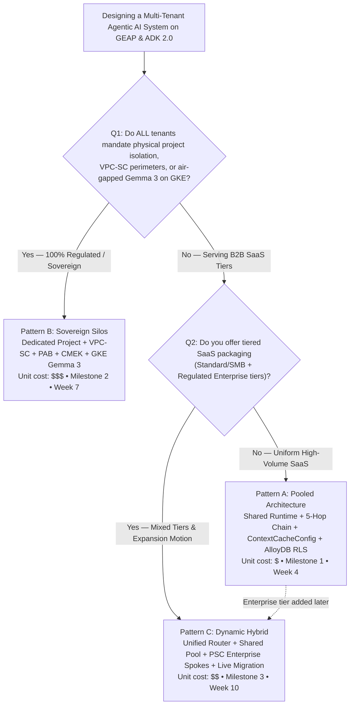

# Pooled, Siloed, or Hybrid? The Executive Decision Guide for Multi-Tenant Agentic AI on Google Cloud

> **Executive TL;DR**
> - **Two questions decide your topology.** (1) Do *all* tenants mandate physical project isolation, VPC Service Controls perimeters, or air-gapped Gemma 3 on GKE? If yes → **Pattern B: Sovereign Silos**. (2) If not, do you sell tiered SaaS packaging (Standard/SMB plus a regulated Enterprise tier)? If no → **Pattern A: Pooled**; if yes → **Pattern C: Dynamic Hybrid**.
> - **The code is 80% identical across all three.** The reusable [`core-cymbal-agent/`](../core-cymbal-agent/) engine implements the 5-Hop Cryptographic Context Chain once; Patterns A, B, and C are 20% topology deltas (shared RLS pool vs. per-tenant VPC-SC/PAB/CMEK projects vs. a hub routing to both over Private Service Connect).
> - **Whichever pattern you choose, you must balance the Multi-Tenant Agentic Triad**: Zero-Trust Cryptographic Security (Hops 1–5), FinOps & COGS Engineering (`ContextCacheConfig` 90% prefix savings, 4k/8k thinking-budget clamps, Redis bulkheads), and Privacy-Preserving Tenant Observability (zero-PII BigQuery OpenTelemetry spans with automated chargeback).
> - **Unit cost ladder from [5.1](../workstream-5-wrap-up-and-backlog/5.1-pattern-comparison-and-decision-guide.md)**: Pattern A `$` (85–90% shared prefix savings), Pattern C `$$` (optimal blended SaaS margin), Pattern B `$$$` (dedicated baseline per tenant).
> - **Nine product gaps remain open** (3× P0, 4× P1, 2× P2) with engineered workarounds in the repo and named EAP allowlists targeting Q4 2026 – Q1 2027.

---

## 1. Series Recap: One Anchor Scenario, Three Topologies, Ten Weeks

Across Workstreams 1–4 we followed a single anchor case study so that every architectural decision could be compared like-for-like. **Cymbal SaaS Platform**, a B2B IT-observability and incident-management ISV, publishes a **Shared Incident Diagnostic Agent** on Gemini 2.5 Pro with shared Prompt Prefix Caching (`ContextCacheConfig`) and serves two very different customers:

| Tenant | Tier | Identity & Tool Stack | Entitlements & Constraints |
| :--- | :--- | :--- | :--- |
| **FinVault Bank** | Enterprise | Google Workspace OIDC, Jira; 3LO to Drive, Calendar, Gmail | `8,000` thinking-token budget; private **Regulatory Escalation Agent (`Agent Alpha`)** on Claude Sonnet via Vertex AI Model Garden; CMEK-encrypted memory (`finvault:user:session`) |
| **RetailStream Corp** | Standard | Microsoft Entra ID, 100% Microsoft 365 + ServiceNow (zero Google footprint) | `4,000` thinking-token cap; Redis rate-limit bulkhead; inline 3LO OAuth consent to SharePoint & ServiceNow mid-session; `403 Forbidden` on any call to `Agent Alpha` |

The program ran on a **`1W Design • 2W Build • 1W Launch`** rhythm across ten weeks, shipping three milestones:

- **Milestone 1 (Week 4) — Pattern A: Pooled Architecture** ([2.1](../workstream-2-pattern-a-pooled/2.1-case-study-and-solution-architecture.md)): one shared GCP project, gVisor runtime with immutable `temp:tenant_id`, AlloyDB Row-Level Security, and the 90% shared-prefix cache.
- **Milestone 2 (Week 7) — Pattern B: Sovereign Silos** ([3.1](../workstream-3-pattern-b-siloed/3.1-case-study-and-solution-architecture.md)): one dedicated project per corporate tenant inside its own VPC-SC perimeter, IAM Principal Access Boundary, project-wide Cloud KMS CMEK kill-switch, and optional air-gapped Gemma 3 (27B) on private GKE.
- **Milestone 3 (Week 10) — Pattern C: Dynamic Hybrid** ([4.1](../workstream-4-pattern-c-hybrid/4.1-case-study-and-solution-architecture.md)): a unified control/ingress hub routing Standard tenants to the shared pool and Enterprise tenants to dedicated PSC spokes, with a 3-phase zero-downtime live tier migration.

This final post consolidates everything into the artifact executives actually asked for: a decision tree, a comparison matrix, and the backlog that turns workarounds into GA features. The in-depth FinOps and observability treatment lives in the flagship capstone, [5.2 — The Multi-Tenant Agentic Triad](../workstream-5-wrap-up-and-backlog/5.2-blog-multi-tenant-agentic-triad.md).

---

## 2. The Executive Decision Tree

The decision guide in [5.1](../workstream-5-wrap-up-and-backlog/5.1-pattern-comparison-and-decision-guide.md) deliberately reduces the choice to two gating questions. The first is a compliance question that only your regulated customers can answer; the second is a packaging question that only your product and pricing teams can answer.

**Question 1 — Do *all* tenants mandate physical project isolation, VPC-SC perimeters, or air-gapped Gemma 3 on GKE?**
If your entire customer base is regulated (OCC/FDIC/DORA banks, HIPAA providers, sovereign public sector) and contracts prohibit shared compute pools or shared database clusters, the answer is yes and the topology is **Pattern B**. There is no pooled tier to optimize, so the extra unit cost of a dedicated baseline per tenant is simply the cost of doing business.

**Question 2 — Do you offer tiered SaaS packaging (Standard/SMB plus a regulated Enterprise tier)?**
If the answer is no — you sell one uniform, high-volume SaaS product — **Pattern A** gives you the lowest unit COGS and instant self-service onboarding, with logical and cryptographic isolation enforced by the 5-Hop chain. If the answer is yes — you have mixed tiers and an expansion motion where Standard customers upgrade to Enterprise — **Pattern C** lets you keep pooled economics for the many while giving the few a sovereign PSC spoke, without forcing a re-platform when a customer upgrades.

> **Note for architects**: Pattern A's upgrade path is explicitly "migrate to Pattern C to add dedicated spokes" ([5.1](../workstream-5-wrap-up-and-backlog/5.1-pattern-comparison-and-decision-guide.md), *Live Tier Upgrade Path* row). Because the hub, the pool, and the 5-Hop code are shared, that migration is an additive topology change — not a rewrite.

---

## 3. Side-by-Side Comparison Matrix

The following matrix condenses the full twelve-row table in [5.1](../workstream-5-wrap-up-and-backlog/5.1-pattern-comparison-and-decision-guide.md) to the six dimensions executives weigh most.

| Dimension | Pattern A: Pooled (`Maximum Density`) | Pattern B: Sovereign Silos (`Zero Trust Isolation`) | Pattern C: Dynamic Hybrid (`Intelligent Routing`) |
| :--- | :--- | :--- | :--- |
| **Isolation model** | Shared runtime & compute pools with logical + cryptographic isolation (5-Hop Context Chain); single shared GCP project | Dedicated GCP project, VPC-SC perimeter, IAM PAB policy & CMEK per corporate tenant + central routing/security hub | Unified control plane & tenant-aware gateway routing across mixed Pooled & Sovereign tiers (hub + pool project + N spoke projects) |
| **Compute & runtime** | Shared GEAP Agent Runtime (gVisor sandbox) + immutable `temp:tenant_id`; shared `ContextCacheConfig` | Dedicated per-tenant GEAP Runtime / Provisioned Throughput **or** air-gapped Gemma 3 (27B) on private GKE | Shared pool for Standard (`4k` cap) + **Private Service Connect** spokes for Enterprise (`8k` cap + CMEK) |
| **Data & memory plane** | Shared AlloyDB with PostgreSQL RLS (`SET LOCAL app.current_tenant`) + tenant-prefixed 5-Level Memory Bank; envelope CMEK per namespace | Dedicated CMEK AlloyDB / BigQuery per project inside VPC-SC; full project-level Cloud KMS / EKM kill-switch (`HTTP 423 KMS_KEY_DISABLED`) | Shared RLS AlloyDB for Standard + PSC bridge to dedicated CMEK data spokes for Enterprise |
| **FinOps & COGS profile** | **`$`** — lowest unit cost; 85–90% shared prefix savings | **`$$$`** — dedicated project quotas & Provisioned Throughput; zero noisy neighbors | **`$$`** — pooled efficiency for SMB/Standard + dedicated SLA & zero-downtime live tier upgrades |
| **Ideal workload fit** | Standard B2B SaaS tiers & high-volume tasks | Healthcare, FinTech & regulated enterprises | Tiered SaaS models serving SMB to Fortune 500 |
| **Delivery milestone** | **Milestone 1 • Week 4** ([WS2](../workstream-2-pattern-a-pooled/)) | **Milestone 2 • Week 7** ([WS3](../workstream-3-pattern-b-siloed/)) | **Milestone 3 • Week 10** ([WS4](../workstream-4-pattern-c-hybrid/)) |

Two rows from the full matrix deserve a direct call-out because they most often change a decision late in procurement:

- **CMEK kill-switch granularity.** Pattern A can only offer envelope CMEK per memory namespace (`finvault:user:session`); Pattern B offers a full project-level kill-switch; Pattern C offers envelope CMEK in the pool and full project CMEK in Enterprise spokes. If a tenant's legal team requires "revoke the key and everything goes dark", that tenant needs a Pattern B silo or a Pattern C spoke.
- **Live tier upgrade path.** Only Pattern C ships the 3-phase zero-downtime migration (`SHADOW_SYNC` → `ATOMIC_CUTOVER` → `DRAIN`). Pattern B silos are statically provisioned; Pattern A requires moving to Pattern C.

---

## 4. The Multi-Tenant Agentic Triad

Whatever topology you select, [5.2](../workstream-5-wrap-up-and-backlog/5.2-blog-multi-tenant-agentic-triad.md) argues that scaling multi-tenant autonomous agents in production means balancing three competing forces at once. We call this the **Multi-Tenant Agentic Triad**:

1. **Zero-Trust Cryptographic Security** — eliminating cross-tenant tool, memory, and data bleed across Hops 1–5. Legacy multi-tenant web apps verify a bearer token once at the load balancer and trust internal services implicitly; in an agent system where the model plans tool calls and retrieves vector memories dynamically, implicit internal trust is one prompt injection away from a cross-tenant breach.
2. **FinOps & COGS Engineering** — protecting SaaS gross margins with three Hop 3 controls: `ContextCacheConfig` (`READ_ONLY_IMMUTABLE_PREFIX`) caching the 32,000-token shared operator prefix at a 90% discount, tiered `thinking_budget` clamps (`4,000` Standard vs. `8,000` Enterprise), and Memorystore for Redis sliding-window bulkheads (`120 RPM` Standard / `600 RPM` Enterprise, `HTTP 429` shed on a runaway tenant).
3. **Privacy-Preserving Tenant Observability** — attributing every token, tool invocation, and guardrail decision in BigQuery OpenTelemetry (`cymbal_multi_tenant_otel.agent_turn_spans`) without writing raw customer PII into central logs, using cryptographic hashes (`obo_token_hash`, `dpop_jkt`), SDP redaction counts, and token metrics to drive three chargeback models (even split, proportional consumption, tiered SLA surcharge).

The triad is a *balance*, not a checklist: tightening security alone (Pattern B everywhere) raises TCO; optimizing cost alone (one giant pool with no bulkheads) exposes you to noisy neighbors and cache bleed; and observability without egress redaction turns your audit sink into the breach. The quantitative model in 5.2 (1,000 tenants: 950 Standard + 50 Enterprise, 50,000 turns/day) reports -90% prefix token COGS, -68% output thinking-token spend, `99.99%` Enterprise SLA preservation, and -74% total infrastructure TCO for the Pattern C blend versus 1,000 dedicated projects.

---

## 5. Figure 1 — Executive Topology Decision Guide & The Multi-Tenant Agentic Triad

*Figure 1 — Unifying Zero-Trust Security, FinOps Unit Economics (90% Prefix Cache), and Zero-PII OpenTelemetry across all three patterns: a shared Routing Hub and Central Governance Hub above a Pattern A pooled spoke (left) and a Pattern B / Pattern C sovereign spoke (right). Editable: [Draw.io](../diagrams/ws5-decision-tree-and-agentic-triad.drawio) • [Slides (.pptx)](../slides/ws5-wrap-up-editable-slides.pptx) • [Cloud Architecture Center SVG](../diagrams/ws5-decision-tree-and-agentic-triad.svg) • [Vision AST](../diagrams/vision_metadata/ws5-decision-tree-and-agentic-triad.vision.json)*

### Reading Figure 1

Figure 1 is laid out in the Cloud Architecture Center hub-and-spoke style; the labels below are the exact addressable objects in the vision AST, so you can find each one in the Draw.io source.

**Outer frame and header.** The title band reads **`[WORKSTREAM 5.1 & 5.2 • CAPSTONE BLUEPRINT] Workstream 5 Capstone: Executive Topology Decision Guide & The Multi-Tenant Agentic Triad`**. Above the Google Cloud frame sits the actor **`Enterprise & SMB Users 10,000+ Multi-Tier Tenants`**, with step badge **`1`** (**`Request`**) entering and badge **`7`** (**`Response`**) returning to the user.

**Two nested wrappers.** The outer wrapper is **`The Multi-Tenant Agentic Triad: Security (Hops 1–5) • FinOps COGS (-84.7%) • Zero-PII Observability`** — the -84.7% figure is the net input-token saving from [2.1 §4](../workstream-2-pattern-a-pooled/2.1-case-study-and-solution-architecture.md) once the 2,000-token tenant suffix is added back to the 90% cached 32,000-token prefix. Inside it, **`Unified GEAP & ADK 2.0 Reference Architecture (12/12 Forensic Audit • 20/20 Simulations PASS)`** frames the shared hubs and both spokes.

**Routing hub (upper left, Triad Pillar 1).** The zone titled **`Triad Pillar 1: Zero-Trust Cryptographic Security`** holds three hop cards stacked on the left — **`Hop 1: Edge PEP Header Strip + OBO + DPoP`** (edge label **`Verify OBO & DPoP`**), **`Hop 4: Model Armor`** (**`Screen & redact PII`**), and **`Hop 2: Registry PDP`** (**`Prune ARD & MCP tools`**) — with the **`External Application Load Balancer`** and the **`Architecture Selector Routes Pattern A, B or C`** card to their right. Step badge **`2`** (**`Request`**) and a second **`7`** (**`Response`**) mark the request leaving the ALB toward the guardrails and the screened response returning.

**Central governance hub (upper right, Triad Pillar 3).** The zone labelled **`Triad Pillar 3: Privacy-`** (Preserving Observability) contains **`Security Command Center`**, **`3 Chargeback Models`**, and the **`BigQuery OTel Sink`**. A dashed governance line labelled **`Real-time COGS & security telemetry`** drops from this hub into the spokes — it is dashed because it carries only zero-PII span metadata, never request payloads.

**The trunk.** Below the routing hub, badge **`3`** (**`Dispatch to optimal cost/security tier`**) is where the Architecture Selector commits to a pattern; badge **`7`** beside it reads **`Verified zero-bleed agent completion`**, the point at which a response has cleared Hop 4 egress redaction on its way back up.

**Left spoke — Pattern A (Triad Pillar 2, High Density).** The wrapper **`Triad Pillar 2 (High Density): Pattern A Pooled FinOps & COGS Engine`** encloses **`Pattern A: Pooled Unit Economics`**. Follow the badges: **`4`** **`Check quota`** at the **`Redis Rate Bulkhead 120 RPM Std / 600 RPM Ent`**; **`Thinking Budget Cap Clamps 4k Std vs 8k Ent`**; **`6`** **`Log COGS`**; **`5`** **`90% Cached inference`** at **`ContextCacheConfig 90% Discount on 32k Prefix`** (annotated **`Zero Cache Bleed`**); **`2LO & 3LO Auth Mgr Scoped Per-Tenant Vault`**; and **`AlloyDB RLS & L1–L5 Shared Storage Density`** (annotated **`Storage-Engine RLS Policy`**).

**Right spoke — Patterns B & C (Triad Pillar 2, Regulated Scale).** The wrapper **`Triad Pillar 2 (Regulated Scale): Pattern B Silos ($$$) & Pattern C Hybrid ($$)`** encloses **`Pattern B Silos & Pattern C PSC Spokes`**: **`VPC-SC & IAM PAB Hard Perimeter Isolation`**, **`Gemma 3 & Claude 3.7`** (air-gapped and Model Garden model choices), **`PSC Spoke Runtime 3-Phase Live Tier Upgrade`** (annotated **`Private PSC NAT Bridge`**), **`Dedicated Silo MCP Zero Cross-Project Egress`**, and **`Cloud KMS CMEK Lock`** (annotated **`Customer-Revocable CMEK Keys`**).

Read left-to-right, the two spokes are the same five hops with different blast radii — which is precisely the point of the next section.

---

## 6. The 5-Hop Cryptographic Context Chain: The Invariant Across All Three Patterns

The 80% reusable core is the 5-Hop chain in [`core-cymbal-agent/governance/`](../core-cymbal-agent/governance/). Every pattern runs the same five modules; only the perimeter each hop is deployed into changes. Each hop below links to its reference implementation and names its Pattern A / B / C delta from the 5.1 matrix.

### Hop 1 — Edge Identity & Token Exchange PEP
[`hop1_edge_identity_pep.py`](../core-cymbal-agent/governance/hop1_edge_identity_pep.py) strips any client-supplied or forged `X-Tenant-ID` / `X-Cymbal-Tier` header, verifies the upstream IdP JWT (Google Workspace OIDC for FinVault, Microsoft Entra ID for RetailStream), and performs an RFC 8693 On-Behalf-Of exchange bound to an RFC 9449 DPoP thumbprint (`jkt`). **Delta**: Pattern B adds mTLS SPIFFE pinning and IAM PAB; Pattern C adds the tenant-aware Firestore router and cross-project PAB.

### Hop 2 — Registry PDP, ARD Catalog & ADK Tool Pruning
[`hop2_registry_pdp_callbacks.py`](../core-cymbal-agent/governance/hop2_registry_pdp_callbacks.py) filters the GEAP Agent Registry by cryptographic tenant labels, filters ARD catalog entries so tenants cannot enumerate each other's private agents or MCP connectors, returns `403 Forbidden` on unauthorized direct invocation, and runs ADK 2.0 `before_agent_callback` deterministic tool pruning mid-turn. **Delta**: Pattern B uses a dedicated per-project registry and local MCP servers; Pattern C uses a cross-project federated registry.

### Hop 3 — Compute Plane, 5-Level Memory Bank & FinOps Bulkheads
[`hop3_compute_finops_bulkhead.py`](../core-cymbal-agent/governance/hop3_compute_finops_bulkhead.py) binds immutable `temp:tenant_id` inside the gVisor sandbox, loads per-tenant prompts, thinking budgets, and GCS Skills via Firestore + Memorystore, enforces `8,000` vs. `4,000` thinking budgets and Redis RPM bulkheads, keys the `L1_TURN_EPHEMERAL`..`L5_PLATFORM_SHARED_SKILLS` memory bank by `{tenant}:{user}:{session}`, verifies Cloud KMS CMEK key state, and attaches shared `ContextCacheConfig`. **Delta**: Pattern B swaps in a dedicated runtime or air-gapped Gemma 3 with project CMEK; Pattern C routes Enterprise tenants over PSC to a dedicated spoke.

### Hop 4 — Vertex AI Model Armor & Semantic NLCs
[`hop4_model_armor_guardrails.py`](../core-cymbal-agent/governance/hop4_model_armor_guardrails.py) screens ingress prompts for injection, jailbreaks, context-cache extraction, and SQL RLS bypass payloads; enforces tenant-specific Semantic Natural Language Constraints; and scrubs egress with tenant-tailored SDP detectors (bank account / IBAN / SWIFT for FinVault, payment card PAN for RetailStream). **Delta**: Pattern B deploys Model Armor per project; Pattern C screens at the hub and enforces spoke-specific SDP/NLC.

### Hop 5 — AlloyDB RLS, 2LO/3LO Tool Auth & BigQuery OTel
[`hop5_data_rls_and_otel.py`](../core-cymbal-agent/governance/hop5_data_rls_and_otel.py) binds `SET LOCAL app.current_tenant = '<tenant_id>'` on every AlloyDB transaction, brokers 2LO implicit passthrough for the Cymbal Telemetry API and 3LO tokens (Google OIDC; Entra ID with inline OAuth consent challenge) via `CymbalMCPHub`, and emits structured OTel FinOps and security traces to BigQuery. **Delta**: Pattern B uses dedicated CMEK AlloyDB and BigQuery inside VPC-SC; Pattern C bridges from the shared RLS database to dedicated VPC-SC spokes over PSC.

---

## 7. Consolidated Product-Gap & EAP Backlog

The program's second deliverable to Google product teams is the gap ledger in [1.4](../workstream-1-reference-architecture/1.4-eap-and-product-gap-tracker.md), refined through the Milestone 1 prioritization in [2.4](../workstream-2-pattern-a-pooled/2.4-product-gaps-prioritization.md). Every gap has a working workaround in the reference repo today and a named EAP allowlist that would retire it.

| Gap ID | Priority | Pattern | Component | Gap (failure mode) | Engineered workaround in repo | EAP / allowlist | Target |
| :--- | :--- | :--- | :--- | :--- | :--- | :--- | :--- |
| `GAP-P0-01` (`GEAP-POOL-01`) | **P0** | A | GEAP Agent Registry (PDP) | Registry list/get filters by IAM project principal, not sub-project `tenant_id` claim | Tenant label check in Gateway PEP + ADK `before_agent_callback` pruning (`403`) | `geap-registry-tenant-label-pdp-eap` | Q4 2026 |
| `GAP-P0-02` (`GEAP-POOL-03`) | **P0** | A | GEAP 5-Level Memory Bank | Project-level CMEK only; no per-`tenant_id` namespace key binding | Envelope encryption per namespace via Cloud KMS in Hop 3, or route to Pattern C PSC memory spoke | `geap-memory-bank-per-tenant-cmek-eap` | Q4 2026 |
| `GAP-P0-03` (`GEAP-POOL-02`) | **P0** | A | GCP Agent Identity (Auth Manager) | OBO + DPoP from external Entra ID tenants needs custom verification before brokering | DPoP `jkt` verification and header strip at Hop 1 before Auth Manager 3LO broker | `gcp-agent-identity-dpop-entra-eap` | Q4 2026 |
| `GAP-P1-01` (`GEAP-POOL-04`) | P1 | A | Vertex AI `ContextCacheConfig` + Model Garden | Partner models (Claude 3.7 Sonnet) use provider-specific cache headers | Cache abstraction split between Gemini `ContextCacheConfig` and Anthropic ephemeral cache control | `vertex-model-garden-unified-cache-api` | Q1 2027 |
| `GAP-P1-02` | P1 | A | ADK 2.0 Inline 3LO OAuth | Pausing/resuming the reasoning loop across stateless Cloud Run needs externalized state | Checkpoint persisted in Firestore/Redis keyed by `retailstream:user:session` | `adk-stateless-oauth-checkpoint-v2` | Q4 2026 |
| `GAP-P1-03` | P1 | B | VPC-SC + GEAP Remote MCP | 3P SaaS MCP egress from a strict perimeter needs explicit PSC egress proxy | Envoy/Cloud NAT egress bridge with FQDN allowlisting ([3.6](../workstream-3-pattern-b-siloed/3.6-terraform-silo-blueprint/)) | `vpc-sc-geap-mcp-egress-bridge` | Q4 2026 |
| `GAP-P1-04` | P1 | B | Cloud KMS CMEK revocation latency | Cached credentials can serve in-memory state up to 5 min after revocation | Sub-second KMS key-state probe in Hop 3 (`423 Locked` on `KMS_KEY_DISABLED`) | `geap-cmek-instant-killswitch-sla` | Q1 2027 |
| `GAP-P2-01` | P2 | C | Cross-project GEAP Registry over PSC | Hub cannot natively discover a spoke's dedicated agent card | Firestore-backed cross-project registry sync + `psc_service_attachment` routing table ([4.3](../workstream-4-pattern-c-hybrid/4.3-solution-implementation/)) | `geap-cross-project-federated-registry` | Q1 2027 |
| `GAP-P2-02` | P2 | C | Zero-downtime tier upgrade | Pool → spoke promotion mid-day risks dropped sessions and lost memory | 3-phase Silent Tenant Migration State Machine (shadow replication → atomic Firestore cutover → drain) | `geap-live-tenant-tier-migrator` | Q1 2027 |

The Milestone 1 sign-off gate in 2.4 is worth adopting as your own acceptance criteria: 100% forged-header strip at Hop 1; deterministic `403` on cross-tenant agent and MCP calls; `4,000`-token clamp and `429` above `120 RPM` for Standard without touching the Enterprise `8,000`-token / `600 RPM` lane; and tenant-aware PII redaction plus RLS that survives simulated SQL filter tampering.

---

## 8. Ten-Week Program Retrospective

| Weeks | Phase | Workstream | Milestone & outputs |
| :--- | :--- | :--- | :--- |
| 1–4 | 1W Design • 2W Build • 1W Launch | WS1 reference architecture + WS2 Pattern A | **Milestone 1 (Week 4)**: taxonomy & 5-Hop baseline diagrams, Pooled case study, 3P auth sandbox, breach-simulation suite, Terraform starter, Pattern A blog, codelab, gap prioritization (2.4) |
| 4–7 | 1W Design • 2W Build • 1W Launch | WS3 Pattern B | **Milestone 2 (Week 7)**: multi-project silo & CMEK setup, VPC-SC sign-off, exfiltration & CMEK-revocation tests, silo Terraform blueprint, Sovereign Silos blog and codelab |
| 7–10 | 1W Design • 2W Build • 1W Launch | WS4 Pattern C + WS5 wrap-up | **Milestone 3 (Week 10)**: hub-and-spoke PSC demo environment, zero-downtime tier-upgrade suite, hybrid PSC Terraform blueprint, Dynamic Tiering blog, decision guide (5.1) and Triad capstone (5.2) |

Three lessons generalize beyond Cymbal:

1. **Build the pooled pattern first, even if you will never ship it alone.** Pattern A forces the 5-Hop chain to be correct under the hardest condition — shared everything. Patterns B and C then become perimeter deltas rather than new security models, which is what made the 80/20 reuse real.
2. **Treat the gap ledger as a first-class deliverable.** The nine entries in Section 7 each have an engineered workaround, a product owner, and an EAP name; that turned product-team collaboration (2.4, 3.4, 4.4) into concrete sign-off gates instead of open-ended feedback.
3. **Diagram once, publish everywhere.** Each of the seven blueprints exists as `.drawio`, `.drawio.png`, Cloud Architecture Center `.svg`, and a `.vision.json` AST with addressable labels — so the same figure appears consistently in blogs, codelab decks, and the documentation PR ([1.3](../workstream-1-reference-architecture/1.3-cloud-architecture-center-doc-update-pr.md)).

---

## 9. Call to Action

- **Run the decision tree with your compliance and pricing leads in the same room.** Question 1 belongs to legal and security; Question 2 belongs to product. Most disagreements about topology are really disagreements about which question is being answered.
- **Start from the reusable core.** Clone [`core-cymbal-agent/`](../core-cymbal-agent/), run the Pattern A breach simulations ([2.5](../workstream-2-pattern-a-pooled/2.5-breach-simulation-suite/run_breach_simulations.py)), the Pattern B silo security tests ([3.5](../workstream-3-pattern-b-siloed/3.5-exfiltration-and-cmek-revocation-tests/run_silo_security_tests.py)), and the Pattern C tier-migration suite ([4.5](../workstream-4-pattern-c-hybrid/4.5-zero-downtime-tier-upgrade-suite/run_tier_migration_suite.py)) before you write a line of pattern-specific code.
- **Deploy with the matching Terraform blueprint**: [2.6](../workstream-2-pattern-a-pooled/2.6-terraform-starter/) (Pooled), [3.6](../workstream-3-pattern-b-siloed/3.6-terraform-silo-blueprint/) (Silos), or [4.6](../workstream-4-pattern-c-hybrid/4.6-terraform-hybrid-psc-blueprint/) (Hybrid PSC), after enabling the APIs in the [1.4 allowlist checklist](../workstream-1-reference-architecture/1.4-eap-and-product-gap-tracker.md).
- **Ask your Google account team for the EAP allowlists in Section 7** that match your chosen pattern — the P0 items are the ones that convert repository workarounds into platform-native guarantees.
- **Go deeper on the Triad** in the flagship capstone, [5.2 — The Multi-Tenant Agentic Triad: Mastering Cost, Observability, and Zero-Trust Security at Scale](../workstream-5-wrap-up-and-backlog/5.2-blog-multi-tenant-agentic-triad.md), including the full BigQuery chargeback SQL.

---

## 10. Assets & Editable Diagrams

All seven program blueprints and all five workstream decks, plus the combined deck. Anchor reference: [Multi-tenant agentic AI system — Google Cloud Architecture Center](https://docs.cloud.google.com/architecture/multi-tenant-agentic-ai-system).

| # | Workstream | Blueprint | Draw.io PNG | Editable `.drawio` | Cloud Architecture Center SVG |
| :--- | :--- | :--- | :--- | :--- | :--- |
| 1 | WS 1.1 | GEAP Multi-Tenant Agentic AI Taxonomy: Pattern A, B & C Overview | [PNG](../diagrams/ws1-multi-tenant-taxonomy-overview.drawio.png) | [.drawio](../diagrams/ws1-multi-tenant-taxonomy-overview.drawio) | [SVG](../diagrams/ws1-multi-tenant-taxonomy-overview.svg) |
| 2 | WS 1.3 | Cloud Architecture Center 5-Hop Cryptographic Context Chain Baseline | [PNG](../diagrams/ws1-cloud-arch-center-5hop-baseline.drawio.png) | [.drawio](../diagrams/ws1-cloud-arch-center-5hop-baseline.drawio) | [SVG](../diagrams/ws1-cloud-arch-center-5hop-baseline.svg) |
| 3 | WS 2.1 | Pattern A: High-Density Pooled Multi-Tenant Architecture & 90% COGS Cache | [PNG](../diagrams/ws2-pattern-a-pooled-5hop-architecture.drawio.png) | [.drawio](../diagrams/ws2-pattern-a-pooled-5hop-architecture.drawio) | [SVG](../diagrams/ws2-pattern-a-pooled-5hop-architecture.svg) |
| 4 | WS 2.5 | Pattern A: 10-Point Cross-Tenant Breach Defense & Guardrail Matrix | [PNG](../diagrams/ws2-pattern-a-breach-defense-sequence.drawio.png) | [.drawio](../diagrams/ws2-pattern-a-breach-defense-sequence.drawio) | [SVG](../diagrams/ws2-pattern-a-breach-defense-sequence.svg) |
| 5 | WS 3.1 | Pattern B: Zero-Trust Sovereign Silos (VPC-SC, PAB, CMEK & Air-Gapped Gemma 3) | [PNG](../diagrams/ws3-pattern-b-sovereign-silos-architecture.drawio.png) | [.drawio](../diagrams/ws3-pattern-b-sovereign-silos-architecture.drawio) | [SVG](../diagrams/ws3-pattern-b-sovereign-silos-architecture.svg) |
| 6 | WS 4.1 | Pattern C: Dynamic Hybrid Hub-and-Spoke, PSC Bridge & Live Tier Migration | [PNG](../diagrams/ws4-pattern-c-hybrid-psc-and-migration.drawio.png) | [.drawio](../diagrams/ws4-pattern-c-hybrid-psc-and-migration.drawio) | [SVG](../diagrams/ws4-pattern-c-hybrid-psc-and-migration.svg) |
| 7 | WS 5.1 | Executive Topology Decision Tree & The Multi-Tenant Agentic Triad | [PNG](../diagrams/ws5-decision-tree-and-agentic-triad.drawio.png) | [.drawio](../diagrams/ws5-decision-tree-and-agentic-triad.drawio) | [SVG](../diagrams/ws5-decision-tree-and-agentic-triad.svg) |

**Editable slide decks (.pptx)**

- Workstream 1 — Reference Architecture: [ws1-reference-architecture-editable-slides.pptx](../slides/ws1-reference-architecture-editable-slides.pptx)
- Workstream 2 — Pattern A Pooled: [ws2-pattern-a-pooled-editable-slides.pptx](../slides/ws2-pattern-a-pooled-editable-slides.pptx)
- Workstream 3 — Pattern B Siloed: [ws3-pattern-b-siloed-editable-slides.pptx](../slides/ws3-pattern-b-siloed-editable-slides.pptx)
- Workstream 4 — Pattern C Hybrid: [ws4-pattern-c-hybrid-editable-slides.pptx](../slides/ws4-pattern-c-hybrid-editable-slides.pptx)
- Workstream 5 — Wrap-Up & Decision Guide: [ws5-wrap-up-editable-slides.pptx](../slides/ws5-wrap-up-editable-slides.pptx)
- **Combined program deck (all workstreams)**: [geap-multi-tenancy-all-workstreams-editable-slides.pptx](../slides/geap-multi-tenancy-all-workstreams-editable-slides.pptx)

**Source documents for this post**: [5.1 Pattern Comparison & Decision Guide](../workstream-5-wrap-up-and-backlog/5.1-pattern-comparison-and-decision-guide.md) • [5.2 The Multi-Tenant Agentic Triad](../workstream-5-wrap-up-and-backlog/5.2-blog-multi-tenant-agentic-triad.md) • [1.4 EAP & Product Gap Tracker](../workstream-1-reference-architecture/1.4-eap-and-product-gap-tracker.md) • [2.4 Product Gaps Prioritization](../workstream-2-pattern-a-pooled/2.4-product-gaps-prioritization.md) • [Program README](../README.md)
