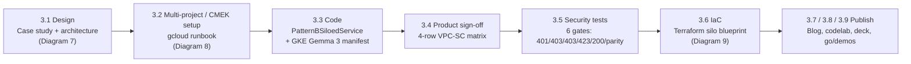

## Workstream 3 — Pattern B: Zero-Trust Sovereign Silos (Milestone 2, Week 7)

### Objective & outcome

**Objective.** Take the 80% reusable Cymbal core (`core-cymbal-agent/`, the 5-Hop Cryptographic Context Chain from Workstream 1/2) and deploy it — unchanged — into **dedicated, physically isolated Google Cloud projects** for the two regulated corporate tenants of the anchor case study: **FinVault Bank** (Tenant Alpha, Google OIDC, Workspace + Jira) and **RetailStream Corp** (Tenant Beta, Microsoft Entra ID, SharePoint + ServiceNow). The 20% "sovereign delta" layered on top is:

1. **mTLS SPIFFE client-certificate pinning** at silo ingress (`HTTP 401 MTLS_CERTIFICATE_MISMATCH` on a mismatched SAN).
2. **Organization-level IAM Principal Access Boundary (PAB)** per tenant (`HTTP 403 PAB_BOUNDARY_VIOLATION` on cross-project access).
3. **VPC Service Controls (VPC-SC) service perimeter** per project (`HTTP 403 VPC_SERVICE_CONTROLS_PERMISSION_DENIED` on exfiltration).
4. **Cloud KMS CMEK cryptographic kill-switch** per tenant (`HTTP 423 KMS_KEY_DISABLED` the moment the key is disabled).
5. **Air-gapped Gemma 3 (27B IT) on private GKE** inside the perimeter for workloads that may not call a multi-tenant model endpoint.

**Outcome (Milestone 2, Week 7).**

- A 4-row VPC-SC / PAB / CMEK / mTLS sign-off matrix with every row **SIGNED OFF** by GCP Security and GEAP Product Engineering ([3.4](../workstream-3-pattern-b-siloed/3.4-product-collaboration-vpc-sc-signoff.md)).
- A 6-gate automated security suite that ends with `ALL 6 PATTERN B (SOVEREIGN SILOS) SECURITY TESTS PASSED (100% VERIFIED)` ([3.5](../workstream-3-pattern-b-siloed/3.5-exfiltration-and-cmek-revocation-tests/run_silo_security_tests.py)).
- A per-tenant Terraform silo blueprint ([3.6](../workstream-3-pattern-b-siloed/3.6-terraform-silo-blueprint/README.md)).
- A publish-ready Part 2 blog ([3.7](../workstream-3-pattern-b-siloed/3.7-blog-sovereign-silos.md), expanded as [blogs/ws3-pattern-b-sovereign-silos.md](../blogs/ws3-pattern-b-sovereign-silos.md)).
- A 90-minute codelab + 10-slide workshop deck ([3.8](../workstream-3-pattern-b-siloed/3.8-codelab-and-workshop-deck/codelab-90min-regulated-airgapped.md)).
- A `go/demos` entry with 5-minute video script ([3.9](../workstream-3-pattern-b-siloed/3.9-go-demos-and-video-script.md)).
- Three editable diagrams (Diagrams 7, 8, 9 below) and the deck [`ws3-pattern-b-siloed-editable-slides.pptx`](../slides/ws3-pattern-b-siloed-editable-slides.pptx) that carry the visual story.

**Status-code vocabulary used throughout this section** (all produced by [`pattern_b_siloed_service.py`](../workstream-3-pattern-b-siloed/3.3-solution-implementation/pattern_b_siloed_service.py) or Hop 3 in [`hop3_compute_finops_bulkhead.py`](../core-cymbal-agent/governance/hop3_compute_finops_bulkhead.py)):

| HTTP | `violation_type` / detail | Control | Where it fires |
| :-- | :-- | :-- | :-- |
| `401` | `MTLS_CERTIFICATE_MISMATCH` | mTLS SPIFFE pinning | Silo ingress, before Hop 1 JWT evaluation |
| `403` | `PAB_BOUNDARY_VIOLATION` | IAM Principal Access Boundary | IAM evaluation plane, before resource IAM |
| `403` | `VPC_SERVICE_CONTROLS_PERMISSION_DENIED` | VPC-SC service perimeter | Google Cloud API boundary on egress |
| `423` | `KMS_KEY_DISABLED` (`DENY`) | Cloud KMS CMEK kill-switch | Hop 3, before Memory Bank / model call |
| `200` | `ALLOW` | — | Normal sovereign response (optionally prefixed `[AirGapped-GKE-Gemma3-27B • Perimeter=…]`) |

> [!NOTE]
> The workstream header in 3.1 says *"Weeks 4–7 • Milestone 2"*; 3.9 and the workshop deck pin the release to *"Milestone 2 • Week 7 Release"*. Both are consistent: Weeks 4–7 is the build window, Week 7 is the release.

### Deliverables map

| # | Deliverable | Purpose | Key content | Diagram |
| :-- | :-- | :-- | :-- | :-- |
| 3.1 | [Case Study & Solution Architecture](../workstream-3-pattern-b-siloed/3.1-case-study-and-solution-architecture.md) | Why regulated tenants mandate Pattern B; the target architecture | 4 mandates (zero blast radius, CMEK kill-switch, PAB, air-gapped Gemma 3); Mermaid hub → two silos; Pattern A vs. B delta table (network, identity, encryption, model serving) | **Diagram 7** (Figure 1) |
| 3.2 | [Multi-Project Silo & CMEK Setup](../workstream-3-pattern-b-siloed/3.2-multi-project-silo-and-cmek-setup.md) | `gcloud` runbook for the 20% infra delta | Create 2 projects under `ORG_ID=123456789012`, link billing, enable 7 APIs; `finvault-kr/agent-memory-cmek` (90-day rotation) + Vertex SA binding; `finvault-sovereign-pab` org PAB; run 3.5 suite | **Diagram 8** (Figure 2) |
| 3.3 | [Solution Implementation](../workstream-3-pattern-b-siloed/3.3-solution-implementation/pattern_b_siloed_service.py) | Python wrapper + GKE manifest | `PatternBSiloedService`, `SILO_PERIMETER_MAP`, [`gke_gemma3_airgapped_manifest.yaml`](../workstream-3-pattern-b-siloed/3.3-solution-implementation/gke_gemma3_airgapped_manifest.yaml) | — (see bullets) |
| 3.4 | [Product Collaboration — VPC-SC Sign-Off](../workstream-3-pattern-b-siloed/3.4-product-collaboration-vpc-sc-signoff.md) | Milestone 2 output | 4-row verification matrix, all **SIGNED OFF** | — (see bullets) |
| 3.5 | [Exfiltration & CMEK Revocation Tests](../workstream-3-pattern-b-siloed/3.5-exfiltration-and-cmek-revocation-tests/run_silo_security_tests.py) | Automated proof of all delta controls | 6 tests across both tenants: 401 / 403 / 403 / 423 / 200 / parity | — (see bullets) |
| 3.6 | [Terraform Silo Blueprint](../workstream-3-pattern-b-siloed/3.6-terraform-silo-blueprint/README.md) | Repeatable per-tenant IaC | [`main.tf`](../workstream-3-pattern-b-siloed/3.6-terraform-silo-blueprint/main.tf) (KMS ring+key, VPC-SC perimeter, VPC/subnet, private GKE Autopilot), [`variables.tf`](../workstream-3-pattern-b-siloed/3.6-terraform-silo-blueprint/variables.tf) (5 vars, 2 outputs), [`terraform.tfvars.example`](../workstream-3-pattern-b-siloed/3.6-terraform-silo-blueprint/terraform.tfvars.example) | **Diagram 9** (Figure 3) |
| 3.7 | [Blog — Sovereign Silos (Part 2 of 4)](../workstream-3-pattern-b-siloed/3.7-blog-sovereign-silos.md) | Publish-ready narrative | 80/20 rule, 4 layers, 6-test table, social kit; expanded in [blogs/ws3-pattern-b-sovereign-silos.md](../blogs/ws3-pattern-b-sovereign-silos.md) with Figures 1–3 and talking points in [`.deck.json`](../blogs/ws3-pattern-b-sovereign-silos.deck.json) | Uses Diagrams 7–9 |
| 3.8 | [Codelab (90 min)](../workstream-3-pattern-b-siloed/3.8-codelab-and-workshop-deck/codelab-90min-regulated-airgapped.md) + [Workshop Deck](../workstream-3-pattern-b-siloed/3.8-codelab-and-workshop-deck/workshop-deck-pattern-b.md) | Hands-on enablement | 5 modules with verification gates; 10-slide deck outline | — (see bullets) |
| 3.9 | [go/demos & Video Script](../workstream-3-pattern-b-siloed/3.9-go-demos-and-video-script.md) | Catalog entry + 5-min run-of-show | Slug `geap-multi-tenant-pattern-b-siloed`; 5 timed beats | — (see bullets) |

#### 3.3 — Solution implementation (no dedicated diagram)

- **`pattern_b_siloed_service.py`** wraps `CymbalMultiTenantRuntime` from `core-cymbal-agent/runtime_pipeline.py`. `SILO_PERIMETER_MAP` holds, per tenant: `project_id` (`cymbal-finvault-silo-prod` / `cymbal-retailstream-silo-prod`), `vpc_sc_perimeter` (`perimeter_finvault_sovereign` / `perimeter_retailstream_sovereign`), `expected_mtls_spiffe` (`spiffe://finvault.com/ns/sre/sa/agent-client` / `spiffe://retailstream.com/ns/itom/sa/agent-client`), `allowed_egress_projects`, and `airgapped_gke_model` (`gke://<project>/us-central1/gemma-3-27b-it-vllm`).
- **`invoke_siloed_agent()`** runs Hop 1 (`authenticate_and_mint_context` with `IsolationTopology.PATTERN_B_SILOED`), then three pre-pipeline checks in order — mTLS SPIFFE (`401 MTLS_CERTIFICATE_MISMATCH`), PAB target-project (`403 PAB_BOUNDARY_VIOLATION`), VPC-SC egress (`403 VPC_SERVICE_CONTROLS_PERMISSION_DENIED`) — before calling `handle_agent_turn()`. `revoke_tenant_cmek()` / `restore_tenant_cmek()` call `hop3.disable_cmek_key()` / `enable_cmek_key()` on the profile's `silo_cmek_key_uri`; Hop 3 then returns `status_code=423` with `KMS_KEY_DISABLED`. With `use_airgapped_gemma3_on_gke=True` a `200` response is prefixed `[AirGapped-GKE-Gemma3-27B • Perimeter=…]`.
- **`gke_gemma3_airgapped_manifest.yaml`** — Deployment `finvault-airgapped-gemma3-27b` in namespace `finvault-sovereign-agents`, 2 replicas, SA `finvault-gemma3-workload-sa`, `nodeSelector: cloud.google.com/gke-accelerator: nvidia-l4`, image `us-central1-docker.pkg.dev/cymbal-finvault-silo-prod/sovereign-models/vllm-gemma-3-27b-it:v1.0`, args `--tensor-parallel-size=2 --max-model-len=32768`, limits `nvidia.com/gpu: 2`, `64Gi`, `16` CPU, read-only weights from PVC `finvault-cmek-model-pvc`; Service `gemma3-internal-svc` is an **Internal** LoadBalancer on port 8000. Only the FinVault manifest is shipped — there is no RetailStream manifest in 3.3.

#### 3.4 — VPC-SC sign-off matrix (no dedicated diagram)

- Row 1 **VPC-SC perimeter** — threat: compromised tool exfiltrating FinVault data to an external GCS bucket / BigQuery project; mechanism: `perimeter_finvault_sovereign` blocks with `VPC_SERVICE_CONTROLS_PERMISSION_DENIED` (`403`). Row 2 **IAM PAB** — threat: stolen/replayed FinVault credential against `cymbal-retailstream-silo-prod`; mechanism: `finvault-sovereign-pab` scoped to `//cloudresourcemanager.googleapis.com/projects/cymbal-finvault-silo-prod`.
- Row 3 **CMEK kill-switch** — disabling `finvault-kr/agent-memory-cmek` halts Hop 3 Memory Bank and Hop 5 AlloyDB with `423 KMS_KEY_DISABLED`. Row 4 **mTLS + air-gapped Gemma 3** — Envoy/ALB verifies SPIFFE ID `spiffe://finvault.com/ns/sre/sa/agent-client` and routes sensitive prompts to the internal GKE `gemma-3-27b-it-vllm` endpoint.
- All four rows: **SIGNED OFF**. The matrix is FinVault-centric; RetailStream parity is asserted by test 6 in 3.5, not by a separate sign-off row.

#### 3.5 — Six security tests and expected codes (no dedicated diagram)

| Test | Scenario | Expected |
| :-- | :-- | :-- |
| 1 | RetailStream SPIFFE presented to `cymbal-finvault-silo-prod` | `401` `MTLS_CERTIFICATE_MISMATCH` |
| 2 | FinVault principal targets `cymbal-retailstream-silo-prod` | `403` `PAB_BOUNDARY_VIOLATION` |
| 3 | "Export wire settlement logs" to `external-attacker-exfil-proj` | `403` `VPC_SERVICE_CONTROLS_PERMISSION_DENIED` |
| 4A | `revoke_tenant_cmek("finvault")` then query Memory Bank | `423`, `DENY`, reason contains `KMS_KEY_DISABLED` |
| 4B & 5 | `restore_tenant_cmek("finvault")`, `use_airgapped_gemma3_on_gke=True` | `200` `ALLOW`, response contains `AirGapped-GKE-Gemma3-27B` |
| 6 | RetailStream silo: revoke → `423`; restore → `200` with `runtime_config.cmek_key_uri` == restored key | Parity |

- Run with `python3 workstream-3-pattern-b-siloed/3.5-exfiltration-and-cmek-revocation-tests/run_silo_security_tests.py` (3.7 adds `PYTHONDONTWRITEBYTECODE=1 python3 -B`). The suite loads the 3.3 module by file path via `importlib.util.spec_from_file_location`.
- Order is deliberate: the three perimeter tests fail fast at ingress; tests 4–6 prove CMEK revocation also stops a request that already passed mTLS, PAB, and VPC-SC.

#### 3.8 — Codelab modules and workshop deck (no dedicated diagram)

- **Codelab (90 min, L300–L400), 5 modules:** M1 `00:00–00:20` provision silos & CMEK (review 3.6 blueprint); M2 `00:20–00:40` mTLS SPIFFE + PAB (verify `401` / `403`); M3 `00:40–01:00` VPC-SC exfiltration denial (`403 VPC_SERVICE_CONTROLS_PERMISSION_DENIED`); M4 `01:00–01:15` live CMEK revocation (`423 KMS_KEY_DISABLED` + restore); M5 `01:15–01:30` air-gapped Gemma 3 on private GKE.
- **Steps:** Step 1 inspect `main.tf` (`tenant_agent_cmek`, `tenant_sovereign_perimeter`, `airgapped_gemma3_cluster`); Step 2 read `pattern_b_siloed_service.py` for the `401` / `403` paths; Step 3 run the 3.5 suite.
- **Workshop deck (10 slides):** title; regulatory drivers (OCC/FDIC, HIPAA, DORA, public sector); 80/20 split; Layer 1 mTLS + PAB; Layer 2 VPC-SC (5 protected APIs listed); Layer 3 CMEK kill-switch; Layer 4 Gemma 3 on GKE; live demo; trade-offs; Pattern C preview. Slide 8 says "all 5 Sovereign Silo gates" while the suite has 6 tests (test 6 was added for RetailStream parity).

#### 3.9 — go/demos package and 5-minute video beats (no dedicated diagram)

- **Catalog entry:** slug `geap-multi-tenant-pattern-b-siloed`; products GEAP, VPC-SC, IAM PAB, Cloud KMS (CMEK), GKE, Gemma 3 (27B IT), Vertex AI Model Armor; blueprint `3.6-terraform-silo-blueprint/`; codelab `3.8-…/codelab-90min-regulated-airgapped.md`.
- **Run-of-show (165 WPM):** `00:00–00:50` architecture diagram (Diagram 7); `00:50–02:00` terminal tests 1–3 (`401`, `403`, `403`); `02:00–03:30` live CMEK revocation (`423 KMS_KEY_DISABLED`) and restore; `03:30–04:30` air-gapped Gemma 3 manifest and inference; `04:30–05:00` Terraform callout and Pattern C teaser.
- The closing line says "all five Sovereign Silo checks pass" — same 5-vs-6 wording drift as the workshop deck.

### End-to-end flow of the workstream

1. **Design (3.1).** Starting from the Cymbal anchor case study (README §2), the team identifies the four Pattern B mandates and draws the hub → two-silo architecture. Diagram 7 is the authoritative rendering; the Mermaid in 3.1 is a sketch of the same topology.
2. **Multi-project / CMEK setup (3.2).** Two projects are created under the org, seven APIs enabled, `finvault-kr/agent-memory-cmek` created with 90-day rotation, the Vertex AI service agent granted `cryptoKeyEncrypterDecrypter`, and `finvault-sovereign-pab` bound at org level. Diagram 8 visualises this provisioning sequence.
3. **Code (3.3).** `PatternBSiloedService` adds the three ingress checks and the CMEK revoke/restore hooks around the unchanged 5-Hop pipeline; the GKE manifest provides the air-gapped serving backend.
4. **Product sign-off (3.4).** GCP Security and GEAP Product Engineering sign the 4-row matrix — the Milestone 2 deliverable output.
5. **Security tests (3.5).** The 6-gate suite replays each threat and asserts the exact status code and violation type; it is the same command referenced by 3.2 §4, 3.8 Step 3, and 3.9's terminal beats.
6. **IaC (3.6).** The manual 3.2 steps are partially codified as a Terraform root module (KMS, perimeter, VPC, GKE); Diagram 9 shows its dependency graph.
7. **Publish (3.7 / 3.8 / 3.9).** The blog (expanded under `blogs/` with Figures 1–3 and the `.deck.json` talking points), the codelab + workshop deck, and the `go/demos` package all reuse the same verification gates and diagrams.

**How the 5-Hop chain (README §1–2, Workstream 1) behaves inside a silo** — summarised from the published blog §4 and `core-cymbal-agent/governance/`:

| Hop | Core module | Unchanged behaviour | Pattern B delta |
| :-- | :-- | :-- | :-- |
| 1 | `hop1_edge_identity_pep.py` | Strip forged `X-Tenant-ID`/`X-Cymbal-Tier`, verify IdP JWT (Google OIDC / Entra ID), RFC 8693 OBO + DPoP `jkt` | Runs *after* mTLS SPIFFE pinning; mints context with `IsolationTopology.PATTERN_B_SILOED` |
| 2 | `hop2_registry_pdp_callbacks.py` | Registry PDP filtering, `before_agent_callback` tool pruning, `403` on cross-tenant agent call | Becomes defence-in-depth behind PAB + VPC-SC |
| 3 | `hop3_compute_finops_bulkhead.py` | gVisor `temp:tenant_id`, thinking budgets (8,000 / 4,000), 5-Level Memory Bank | Resolves `silo_cmek_key_uri`; disabled key → `DENY` `423 KMS_KEY_DISABLED` |
| 4 | `hop4_model_armor_guardrails.py` | Ingress prompt screen, tenant NLCs, egress SDP redaction (IBAN/SWIFT vs. PAN) | Dedicated per-silo Model Armor template; `modelarmor.googleapis.com` is VPC-SC restricted |
| 5 | `hop5_data_rls_and_otel.py` | `SET LOCAL app.current_tenant` RLS, 2LO/3LO token broker, BigQuery OTel audit | AlloyDB + BigQuery are dedicated and CMEK-encrypted; RLS is belt-and-braces |

**Control → evidence cross-reference** (which deliverable proves which control):

| Control | Designed in | Provisioned by | Coded in | Signed off | Tested by | Codified in IaC |
| :-- | :-- | :-- | :-- | :-- | :-- | :-- |
| mTLS SPIFFE pinning | 3.1 §3 | — (ingress config not in 3.2) | 3.3 `expected_mtls_spiffe` | 3.4 row 4 | 3.5 test 1 | — |
| IAM PAB | 3.1 §1.3 | 3.2 §3 (`finvault-sovereign-pab`) | 3.3 `project_id` check | 3.4 row 2 | 3.5 test 2 | — (not in `main.tf`) |
| VPC-SC perimeter | 3.1 §1.1 | 3.2 enables ACM API only | 3.3 `allowed_egress_projects` | 3.4 row 1 | 3.5 test 3 | 3.6 `tenant_sovereign_perimeter` |
| CMEK kill-switch | 3.1 §1.2 | 3.2 §2 (`finvault-kr/agent-memory-cmek`) | 3.3 `revoke/restore_tenant_cmek` | 3.4 row 3 | 3.5 tests 4A, 4B, 6 | 3.6 `tenant_agent_cmek` + GKE `database_encryption` |
| Air-gapped Gemma 3 on GKE | 3.1 §1.4 | 3.2 enables `container.googleapis.com` | 3.3 manifest + `airgapped_gke_model` | 3.4 row 4 | 3.5 test 5 | 3.6 `airgapped_gemma3_cluster` |

### Diagram 7 — Pattern B: Zero-Trust Sovereign Silos (VPC-SC, IAM PAB, CMEK Kill-Switch & Air-Gapped Gemma 3 on GKE)

| Field | Value |
| :-- | :-- |
| Diagram ID | `ws3-pattern-b-sovereign-silos-architecture` |
| Source deliverable | [3.1 Case Study & Solution Architecture](../workstream-3-pattern-b-siloed/3.1-case-study-and-solution-architecture.md) |
| Badge | `WORKSTREAM 3.1 • PATTERN B BLUEPRINT` |
| Subtitle | Milestone 2 (Weeks 4–7) • Dedicated Per-Tenant GCP Projects with Physical Isolation & Instant HTTP 423 CMEK Lock |
| Blueprint config | [`scripts/build_all_workstream_diagrams.mjs`](../scripts/build_all_workstream_diagrams.mjs) (entry 5, lines 327–391) |
| File — editable Draw.io | [`ws3-pattern-b-sovereign-silos-architecture.drawio`](../diagrams/ws3-pattern-b-sovereign-silos-architecture.drawio) |
| File — Draw.io XML | [`ws3-pattern-b-sovereign-silos-architecture.drawio.xml`](../diagrams/ws3-pattern-b-sovereign-silos-architecture.drawio.xml) |
| File — Draw.io render (PNG) | [`ws3-pattern-b-sovereign-silos-architecture.drawio.png`](../diagrams/ws3-pattern-b-sovereign-silos-architecture.drawio.png) |
| File — Cloud Architecture Center SVG | [`ws3-pattern-b-sovereign-silos-architecture.svg`](../diagrams/ws3-pattern-b-sovereign-silos-architecture.svg) |
| File — 2x PNG export | [`ws3-pattern-b-sovereign-silos-architecture.png`](../diagrams/ws3-pattern-b-sovereign-silos-architecture.png) |
| File — Vision AST (labels & coordinates) | [`ws3-pattern-b-sovereign-silos-architecture.vision.json`](../diagrams/vision_metadata/ws3-pattern-b-sovereign-silos-architecture.vision.json) |
| Workstream-local copies | `../workstream-3-pattern-b-siloed/diagrams/ws3-pattern-b-sovereign-silos-architecture.*` (same five formats, referenced by 3.1 / 3.7) |
| Editable deck | [`ws3-pattern-b-siloed-editable-slides.pptx`](../slides/ws3-pattern-b-siloed-editable-slides.pptx) — **Figure 1** |
| Shape stats | 56 editable shapes (vertices), 23 connectors, 54 addressable vision objects (79 components) |

#### The question this diagram answers

*"If FinVault's auditor asks whether any other customer — or a compromised agent — could ever touch FinVault's compute, data, or key, what physically stops it, and what does the client see when a control fires?"* The diagram shows a single shared **mTLS routing + governance hub** fronting two **structurally identical** tenant silos whose only differences are the wrapper (project, perimeter, PAB, key) and the model backend, with HTTP 401 / 403 / 423 / 200 outcomes annotated at the exact point each is produced.

#### Zone-by-zone walkthrough

**Top actor.** `mTLS SPIFFE Clients` / `FinVault & RetailStream` — the two client populations identified by SPIFFE IDs `spiffe://finvault.com/ns/sre/sa/agent-client` and `spiffe://retailstream.com/ns/itom/sa/agent-client`. Badge **1 — `mTLS Request`** enters on the left; badge **7 — `Silo Response`** returns on the right of the same trunk.

**Outer & inner boundary labels.**
- Outer wrapper: `Multi-Project Sovereign Topology (80% Core 5-Hop Pipeline + 20% Sovereign VPC-SC / PAB / CMEK Delta)`.
- Inner wrapper: `Central mTLS Routing & Governance Hub VPC`.

**Routing hub (left, blue) — `Central mTLS & SPIFFE Routing Hub` / `Client certificate pinning (HTTP 401 on SAN mismatch)`.** Five cards:

| Position | Icon (meaning) | Title | Subtitle |
| :-- | :-- | :-- | :-- |
| Top-left | `load_balancer_cloud_armor` (edge LB + WAF) | Cloud Armor & mTLS | X.509 SPIFFE Cert Pinning |
| Mid-left | `model_armor` (prompt safety) | Model Armor | Edge Prompt & DDoS Filter |
| Bottom-left | `iap_iam_shield` (identity / IAM) | IAM PAB Verifier | HTTP 403 Cross-Project Block |
| Top-right | `load_balancer_cloud_armor` | External Application / Load Balancer | SNI Silo Routing |
| Bottom-right | `cloud_run` (serverless router) | Sovereign Hub Router | Routes to Dedicated Silo |

Bracket edge labels on the three left cards: `Verify client / SPIFFE SAN`, `Sanitize / prompt`, `Enforce org / PAB policy`. Mid-hub badges: **2 — `mTLS Valid`** and **7 — `200 / 423`**.

**Central governance hub (right, green) — `Cloud KMS CMEK &` / `Sovereign Security Hub`.** Three cards:

| Position | Icon (meaning) | Title | Subtitle |
| :-- | :-- | :-- | :-- |
| Top | `security_command_center` (findings feed) | Security Command Center | VPC-SC & PAB Violation Feed |
| Mid | `iap_iam_shield` (key custody) | Cloud KMS / EKM Key | Customer Kill-Switch (HTTP 423) |
| Bottom | `cloud_logging` (test evidence) | Silo Security Suite | 6/6 Sovereign Tests PASS |

A dashed governance line labelled `CMEK state & VPC-SC / audit monitoring` drops from this hub into both silos — the control-plane signal that lets Hop 3 refuse work the instant a key is disabled.

**Trunk labels.** Badge **3 — `Route to isolated / VPC-SC tenant project`**; badge **7 — `Sovereign response / (or HTTP 423 Locked)`**.

**Left spoke (yellow) — FinVault.**
- Boundary label: `PAB + VPC-SC Perimeter Alpha • Project: cymbal-finvault-silo-prod`.
- Zone title / sub: `Tenant A Silo (FinVault Bank)` / `Dedicated Project • CMEK: finvault-kr/agent-memory`.
- Cards (icon → title / subtitle):
  - `model_armor → Model Armor` / `Dedicated FinVault Template`
  - `gemini_agent_platform → Gemma 3 (27B) GKE` / `Air-Gapped vLLM + Claude 3.7`
  - `gemini_agent_platform → Agent Runtime` / `Dedicated Silo + Agent Alpha`
  - `mcp_servers → Local Silo MCP` / `Workspace & Jira (0 Egress)`
  - `datastore_alloydb_bq → CMEK Datastore` / `Dedicated AlloyDB & Memory`
- Step labels: **4 — `Sanitize request`**, **6 — `Sanitize response`** (both on Model Armor), **5 — `Air-gapped / inference`** (on the Gemma 3 GKE card).
- RAG / tool labels: `Private GKE / Zero Egress`; `CMEK Kill-Switch / HTTP 423 Ready`.

**Right spoke (red) — RetailStream.**
- Boundary label: `PAB + VPC-SC Perimeter Beta • Project: cymbal-retailstream-silo-prod`.
- Zone title / sub: `Tenant B Silo (RetailStream)` / `Dedicated Project • CMEK: retailstream-kr/memory`.
- Cards (icon → title / subtitle):
  - `model_armor → Model Armor` / `Dedicated Retail PCI Template`
  - `gemini_agent_platform → Gemini 2.5 Pro PT` / `Dedicated Provisioned Quota`
  - `gemini_agent_platform → Agent Runtime` / `Dedicated RetailStream Silo`
  - `mcp_servers → Local Silo MCP` / `Entra SharePoint & SNOW`
  - `datastore_alloydb_bq → CMEK Datastore` / `Dedicated AlloyDB & Memory`
- RAG / tool labels: `VPC-SC Bound / Secure RAG`; `CMEK Kill-Switch / HTTP 423 Ready`. The renderer draws step badges 4/5/6 on the **left** spoke only; the right spoke is implied to run the same steps.

**Steps 1–7 narrative.**
1. **mTLS Request** — a client presents an X.509 certificate; Cloud Armor & mTLS pins the SPIFFE SAN. Mismatch → **`401 MTLS_CERTIFICATE_MISMATCH`** (3.5 test 1) and the flow stops here.
2. **mTLS Valid** — Model Armor sanitises the prompt at the edge and the IAM PAB Verifier enforces the org PAB policy. A principal targeting the wrong project → **`403 PAB_BOUNDARY_VIOLATION`** (test 2).
3. **Route to isolated VPC-SC tenant project** — the ALB (SNI routing) and Sovereign Hub Router send the request into the correct silo. Any API call attempting egress outside the perimeter → **`403 VPC_SERVICE_CONTROLS_PERMISSION_DENIED`** (test 3).
4. **Sanitize request** — the per-silo Model Armor template (Hop 4) screens the prompt.
5. **Air-gapped inference** — FinVault runs Gemma 3 (27B) on private GKE (or Agent Alpha); RetailStream uses Gemini 2.5 Pro Provisioned Throughput. Before any Memory Bank/model call, Hop 3 resolves `silo_cmek_key_uri`; a disabled key → **`423 KMS_KEY_DISABLED`** (tests 4A, 6).
6. **Sanitize response** — egress SDP redaction (Hop 4).
7. **Sovereign response (or HTTP 423 Locked)** — **`200`** returns on the trunk; the mid-hub badge `200 / 423` records the two legitimate terminal outcomes (tests 4B/5 and 6 restore to `200`).

#### Grounding in the source

- Project IDs `cymbal-finvault-silo-prod` and `cymbal-retailstream-silo-prod` and the Perimeter Alpha / Beta framing come directly from 3.1 §1–2 and the Mermaid subgraph titles.
- `finvault-kr/agent-memory-cmek` and `retailstream-kr/agent-memory-cmek` are the exact `silo_cmek_key_uri` values in `core-cymbal-agent/models.py` (lines 80 and 117); the diagram abbreviates the right spoke to `retailstream-kr/memory` for width.
- `Gemma 3 (27B) GKE / Air-Gapped vLLM + Claude 3.7` matches 3.1 (`Gemma 3 (27B IT)`, vLLM, L4/H100) and 3.7's `Agent Alpha (Claude 3.7 Sonnet)`; README §2 describes Agent Alpha as *Claude Sonnet on Vertex AI Model Garden*.
- `Gemini 2.5 Pro PT / Dedicated Provisioned Quota` reflects 3.1 §3 ("Dedicated Provisioned Throughput OR Air-Gapped Gemma 3") and the deck.json statement that RetailStream runs Gemini 2.5 Pro with dedicated Provisioned Throughput.
- `Silo Security Suite / 6/6 Sovereign Tests PASS` mirrors the 3.5 banner `ALL 6 PATTERN B (SOVEREIGN SILOS) SECURITY TESTS PASSED (100% VERIFIED)`.
- `Local Silo MCP / Workspace & Jira` vs. `Entra SharePoint & SNOW` reflect the README §2 tenant personas and `core-cymbal-agent/mcp_servers/cymbal_mcp_hub.py`.

#### Design decisions & trade-offs

- **Shared hub, dedicated spokes.** mTLS pinning, edge Model Armor, PAB verification and SNI routing are centralised so the 80% core is operated once; everything stateful (runtime, MCP, datastore, key) is per tenant. Trade-off: the hub is a shared control-plane component and must itself be hardened (Cloud Armor + mTLS).
- **Symmetric spoke layout.** Both silos use the same five cards so a CISO can see at a glance that only the wrapper differs — the visual argument for the 80/20 rule.
- **Model backend as the one deliberate asymmetry.** Air-gapped GKE is offered to FinVault only; RetailStream takes Provisioned Throughput, acknowledging that the GKE GPU floor dominates per-tenant cost (blog §8).
- **Three terminal codes on one badge (`200 / 423`).** Rather than a separate failure path, the diagram treats a 423 as a legitimate sovereign outcome — the kill-switch is a feature.

#### Caveats / known gaps

- The diagram shows `Claude 3.7` on FinVault's model card; README §2 says *Claude Sonnet* without a version. Treat the version as the blog's wording, not a verified SKU.
- Step badges 4/5/6 are drawn only on the left spoke; the right spoke has no numbered badges. This is a renderer template limitation, not a statement that RetailStream skips Hops 4/5.
- `vision.json` reports `validationReport.valid: false` with 34 errors (and `isCertified: true`). The source does not explain the error classes; treat this as a decompiler self-report rather than a diagram defect.
- The hub-side `Model Armor` card and the per-silo `Model Armor` cards both appear; the source does not say whether these are two template instances or one service referenced twice.
- 3.1's Mermaid lists `Dedicated GEAP Runtime (Gemini 2.5 Pro)` for RetailStream, while the deck.json and 3.7 Mermaid say RetailStream also has *air-gapped Gemma 3 on Private GKE*. The diagram follows 3.1 (Gemini 2.5 Pro PT).

#### How to edit / reuse

- Edit labels in the blueprint entry (lines 327–391 of `scripts/build_all_workstream_diagrams.mjs`) and re-run the build script; every card title/subtitle, edge label and step label above is a property there. Do not hand-edit `.drawio.xml` unless you also update the blueprint, or the next build will overwrite it.
- To open directly: `../diagrams/ws3-pattern-b-sovereign-silos-architecture.drawio` in diagrams.net; the PPTX Figure 1 slide holds the same shapes as editable objects.
- To reuse for a third tenant, copy the `leftCards`/`rightCards` block, change the boundary label project ID and `CMEK:` sub, and keep the step labels; the renderer only supports two spokes, so a third silo needs a second diagram.

### Diagram 8 — Pattern B Provisioning Topology: Org → Per-Tenant Silo Projects, VPC-SC Perimeters, IAM PAB & Cloud KMS CMEK Keys

| Field | Value |
| :-- | :-- |
| Diagram ID | `ws3-multi-project-silo-and-cmek-setup-topology` |
| Source deliverable | [3.2 Multi-Project Silo & CMEK Setup](../workstream-3-pattern-b-siloed/3.2-multi-project-silo-and-cmek-setup.md) |
| Badge | `WORKSTREAM 3.2 • MULTI-PROJECT SILO & CMEK SETUP` |
| Subtitle | Setup Multi-Project Silo Demo & Cloud KMS CMEK Keys • cymbal-finvault-silo-prod & cymbal-retailstream-silo-prod (us-central1) |
| Blueprint config | [`scripts/blueprints_ext/10-ws3-multi-project-silo-and-cmek-setup-topology.mjs`](../scripts/blueprints_ext/10-ws3-multi-project-silo-and-cmek-setup-topology.mjs) |
| File — editable Draw.io | [`ws3-multi-project-silo-and-cmek-setup-topology.drawio`](../diagrams/ws3-multi-project-silo-and-cmek-setup-topology.drawio) |
| File — Draw.io XML | [`ws3-multi-project-silo-and-cmek-setup-topology.drawio.xml`](../diagrams/ws3-multi-project-silo-and-cmek-setup-topology.drawio.xml) |
| File — Draw.io render (PNG) | [`ws3-multi-project-silo-and-cmek-setup-topology.drawio.png`](../diagrams/ws3-multi-project-silo-and-cmek-setup-topology.drawio.png) |
| File — Cloud Architecture Center SVG | [`ws3-multi-project-silo-and-cmek-setup-topology.svg`](../diagrams/ws3-multi-project-silo-and-cmek-setup-topology.svg) |
| File — 2x PNG export | [`ws3-multi-project-silo-and-cmek-setup-topology.png`](../diagrams/ws3-multi-project-silo-and-cmek-setup-topology.png) |
| File — Vision AST (labels & coordinates) | [`ws3-multi-project-silo-and-cmek-setup-topology.vision.json`](../diagrams/vision_metadata/ws3-multi-project-silo-and-cmek-setup-topology.vision.json) |
| Workstream-local copies | `../workstream-3-pattern-b-siloed/diagrams/ws3-multi-project-silo-and-cmek-setup-topology.*` (same five formats, referenced by 3.1 / 3.7) |
| Editable deck | [`ws3-pattern-b-siloed-editable-slides.pptx`](../slides/ws3-pattern-b-siloed-editable-slides.pptx) — **Figure 2** |
| Shape stats | 56 editable shapes, 23 connectors, 54 addressable vision objects (79 components) |

#### The question this diagram answers

*"What exactly does an operator create, in what order, to stand up one sovereign silo — and which objects are org-level versus per-project?"* It re-uses the hub-and-spoke template as a **provisioning sequence**: operator → project bootstrap → org-level governance → two finished tenant silos → verification.

#### Zone-by-zone walkthrough

**Top actor.** `Platform / FDE Operator` / `gcloud + ORG_ID + BILLING_ACCOUNT`. Badge **1 — `gcloud bootstrap`**; badge **7 — `Silo tests PASS`**.

**Outer & inner boundary labels.**
- Outer: `Google Cloud Organization 123456789012 • Multi-Project Sovereign Silo Topology (One Project, Perimeter, Key Ring & PAB Policy per Tenant)`.
- Inner: `Shared Hub Project Bootstrap & Org-Level Governance`.

**Routing hub — `Shared Hub Project Bootstrap` / `projects create → billing link → services enable`.**

| Position | Icon (meaning) | Title | Subtitle |
| :-- | :-- | :-- | :-- |
| Top-left | `iap_iam_shield` (resource/IAM op) | gcloud projects create | --organization=ORG_ID |
| Mid-left | `cloud_logging` (account linkage) | Billing Link | BILLING_ACCOUNT per silo |
| Bottom-left | `cloud_run` (service enablement) | Enable 7 Silo APIs | aiplatform…accesscontext |
| Top-right | `load_balancer_cloud_armor` | Region & Env / Variables | REGION=us-central1 |
| Bottom-right | `security_command_center` | Silo Security Tests | run_silo_security_tests.py |

Edge labels: `Create silo / projects`, `Link billing / account`, `Enable KMS, / GKE, AlloyDB`. Mid-hub badges: **2 — `Projects ready`**, **7 — `Verified`**.

**Central governance hub — `Org-Level PAB, KMS &` / `Security Governance Hub`.** Three cards:

| Position | Icon (meaning) | Title | Subtitle |
| :-- | :-- | :-- | :-- |
| Top | `iap_iam_shield` (org IAM policy) | IAM PAB Policy | finvault-sovereign-pab |
| Mid | `security_command_center` (perimeter policy) | Access Context Mgr | VPC-SC Perimeter Policy |
| Bottom | `cloud_logging` (IAM binding record) | KMS Key IAM Binding | cryptoKeyEncrypterDecrypter |

Dashed governance line into both spokes: `PAB, perimeter & / KMS IAM bindings`.

**Trunk labels.** Badge **3 — `Provision tenant / silo project`**; badge **7 — `Exfil & CMEK / revocation tests`**.

**Left spoke — FinVault.**
- Boundary: `VPC-SC Perimeter + PAB • Project: cymbal-finvault-silo-prod`.
- Zone title / sub: `FinVault Silo Setup` / `Key Ring finvault-kr • agent-memory-cmek`.
- Cards (icon → title / subtitle):
  - `security_command_center → VPC-SC Perimeter` / `Restricts 7 silo APIs`
  - `gemini_agent_platform → Private GKE Gemma 3` / `container.googleapis.com`
  - `iap_iam_shield → KMS Ring finvault-kr` / `location us-central1`
  - `model_armor → agent-memory-cmek` / `rotation 7776000s (90d)`
  - `datastore_alloydb_bq → CMEK AlloyDB & GEAP` / `Vertex SA key binding`
- Steps: **4 — `Create key ring`**, **6 — `Bind CMEK key`**, **5 — `Create CMEK / crypto key`**.
- RAG / tool labels: `PAB scoped to / FinVault project`; `Vertex AI SA / EncrypterDecrypter`.

**Right spoke — RetailStream.**
- Boundary: `VPC-SC Perimeter + PAB • Project: cymbal-retailstream-silo-prod`.
- Zone title / sub: `RetailStream Silo Setup` / `Same loop • Dedicated key ring & CMEK`.
- Cards (icon → title / subtitle):
  - `security_command_center → VPC-SC Perimeter` / `Restricts 7 silo APIs`
  - `gemini_agent_platform → Private GKE Gemma 3` / `container.googleapis.com`
  - `iap_iam_shield → KMS Ring (Tenant B)` / `location us-central1`
  - `model_armor → agent-memory-cmek` / `rotation 7776000s (90d)`
  - `datastore_alloydb_bq → CMEK AlloyDB & GEAP` / `Vertex SA key binding`
- RAG / tool labels: `PAB scoped to / RetailStream proj`; `Vertex AI SA / EncrypterDecrypter`.

**Steps 1–7 narrative.**
1. **gcloud bootstrap** — operator exports `ORG_ID=123456789012`, `BILLING_ACCOUNT=01ABCD-23EFGH-45IJKL`, `REGION=us-central1`, and the two project IDs.
2. **Projects ready** — the `for PROJ in …` loop runs `gcloud projects create --organization`, `gcloud beta billing projects link`, and `gcloud services enable` for `aiplatform`, `discoveryengine`, `modelarmor`, `container`, `cloudkms`, `alloydb`, `accesscontextmanager` in each project.
3. **Provision tenant silo project** — the hub fans out identically to both spokes.
4. **Create key ring** — `gcloud kms keyrings create finvault-kr --location=us-central1`.
5. **Create CMEK crypto key** — `gcloud kms keys create agent-memory-cmek --purpose=encryption --rotation-period=7776000s`.
6. **Bind CMEK key** — `gcloud kms keys add-iam-policy-binding agent-memory-cmek --member=serviceAccount:service-${PROJECT_NUMBER}@gcp-sa-aiplatform.iam.gserviceaccount.com --role=roles/cloudkms.cryptoKeyEncrypterDecrypter`. In parallel the governance hub creates `finvault-sovereign-pab` at `--organization --location=global` from `/tmp/finvault_pab_policy.json` (display name `finvault-sovereign-pab-policy`, one `ALLOW` rule on `//cloudresourcemanager.googleapis.com/projects/${FINVAULT_PROJECT}`).
7. **Silo tests PASS / Verified** — `python3 workstream-3-pattern-b-siloed/3.5-exfiltration-and-cmek-revocation-tests/run_silo_security_tests.py` must report 6/6 before the silo is declared live. No HTTP codes are produced by provisioning itself; the 401/403/423/200 outcomes belong to step 7's test run.

#### Grounding in the source

- Org ID `123456789012`, billing account, region and both project IDs are the literal `export` values in 3.2 §1.
- The seven enabled APIs (`aiplatform`, `discoveryengine`, `modelarmor`, `container`, `cloudkms`, `alloydb`, `accesscontextmanager`) are the exact `gcloud services enable` list — hence `Enable 7 Silo APIs`.
- `finvault-kr`, `agent-memory-cmek`, `--purpose=encryption`, `--rotation-period=7776000s` (90 days) are verbatim from 3.2 §2.
- `roles/cloudkms.cryptoKeyEncrypterDecrypter` granted to `service-${PROJECT_NUMBER}@gcp-sa-aiplatform.iam.gserviceaccount.com` is 3.2 §2's binding — the `Vertex AI SA / EncrypterDecrypter` label.
- `finvault-sovereign-pab` (policy ID) and `finvault-sovereign-pab-policy` (display name) are from 3.2 §3; the same names are used in the 3.4 sign-off matrix row 2.
- `Private GKE Gemma 3 / container.googleapis.com` ties the enabled GKE API to the 3.3 manifest and 3.6 cluster.

#### Design decisions & trade-offs

- **Org-level objects separated from project-level objects.** PAB, Access Context Manager policy and KMS IAM binding sit in the governance hub to make clear that the tenant project alone cannot grant itself these controls.
- **Symmetric spokes by construction.** The RetailStream spoke is labelled `Same loop • Dedicated key ring & CMEK` to communicate that provisioning is a per-tenant loop, not a bespoke build.
- **Verification as the last step.** Putting the 3.5 suite on the step-7 badge makes "tests pass" a provisioning gate rather than an afterthought.
- **Imperative `gcloud` first, Terraform second.** 3.2 keeps the sequence readable for a workshop; 3.6 is the repeatable form (Diagram 9).

#### Caveats / known gaps

- **3.2 only scripts FinVault's key ring and PAB.** The `gcloud kms` and `gcloud iam principal-access-boundary-policies` blocks name `finvault-kr` and `finvault-sovereign-pab` only; the RetailStream spoke (`KMS Ring (Tenant B)`, `PAB scoped to RetailStream proj`) is mirrored **by convention**, not by shipped commands. `retailstream-kr` appears in `core-cymbal-agent/models.py` and 3.7 but not in 3.2.
- **No VPC-SC perimeter creation command in 3.2.** The `VPC-SC Perimeter / Restricts 7 silo APIs` cards and the `Access Context Mgr` governance card reflect the enabled `accesscontextmanager.googleapis.com` API and 3.4's named perimeter `perimeter_finvault_sovereign`; the actual perimeter resource is only declared in 3.6's Terraform (which restricts **8** services, adding `bigquery` and `storage`). "Restricts 7 silo APIs" refers to the enabled-API count, not the perimeter's `restricted_services` list.
- **No AlloyDB or GEAP provisioning commands.** `CMEK AlloyDB & GEAP / Vertex SA key binding` summarises intent; 3.2 contains no `gcloud alloydb` or Discovery Engine commands.
- `vision.json` shows the same `valid: false / errorCount: 34` self-report as Diagram 7.

#### How to edit / reuse

- All labels live in `scripts/blueprints_ext/10-ws3-multi-project-silo-and-cmek-setup-topology.mjs`; change the `leftCards` / `rightCards` / `govCards` objects and rebuild.
- To add RetailStream-specific commands to the runbook, extend 3.2 §2–3 and change the right-spoke `KMS Ring (Tenant B)` card to `KMS Ring retailstream-kr` so the diagram stops relying on convention.
- Open `../diagrams/ws3-multi-project-silo-and-cmek-setup-topology.drawio` for manual layout tweaks; Figure 2 in the PPTX is the slide-native copy.

### Diagram 9 — Terraform Blueprint Resource Graph: Provider → Cloud KMS CMEK → VPC-SC Perimeter → Sovereign VPC → Private Air-Gapped GKE (Gemma 3)

| Field | Value |
| :-- | :-- |
| Diagram ID | `ws3-terraform-silo-blueprint-resource-graph` |
| Source deliverable | [3.6 Terraform Silo Blueprint](../workstream-3-pattern-b-siloed/3.6-terraform-silo-blueprint/README.md) — [`main.tf`](../workstream-3-pattern-b-siloed/3.6-terraform-silo-blueprint/main.tf) • [`variables.tf`](../workstream-3-pattern-b-siloed/3.6-terraform-silo-blueprint/variables.tf) • [`terraform.tfvars.example`](../workstream-3-pattern-b-siloed/3.6-terraform-silo-blueprint/terraform.tfvars.example) |
| Badge | `WORKSTREAM 3.6 • TERRAFORM SILO BLUEPRINT RESOURCE GRAPH` |
| Subtitle | main.tf / variables.tf / terraform.tfvars.example • hashicorp/google >= 5.30.0 • terraform init → plan → apply |
| Blueprint config | [`scripts/blueprints_ext/11-ws3-terraform-silo-blueprint-resource-graph.mjs`](../scripts/blueprints_ext/11-ws3-terraform-silo-blueprint-resource-graph.mjs) |
| File — editable Draw.io | [`ws3-terraform-silo-blueprint-resource-graph.drawio`](../diagrams/ws3-terraform-silo-blueprint-resource-graph.drawio) |
| File — Draw.io XML | [`ws3-terraform-silo-blueprint-resource-graph.drawio.xml`](../diagrams/ws3-terraform-silo-blueprint-resource-graph.drawio.xml) |
| File — Draw.io render (PNG) | [`ws3-terraform-silo-blueprint-resource-graph.drawio.png`](../diagrams/ws3-terraform-silo-blueprint-resource-graph.drawio.png) |
| File — Cloud Architecture Center SVG | [`ws3-terraform-silo-blueprint-resource-graph.svg`](../diagrams/ws3-terraform-silo-blueprint-resource-graph.svg) |
| File — 2x PNG export | [`ws3-terraform-silo-blueprint-resource-graph.png`](../diagrams/ws3-terraform-silo-blueprint-resource-graph.png) |
| File — Vision AST (labels & coordinates) | [`ws3-terraform-silo-blueprint-resource-graph.vision.json`](../diagrams/vision_metadata/ws3-terraform-silo-blueprint-resource-graph.vision.json) |
| Workstream-local copies | `../workstream-3-pattern-b-siloed/diagrams/ws3-terraform-silo-blueprint-resource-graph.*` (same five formats, referenced by 3.1 / 3.7) |
| Editable deck | [`ws3-pattern-b-siloed-editable-slides.pptx`](../slides/ws3-pattern-b-siloed-editable-slides.pptx) — **Figure 3** |
| Shape stats | 56 editable shapes, 23 connectors, 54 addressable vision objects (79 components) |

#### The question this diagram answers

*"From five input variables, which Terraform resources does one `apply` create, in what dependency order, and how does the tenant's CMEK key end up wired into the GKE cluster?"* Every card title is a real resource, variable or argument name in `main.tf` / `variables.tf`, so the figure can be read side-by-side with the code.

#### Zone-by-zone walkthrough

**Top actor.** `Terraform Operator` / `init → plan → apply (>= 1.5.0)`. Badge **1 — `terraform apply`**; badge **7 — `Outputs emitted`**.

**Outer & inner boundary labels.**
- Outer: `Terraform Root Module • Pattern B Sovereign Silo (One Workspace per Tenant: tenant_id, tenant_silo_project_id, access_context_policy_id)`.
- Inner: `provider "google" • project = var.tenant_silo_project_id • region = var.region`.

**Routing hub — `Provider & Input Variables` / `terraform.tfvars.example → variables.tf → provider "google"`.**

| Position | Icon (meaning) | Title | Subtitle |
| :-- | :-- | :-- | :-- |
| Top-left | `iap_iam_shield` (identity/naming input) | var.tenant_id | default "finvault" |
| Mid-left | `cloud_run` (project binding) | tenant_silo_project | cymbal-finvault-silo-prod |
| Bottom-left | `security_command_center` (policy parent) | access_context_policy | ACM policy 998877665544 |
| Top-right | `load_balancer_cloud_armor` | provider "google" / >= 5.30.0 | region us-central1 |
| Bottom-right | `cloud_logging` (state/outputs) | Outputs | cmek_key_id • perimeter |

Edge labels: `Name prefix / for resources`, `Project ID & / number`, `Perimeter / parent policy`. Mid-hub badges: **2 — `Vars resolved`**, **7 — `State written`**.

**Central governance hub — `google_kms_key_ring &` / `google_kms_crypto_key`.** Three cards:

| Position | Icon (meaning) | Title | Subtitle |
| :-- | :-- | :-- | :-- |
| Top | `iap_iam_shield` (key ring) | tenant_silo_keyring | ${tenant_id}-sovereign-kr |
| Mid | `model_armor` (crypto key) | tenant_agent_cmek | agent-memory-cmek 90d |
| Bottom | `cloud_logging` (key attributes) | ENCRYPT_DECRYPT | rotation_period 7776000s |

Dashed line into both spokes: `key_name feeds GKE / etcd encryption`.

**Trunk labels.** Badge **3 — `Build dependency / graph (KMS first)`**; badge **7 — `Outputs: CMEK key / ID & perimeter`**.

**Left spoke — VPC-SC perimeter resources.**
- Boundary: `google_access_context_manager_service_perimeter.tenant_sovereign_perimeter`.
- Zone title / sub: `VPC-SC Perimeter Resources` / `perimeter_${tenant_id}_sovereign`.
- Cards (icon → title / subtitle):
  - `security_command_center → Service Perimeter` / `accessPolicies/${policy}`
  - `gemini_agent_platform → aiplatform & GEAP` / `discoveryengine restricted`
  - `model_armor → modelarmor & kms` / `restricted_services`
  - `cloud_run → storage & container` / `restricted_services`
  - `datastore_alloydb_bq → alloydb & bigquery` / `restricted_services`
- Steps: **4 — `Bind project num`**, **6 — `Restrict 8 APIs`**, **5 — `status.resources / projects/${number}`**.
- RAG / tool labels: `Perimeter parent / ACM policy ID`; `No egress for / 8 restricted APIs`.

**Right spoke — sovereign VPC & private GKE.**
- Boundary: `google_compute_network / subnetwork / google_container_cluster`.
- Zone title / sub: `Sovereign VPC & Private GKE` / `${tenant_id}-airgapped-gemma3-gke`.
- Cards (icon → title / subtitle):
  - `load_balancer_cloud_armor → tenant_silo_vpc` / `auto_create_subnets=false`
  - `gemini_agent_platform → Gemma 3 (27B IT)` / `Local air-gapped serving`
  - `cloud_run → GKE Autopilot` / `private nodes + endpoint`
  - `iap_iam_shield → tenant_silo_subnet` / `10.40.0.0/20 PGA on`
  - `datastore_alloydb_bq → database_encryption` / `key_name = CMEK id`
- RAG / tool labels: `master CIDR / 172.16.0.0/28`; `etcd ENCRYPTED / with CMEK key`.

**Steps 1–7 narrative.**
1. **terraform apply** — after `cp terraform.tfvars.example terraform.tfvars && terraform init && terraform plan` (README quickstart).
2. **Vars resolved** — `tenant_id="finvault"`, `tenant_silo_project_id="cymbal-finvault-silo-prod"`, `tenant_silo_project_number="102938475610"`, `access_context_policy_id="998877665544"`, `region="us-central1"`.
3. **Build dependency graph (KMS first)** — `google_kms_key_ring.tenant_silo_keyring` → `google_kms_crypto_key.tenant_agent_cmek`; the cluster references the key ID, so KMS must precede GKE.
4. **Bind project num** — `status.resources = ["projects/${var.tenant_silo_project_number}"]` under `parent = "accessPolicies/${var.access_context_policy_id}"`.
5. **status.resources** — perimeter name `accessPolicies/${policy}/servicePerimeters/perimeter_${tenant_id}_sovereign`, title `Sovereign Silo Perimeter for ${tenant_id}`.
6. **Restrict 8 APIs** — `restricted_services = [aiplatform, discoveryengine, modelarmor, alloydb, bigquery, storage, cloudkms, container]`.
7. **Outputs emitted / State written** — `cmek_crypto_key_id` (= `google_kms_crypto_key.tenant_agent_cmek.id`) and `vpc_sc_perimeter_name` (= perimeter `.name`). Terraform emits no HTTP codes; the 423 kill-switch behaviour is exercised later by 3.5 against the key this output names.

The right spoke runs in parallel after step 3: `google_compute_network.tenant_silo_vpc` (`auto_create_subnetworks = false`) → `google_compute_subnetwork.tenant_silo_subnet` (`10.40.0.0/20`, `private_ip_google_access = true`) → `google_container_cluster.airgapped_gemma3_cluster` (`enable_autopilot = true`, `enable_private_nodes`, `enable_private_endpoint`, `master_ipv4_cidr_block = "172.16.0.0/28"`, `database_encryption { state = "ENCRYPTED", key_name = google_kms_crypto_key.tenant_agent_cmek.id }`).

#### Grounding in the source

- `terraform { required_version = ">= 1.5.0" }` and `hashicorp/google >= 5.30.0` are lines 7–15 of `main.tf`.
- Key ring name `${var.tenant_id}-sovereign-kr`, key `agent-memory-cmek`, `rotation_period = "7776000s"`, `purpose = "ENCRYPT_DECRYPT"` — `main.tf` lines 23–33.
- `google_access_context_manager_service_perimeter.tenant_sovereign_perimeter` with the eight `restricted_services` — lines 36–56.
- Subnet `10.40.0.0/20` with Private Google Access; cluster `${var.tenant_id}-airgapped-gemma3-gke`, control-plane CIDR `172.16.0.0/28` — lines 59–92.
- The five variables and two outputs — `variables.tf`; example values `102938475610` / `998877665544` — `terraform.tfvars.example`.
- The README's protected-service list ("Vertex AI, GEAP Discovery Engine, Model Armor, AlloyDB, BigQuery, Cloud Storage, and GKE") omits `cloudkms`, which `main.tf` does include; the diagram follows `main.tf` (8 APIs).

#### Design decisions & trade-offs

- **One workspace per tenant.** The module is parameterised by `tenant_id`; a second `apply` with a different tfvars produces a second silo. Trade-off: state and lifecycle are per tenant, which is exactly the "multi-project operations" cost the deck lists as a con.
- **CMEK wired into GKE `database_encryption`.** Disabling `agent-memory-cmek` therefore reaches cluster etcd state, not just agent memory — making a single key the complete kill-switch (deck.json takeaway 4).
- **Perimeter keyed by project *number*, not ID.** VPC-SC requires the numeric project; this is why `tenant_silo_project_number` is a separate variable.
- **Autopilot + private endpoint.** Chosen for zero public node IPs; the GPU node selector (`nvidia-l4`) is left to the 3.3 manifest rather than the cluster resource.

#### Caveats / known gaps

- **`main.tf` declares only four resource groups:** KMS key ring + crypto key, the VPC-SC service perimeter, VPC + subnet, and the GKE Autopilot cluster. It does **not** declare an AlloyDB cluster/instance, a BigQuery dataset, the IAM PAB policy, the Vertex AI service-agent KMS binding, Cloud Logging/OTel sinks, or project creation/API enablement. Those remain manual steps in 3.2 (or follow-up resources), and the published blog §11 states this gap explicitly.
- Key ring naming differs between the runbook and the module: 3.2 creates `finvault-kr`, while Terraform creates `${tenant_id}-sovereign-kr` (`finvault-sovereign-kr`). `core-cymbal-agent/models.py` and 3.4 use `finvault-kr`. A real deployment must pick one or the 3.5 `silo_cmek_key_uri` will not match the Terraform-managed key.
- No `google_container_node_pool` or GPU configuration is declared; Autopilot GPU provisioning is implied by the 3.3 manifest's `nodeSelector`, not by Terraform.
- The example project number `102938475610` and ACM policy `998877665544` are placeholders; the source does not claim they are real.
- `vision.json` carries the same `valid: false / errorCount: 34` self-report as Diagrams 7 and 8.

#### How to edit / reuse

- Labels come from `scripts/blueprints_ext/11-ws3-terraform-silo-blueprint-resource-graph.mjs`; when you add resources to `main.tf` (e.g. AlloyDB, PAB), add a card or update a subtitle there so the diagram stays a truthful resource graph.
- To provision RetailStream, copy `terraform.tfvars.example` with `tenant_id = "retailstream"`, `tenant_silo_project_id = "cymbal-retailstream-silo-prod"`, its project number, and the same ACM policy ID; the diagram's `${tenant_id}` placeholders already generalise.
- Open `../diagrams/ws3-terraform-silo-blueprint-resource-graph.drawio` or the PPTX Figure 3 slide for layout edits.

#### Deck & blog cross-reference for Diagrams 7–9

The `.deck.json` ([`blogs/ws3-pattern-b-sovereign-silos.deck.json`](../blogs/ws3-pattern-b-sovereign-silos.deck.json)) carries six `talkingPoints` per figure that the PPTX speaker notes and the published blog sections reuse:

| Diagram | deck.json `figure` | Published blog section | First talking point (verbatim) |
| :-- | :-- | :-- | :-- |
| 7 | Figure 1 | §3 *Figure 1 — Pattern B Architecture Walkthrough* | "Follow badges 1→7: mTLS Request enters from the SPIFFE clients; Silo Response or HTTP 423 Locked returns on the same trunk." |
| 8 | Figure 2 | §10 *Figure 2 — Pattern B Provisioning Topology* | "One org, two dedicated tenant projects — cymbal-finvault-silo-prod and cymbal-retailstream-silo-prod — created under ORG_ID and linked to one billing account." |
| 9 | Figure 3 | §11 *Figure 3 — Terraform Blueprint Resource Graph* | "A single root module (Terraform >= 1.5.0, hashicorp/google >= 5.30.0) provisions one sovereign silo per tenant from five variables in terraform.tfvars." |

The deck TL;DR and `takeaways` arrays repeat the five-line thesis: regulated tenants prohibit shared compute/keys; Pattern B keeps `core-cymbal-agent` unchanged and adds the 20% delta; one project + one `agent-memory-cmek` per tenant; CMEK revoke → `423` at Hop 3 with 6/6 tests passing; zero noisy neighbours at a higher per-tenant floor.

### Workstream 3 summary & hand-off to Workstream 4

**What Workstream 3 proves.** The same 5-Hop core that served pooled tenants in Workstream 2 runs unchanged inside two dedicated projects, and four infrastructure controls turn logical isolation into physical isolation: mTLS SPIFFE pinning (`401`), org-level IAM PAB (`403`), VPC-SC perimeters (`403 VPC_SERVICE_CONTROLS_PERMISSION_DENIED`), and a per-tenant Cloud KMS CMEK whose disablement yields `423 KMS_KEY_DISABLED` at Hop 3 before any Memory Bank, AlloyDB or model call. FinVault additionally gets air-gapped Gemma 3 (27B IT) on private GKE; RetailStream takes Gemini 2.5 Pro Provisioned Throughput. All six 3.5 gates pass; all four 3.4 rows are signed off.

**What the three diagrams add.** Diagram 7 is the runtime view (who calls what, and which HTTP code fires where); Diagram 8 is the imperative provisioning view (what an operator creates, org-level vs. project-level); Diagram 9 is the declarative view (what one `terraform apply` creates, and how the CMEK key reaches GKE). Read together they expose the honest gaps listed above — FinVault-only `gcloud` blocks in 3.2, a Terraform module that stops at KMS/perimeter/VPC/GKE, and a key-ring naming mismatch (`finvault-kr` vs. `finvault-sovereign-kr`) — which are the first items for a follow-up sprint.

**Trade-off to carry forward.** Pattern B eliminates noisy neighbours and gives the simplest per-project quota accounting, at the cost of a higher per-tenant infrastructure floor (dominated by the GKE GPU floor when air-gapped inference is mandated) and multi-project lifecycle operations. The blog's guidance: choose Pattern B only when a contract demands a dedicated blast radius, a customer-revocable key, or no multi-tenant model endpoints.

**Hand-off to Workstream 4 (Pattern C — Dynamic Hybrid, Milestone 3, Weeks 7–10).** Most tiered SaaS businesses need both: Standard tenants in the Workstream 2 pool and a handful of Enterprise tenants on sovereign data/tool spokes. Workstream 4 introduces a unified control plane and tenant-aware gateway that routes Standard tenants to the shared pool and Enterprise tenants to dedicated CMEK spokes over **Private Service Connect (PSC)**, with **zero-downtime live tier migration** between tiers. The CMEK kill-switch, PAB and VPC-SC primitives built here become the spoke-side controls in Pattern C. Start at [`4.1-case-study-and-solution-architecture.md`](../workstream-4-pattern-c-hybrid/4.1-case-study-and-solution-architecture.md) and the Part 3 blog [`4.7-blog-dynamic-tiering-and-migration.md`](../workstream-4-pattern-c-hybrid/4.7-blog-dynamic-tiering-and-migration.md).
