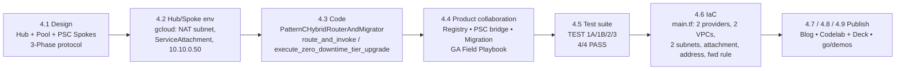

## Workstream 4 — Pattern C: Dynamic Hybrid Hub-and-Spoke (Milestone 3, Week 10)

> **Source folder**: [`workstream-4-pattern-c-hybrid/`](../workstream-4-pattern-c-hybrid/) • **Companion blog**: [`blogs/ws4-pattern-c-hybrid-dynamic-tiering.md`](../blogs/ws4-pattern-c-hybrid-dynamic-tiering.md) • **Editable deck**: [`slides/ws4-pattern-c-hybrid-editable-slides.pptx`](../slides/ws4-pattern-c-hybrid-editable-slides.pptx) (Figures 1–4 = Diagrams 10–13 in this guide)
> **Program slot**: Weeks 7–10 • Milestone 3 • Week 10 release (per [`README.md`](../README.md) §1 table and the deliverable headers).

### 1. Objective & outcome

**Objective.** Pattern C answers the question left open by Workstreams 2 and 3: how does a tiered B2B SaaS vendor run *one* control plane that serves Standard-tier tenants from the cost-optimised shared pool (Pattern A economics) **and** Enterprise-tier tenants from dedicated, CMEK-encrypted, VPC-SC spoke projects (Pattern B sovereignty) — and then move a live customer from one tier to the other without a maintenance window?

Using the Cymbal anchor case study from [`README.md`](../README.md) §2:

| Tenant | Tier | Pattern C placement | Budget | Identity / tools |
| :--- | :--- | :--- | :--- | :--- |
| **RetailStream Corp** | Standard → *upgraded to* Enterprise | Starts on `pool://cymbal-shared-pooled-runtime-v2`; promoted live to `psc://10.10.0.51/...` | `4,000` thinking cap → `8,000` | Microsoft Entra ID; SharePoint / ServiceNow via inline 3LO |
| **FinVault Bank** | Enterprise | `psc://10.10.0.50/projects/cymbal-finvault-silo-prod/serviceAttachments/finvault-agent-spoke-psc` | `8,000` | Google Workspace OIDC; private `Agent Alpha` (Claude Sonnet); Workspace / Jira 3LO |

**Outcome (as verified by the deliverables).**

- A **Unified Hybrid Control Hub** in project `cymbal-hybrid-hub-prod` (External ALB + Cloud Armor + IAP, Cloud Run Router, Firestore Route Table, Cross-Project GEAP Registry) fronts both tiers behind a single SaaS URL.
- Enterprise spokes are reached over **Private Service Connect (PSC)** — producer `ServiceAttachment` in the spoke, consumer forwarding rule in the hub — with `ACCEPT_MANUAL` and a hub-only accept list.
- A **3-Phase Zero-Downtime Tier Migration Engine** (`SHADOW_SYNC` → `ATOMIC_CUTOVER` → `DRAIN_AND_VERIFY`) promotes `retailstream` mid-session; the 4.5 suite prints `ALL 4 PATTERN C (DYNAMIC HYBRID & LIVE TIER UPGRADE) TESTS PASSED (100% VERIFIED)` with `replication_lag_ms == 0` and `dropped_sessions == 0`.
- The same `core-cymbal-agent/` engine (80% reusable code) is reused; Pattern C adds only the router, registry federation and migrator (the 20% delta).

### 2. Deliverables map

| # | Deliverable | Purpose | Key content | Visualised by |
| :--- | :--- | :--- | :--- | :--- |
| 4.1 | [`4.1-case-study-and-solution-architecture.md`](../workstream-4-pattern-c-hybrid/4.1-case-study-and-solution-architecture.md) | Case study + reference architecture | Why tiered SaaS converges on Pattern C; Mermaid topology of Hub / Shared Pool / FinVault spoke / RetailStream spoke; the 3-Phase migration protocol with the Firestore `tenant_routing_table['retailstream']` fields | **Diagram 10** (deck Figure 1) |
| 4.2 | [`4.2-hub-and-spoke-demo-env-setup.md`](../workstream-4-pattern-c-hybrid/4.2-hub-and-spoke-demo-env-setup.md) | Demo environment runbook | `gcloud` steps: PSC NAT subnet `10.40.240.0/24`, service attachment `finvault-agent-spoke-psc` (`ACCEPT_MANUAL`, accept list `cymbal-hybrid-hub-prod=10`), hub address `10.10.0.50`, forwarding rule `psc-consumer-finvault`; verify via the 4.5 suite | **Diagram 11** (deck Figure 2) |
| 4.3 | [`4.3-solution-implementation/pattern_c_hybrid_router_and_migrator.py`](../workstream-4-pattern-c-hybrid/4.3-solution-implementation/pattern_c_hybrid_router_and_migrator.py) | Router + migrator code | `PatternCHybridRouterAndMigrator`, `route_and_invoke()`, `execute_zero_downtime_tier_upgrade()` | — (code; exercised by Diagram 12) |
| 4.4 | [`4.4-product-collaboration-psc-and-registry.md`](../workstream-4-pattern-c-hybrid/4.4-product-collaboration-psc-and-registry.md) | Product collaboration + GA Field Enablement Playbook | 3 capability alignments (registry, PSC bridge, live migration); 15-minute triage; 4-step live-upgrade runbook | — |
| 4.5 | [`4.5-zero-downtime-tier-upgrade-suite/run_tier_migration_suite.py`](../workstream-4-pattern-c-hybrid/4.5-zero-downtime-tier-upgrade-suite/run_tier_migration_suite.py) | Automated verification suite | TEST 1A / 1B / 2 / 3 with assertions on topology, budget, endpoint, phases, CMEK | **Diagram 12** (deck Figure 3) |
| 4.6 | [`4.6-terraform-hybrid-psc-blueprint/`](../workstream-4-pattern-c-hybrid/4.6-terraform-hybrid-psc-blueprint/README.md) ([`main.tf`](../workstream-4-pattern-c-hybrid/4.6-terraform-hybrid-psc-blueprint/main.tf), [`variables.tf`](../workstream-4-pattern-c-hybrid/4.6-terraform-hybrid-psc-blueprint/variables.tf), [`terraform.tfvars.example`](../workstream-4-pattern-c-hybrid/4.6-terraform-hybrid-psc-blueprint/terraform.tfvars.example)) | IaC for the PSC bridge | Dual provider aliases, hub VPC/subnet, spoke VPC + PSC NAT subnet, service attachment, consumer address + forwarding rule, 2 outputs | **Diagram 13** (deck Figure 4) |
| 4.7 | [`4.7-blog-dynamic-tiering-and-migration.md`](../workstream-4-pattern-c-hybrid/4.7-blog-dynamic-tiering-and-migration.md) | Flagship deep-dive blog (Part 3 of 4) | PSC vs VPC peering table; 3-phase deep dive with the `replace()` code; 4-gate verification table; social promotion kit | Embeds Diagram 10 (as `diagrams/...png`) |
| 4.8 | [`4.8-codelab-and-workshop-deck/codelab-90min-multi-pattern-master-lab.md`](../workstream-4-pattern-c-hybrid/4.8-codelab-and-workshop-deck/codelab-90min-multi-pattern-master-lab.md) + [`workshop-deck-pattern-c.md`](../workstream-4-pattern-c-hybrid/4.8-codelab-and-workshop-deck/workshop-deck-pattern-c.md) | 90-min L400 codelab + 10-slide workshop deck | 4 modules with verification gates; 10 slide outlines | — |
| 4.9 | [`4.9-go-demos-and-video-script.md`](../workstream-4-pattern-c-hybrid/4.9-go-demos-and-video-script.md) | `go/demos` catalog entry + 5-minute video script | Slug `geap-multi-tenant-pattern-c-hybrid`; 5 timestamped beats | — |

#### Deliverables without a dedicated diagram

**4.3 — `PatternCHybridRouterAndMigrator`** ([source](../workstream-4-pattern-c-hybrid/4.3-solution-implementation/pattern_c_hybrid_router_and_migrator.py))

- `__init__` instantiates `CymbalMultiTenantRuntime` from `core-cymbal-agent/runtime_pipeline.py` and an in-memory `routing_table` seeded with two entries: `finvault` (`ENTERPRISE`, `PATTERN_C_HYBRID_PSC_SPOKE`, `psc://10.10.0.50/projects/cymbal-finvault-silo-prod/serviceAttachments/finvault-agent-spoke-psc`, budget `8000`, `STEADY_STATE_SPOKE`) and `retailstream` (`STANDARD`, `PATTERN_C_HYBRID_POOL`, `pool://cymbal-shared-pooled-runtime-v2`, budget `4000`, `cmek_key_uri=None`, `STEADY_STATE_POOL`).
- `route_and_invoke()` calls `hop1.authenticate_and_mint_context()` first, indexes `routing_table[ctx.tenant_id]` (never a client header), passes the resolved `topology` into `runtime.handle_agent_turn()`, and attaches a `hybrid_route` receipt (`tenant_id`, `tier`, `topology`, `target_endpoint`, `migration_state`).
- `execute_zero_downtime_tier_upgrade()` runs the three phases strictly against the instance-scoped `self.runtime.tenant_profiles` (comment: "never mutates global `TENANT_PROFILES`"): Phase 1 selects the tenant's rows via `hop5.query_alloydb_with_rls()` and records `replication_lag_ms: 0` / `psc_health_check: PSC_CONNECTION_ACCEPTED`; Phase 2 uses `dataclasses.replace()` to set `tier=ENTERPRISE`, `thinking_token_budget=8000`, `redis_rpm_limit=600`, CMEK, `dedicated_project_id`, `psc_service_attachment`, and rewrites the route to `psc://10.10.0.51/{attachment}` with `migration_state=UPGRADED_ZERO_DOWNTIME_SPOKE`; Phase 3 appends `dropped_sessions: 0`, `status: MIGRATION_COMPLETE`. All three records go to `migration_audit_log`.

**4.4 — Product collaboration outcomes & GA playbook** ([source](../workstream-4-pattern-c-hybrid/4.4-product-collaboration-psc-and-registry.md))

- **Cross-Project GEAP Agent Registry**: spoke-published agent cards (`Agent Alpha` in `cymbal-finvault-silo-prod`) must be discoverable by the hub without exposing the spoke to other tenants → federated Firestore/Registry sync with cryptographic `tenant_id` PDP enforcement at Hop 2.
- **PSC Spoke Bridge**: eliminates VPC-peering CIDR exhaustion across hundreds of spokes and supports VPC-SC ingress rules for the router service account → producer `google_compute_service_attachment` per spoke + consumer `google_compute_forwarding_rule` in the hub.
- **Zero-Downtime Live Tier Migration**: upgrade mid-business-day with `0` dropped turns → 3-phase state machine. The playbook adds a 15-minute triage (3 questions → Pattern A / B / C) and a 4-step runbook: run the 4.6 module → call `execute_zero_downtime_tier_upgrade()` → verify `replication_lag_ms == 0` and `PSC_CONNECTION_ACCEPTED` → confirm in BigQuery OTel that turns carry `PATTERN_C_HYBRID_PSC_SPOKE` with `8,000` budget and CMEK.

**4.7 — Flagship blog** ([source](../workstream-4-pattern-c-hybrid/4.7-blog-dynamic-tiering-and-migration.md))

- Front-matter: Part 3 of 4, `14 min read`, `status: PUBLISH_READY`; TL;DR frames the pooled-to-sovereign chasm.
- §3 PSC vs VPC peering table (CIDR, directionality, 25-peering limit vs hundreds of spokes, VPC-SC allowlisting via `consumer_accept_lists`).
- §4 reproduces the Phase 2 `replace()` block verbatim; §5 the 4-gate table; §6 a LinkedIn/X promotion kit; closes with a pointer to Part 4 (`5.2`).

**4.8 — Codelab & workshop deck** ([codelab](../workstream-4-pattern-c-hybrid/4.8-codelab-and-workshop-deck/codelab-90min-multi-pattern-master-lab.md) • [deck](../workstream-4-pattern-c-hybrid/4.8-codelab-and-workshop-deck/workshop-deck-pattern-c.md))

- Codelab (L400, 90 min): **Module 1** `00:00–00:20` configure the tenant-aware router (verify `STANDARD`→Pool `4k`, `ENTERPRISE`→PSC `8k`); **Module 2** `00:20–00:45` wire producer attachments & consumer endpoints (inspect `main.tf`); **Module 3** `00:45–01:10` execute `SHADOW_SYNC` + `ATOMIC_CUTOVER` (verify `replication_lag_ms == 0` and the route flip); **Module 4** `01:10–01:30` verify `DRAIN_AND_VERIFY` continuity on `sess-rs-live-upgrade-01`.
- Hands-on steps: read `route_and_invoke()`, trace `execute_zero_downtime_tier_upgrade()`, run `python3 workstream-4-pattern-c-hybrid/4.5-zero-downtime-tier-upgrade-suite/run_tier_migration_suite.py`.
- Workshop deck: 10 slides — title, multi-tier growth journey, hub-and-spoke with PSC, why PSC, cross-project registry (`403 Forbidden` for Standard users), the upgrade challenge, 3-phase state machine, live demo on `sess-rs-live-upgrade-01`, GA decision matrix, wrap-up.

**4.9 — `go/demos` package & video script** ([source](../workstream-4-pattern-c-hybrid/4.9-go-demos-and-video-script.md))

- Catalog metadata: slug `geap-multi-tenant-pattern-c-hybrid`; products GEAP, PSC, Firestore, AlloyDB, Cloud KMS (CMEK), Vertex AI Model Armor, BigQuery OTel; blueprint = 4.6; codelab = 4.8.
- Five demo beats (165 WPM): `00:00–00:50` topology diagram; `00:50–02:10` pre-upgrade traffic (TEST 1A/1B — RS clamped to 4,000 on `pool://`, FV on `psc://10.10.0.50` with 8,000); `02:10–03:40` `execute_zero_downtime_tier_upgrade` phases 1–3 with the flip to `psc://10.10.0.51`; `03:40–04:30` TEST 3 session continuity; `04:30–05:00` terminal `ALL 4 PATTERN C TESTS PASSED`.

### 3. End-to-end flow of the workstream



1. **Design (4.1).** Establish the three-project topology (hub `cymbal-hybrid-hub-prod`, FinVault spoke `cymbal-finvault-silo-prod`, RetailStream upgrade target `cymbal-retailstream-spoke-prod`) and the 3-phase protocol with the exact Firestore fields that flip at cutover (`topology`, `tier`, `thinking_token_budget` `4000`→`8000`, `psc_service_attachment`). → **Diagram 10**.
2. **Hub/spoke environment (4.2).** Stand up the producer side in the spoke (`finvault-psc-nat-subnet` `10.40.240.0/24`, `finvault-agent-spoke-psc` with `ACCEPT_MANUAL` and `--consumer-accept-list cymbal-hybrid-hub-prod=10`) and the consumer side in the hub (`psc-endpoint-finvault-ip` = `10.10.0.50` in `cymbal-hub-subnet`, `psc-consumer-finvault` on `cymbal-hub-vpc`). → **Diagram 11**.
3. **Router + migrator code (4.3).** Implement the tenant-aware router over the shared runtime and the instance-scoped migration state machine.
4. **Product collaboration (4.4).** Align registry federation, the PSC bridge and live migration with product engineering; publish the GA playbook that calls 4.6 and 4.3 in order.
5. **Zero-downtime test suite (4.5).** Prove the claim on the *same* session id, before and after the cutover. → **Diagram 12**.
6. **IaC (4.6).** Codify the network half of step 2 as a parameterised Terraform root module keyed on `enterprise_tenant_id`. → **Diagram 13**.
7. **Publish (4.7 / 4.8 / 4.9).** Flagship blog, 90-minute codelab + 10-slide deck, `go/demos` entry + video script; the companion blog [`blogs/ws4-pattern-c-hybrid-dynamic-tiering.md`](../blogs/ws4-pattern-c-hybrid-dynamic-tiering.md) and `.deck.json` drive the editable `.pptx`.

#### Shared template note for Diagrams 10–13

All four WS4 diagrams are rendered by the same hub-and-spoke template in [`scripts/build_all_workstream_diagrams.mjs`](../scripts/build_all_workstream_diagrams.mjs) (Diagram 10 is configured inline at lines 395–459; Diagrams 11–13 are loaded from [`scripts/blueprints_ext/`](../scripts/blueprints_ext/)). The template fixes the geometry: a top actor; an outer wrapper and an inner wrapper; a **routing hub** with 5 cards (`topLeft`, `midLeft`, `botLeft`, `topRight`, `botRight`) and 3 bracket callouts (`edgeTopLeft/MidLeft/BotLeft`); a **governance hub** with 3 stacked cards; a **left spoke** and a **right spoke** of 5 cards each (`modelArmor`, `llm`, `runtime`, `mcp`, `datastore`); and royal-blue step badges **1** and **7** (top), **2** and **7** (routing hub), **3** and **7** (central trunk), **4 / 6 / 5** (left spoke only). The right spoke has *no* numbered badges — only its two `ragLabel` / `toolLabel` callouts. Each build emits 56 editable shapes, 23 connectors and 54 Vision-AST addressable objects.

### Diagram 10 — Pattern C: Dynamic Hybrid Hub-and-Spoke, Private Service Connect (PSC) & Live Tier Migration

| Field | Value |
| :--- | :--- |
| Diagram ID | `ws4-pattern-c-hybrid-psc-and-migration` |
| Source deliverable | [`4.1-case-study-and-solution-architecture.md`](../workstream-4-pattern-c-hybrid/4.1-case-study-and-solution-architecture.md) (also embedded by 4.7) |
| Badge | `WORKSTREAM 4.1 • PATTERN C BLUEPRINT` |
| Subtitle | `Milestone 3 (Weeks 7–10) • Unified Control Plane Routing Standard to Shared Pool & Enterprise to PSC Spokes (0 Dropped Turns)` |
| Files | [`.drawio`](../diagrams/ws4-pattern-c-hybrid-psc-and-migration.drawio) • [`.drawio.xml`](../diagrams/ws4-pattern-c-hybrid-psc-and-migration.drawio.xml) • [`.drawio.png`](../diagrams/ws4-pattern-c-hybrid-psc-and-migration.drawio.png) • [`.svg`](../diagrams/ws4-pattern-c-hybrid-psc-and-migration.svg) • [`.png`](../diagrams/ws4-pattern-c-hybrid-psc-and-migration.png) • [`vision.json`](../diagrams/vision_metadata/ws4-pattern-c-hybrid-psc-and-migration.vision.json) |
| Blueprint config | [`build_all_workstream_diagrams.mjs` L395–459](../scripts/build_all_workstream_diagrams.mjs) |
| Editable deck | [`ws4-pattern-c-hybrid-editable-slides.pptx`](../slides/ws4-pattern-c-hybrid-editable-slides.pptx) — **Figure 1** |
| Shape stats | 56 editable shapes • 23 connectors • 54 vision objects (`vertexCount: 56`, `edgeCount: 23`, `addressableObjectCount: 54`, `isCertified: true`) |


#### The question this diagram answers

*"How can one SaaS hostname serve a pooled Standard tier and a sovereign Enterprise tier at the same time — and how does a tenant move from the left side to the right side without anyone noticing?"* It is the architecture blueprint of 4.1 rendered on the shared template: routing on top, the migration engine as the governance hub, pool on the left, PSC spokes on the right.

#### Zone-by-zone walkthrough

**Top actor.** `Standard & Enterprise` / `Single Unified SaaS URL`. Step **1 `Request`** enters; step **7 `Response`** returns. One actor for both tiers is the point of Pattern C.

**Outer & inner boundary labels.**
- Outer: `Unified Hybrid Control Hub (cymbal-hybrid-hub-prod) + PSC Bridge to Sovereign Spokes`
- Inner: `Hub VPC • Tenant-Aware Router & 3-Phase Live Tier Migrator`

**Routing hub — `Unified Control Plane & Intelligent Router Hub`** (sub: `Firestore live routing table + Cross-Project GEAP Registry`)

| Slot | Icon (meaning) | Title | Subtitle | Bracket label |
| :--- | :--- | :--- | :--- | :--- |
| topLeft | `load_balancer_cloud_armor` (edge WAF/IAP) | `Cloud Armor & IAP` | `Single SaaS URL + OBO/DPoP` | `Security policies` |
| midLeft | `model_armor` (policy/registry filter) | `Cross-Project ARD` | `Federated GEAP Registry` | `Resolve agent route` |
| botLeft | `iap_iam_shield` (authoritative lookup) | `Firestore Route Table` | `Maps Tenant -> Pool or PSC` | `Atomic route lookup` |
| topRight | `load_balancer_cloud_armor` | `External Application` / `Load Balancer` | `Cloud Load Balancing` | — |
| botRight | `cloud_run` | `Cloud Run Router` | `Tier Router & Live Migrator` | — |

Step **2 `Request`** / **7 `Response`** badges sit between the ALB and the Cloud Run Router. ("ARD" is not expanded anywhere in the WS4 sources.)

**Central governance hub — `3-Phase Zero-Downtime` / `Tier Migration Engine`**

| Slot | Icon | Title | Subtitle |
| :--- | :--- | :--- | :--- |
| top | `cloud_run` | `1. SHADOW_SYNC` / `(0ms Lag Copy)` | `Streams RLS & L4 Memory` |
| mid | `iap_iam_shield` | `2. ATOMIC_CUTOVER` | `Flips Firestore Route to PSC` |
| bot | `cloud_logging` | `3. DRAIN_AND_VERIFY` | `0 Dropped Turns (4/4 PASS)` |

Governance callout: `Live promotion: Pool -> PSC Spoke` — this is the dashed line that carries RetailStream from the left spoke to the right.

**Central trunk.** Step **3** `Route Standard to Pool or Enterprise via PSC`; step **7** `Seamless response (0 dropped sessions)`.

**Left spoke.**
- Boundary: `Standard Tier: Shared Pooled Plane (Initial RetailStream Route)`
- Zone title / sub: `Shared Pooled Runtime` / `pool://cymbal-shared-pooled-v2 (90% Cache Savings)`
- Cards: `Shared Model Armor` (`Multi-Tenant Prompt & SDP`); `Gemini 2.5 Pro` (`4,000 Thinking Cap + Cache`); `Pooled Runtime` (`Serves Standard SaaS Tier`); `Pooled MCP Hub` (`2LO + Delegated 3LO Tools`); `Shared AlloyDB RLS` (`Source for Phase 1 Shadow Sync`)
- Steps: **4** `Sanitize request`, **6** `Sanitize response`, **5** `Pooled inference`
- RAG / tool labels: `Shared Pool RAG`; `Streams State to PSC Spoke`

**Right spoke.**
- Boundary: `Enterprise Tier: Private Service Connect (PSC) Spokes (FinVault + Upgraded RetailStream)`
- Zone title / sub: `Dedicated Enterprise PSC Spokes` / `psc://10.10.0.50 (FinVault) & psc://10.10.0.51 (Retail)`
- Cards: `Spoke Model Armor` (`Dedicated Spoke DLP & NLC`); `Gemini & Claude 3.7` (`Upgraded 8,000 Thinking Cap`); `Spoke Runtime` (`PSC ServiceAttachment Target`); `Dedicated Spoke MCP` (`Isolated Inside VPC-SC Spoke`); `CMEK Spoke AlloyDB` (`Replicated State + CMEK Lock`)
- RAG / tool labels: `Unidirectional PSC Bridge`; `CMEK-Encrypted Spoke Storage`

**Steps 1–7 narrative.** (1) A user of either tier sends a request to the single SaaS URL. (2) Cloud Armor + IAP apply security policies and the request reaches the Cloud Run Router through the External ALB, carrying the Hop 1 OBO/DPoP context. The router resolves the agent through the Cross-Project ARD and performs an atomic Firestore route lookup. (3) The trunk fans out: Standard → pool, Enterprise → PSC. (4) In the pool, Shared Model Armor sanitises the request; (5) Gemini 2.5 Pro performs pooled inference under the 4,000 cap with shared cache, pulling Shared Pool RAG via the Pooled MCP Hub and RLS-scoped rows from Shared AlloyDB; (6) Shared Model Armor sanitises the response. For Enterprise traffic the same 4–6 flow happens inside the dedicated spoke over the unidirectional PSC bridge (no badges are drawn there). Independently, the governance hub runs SHADOW_SYNC (streaming RLS rows and L4 memory from the left datastore to the right), ATOMIC_CUTOVER (flipping the Firestore route to PSC) and DRAIN_AND_VERIFY. (7) The response returns through the trunk, router and ALB — "Seamless response (0 dropped sessions)".

#### Grounding in the source

- Hub project `cymbal-hybrid-hub-prod`; FinVault spoke `cymbal-finvault-silo-prod` (VPC-SC); RetailStream target `cymbal-retailstream-spoke-prod` — 4.1 §2/§3.
- Endpoints `psc://10.10.0.50/...finvault-agent-spoke-psc` and `pool://cymbal-shared-pooled-runtime-v2` — 4.3 `routing_table`; `.51` for the upgraded RetailStream — 4.3 Phase 2 / 4.5 TEST 3.
- Cutover fields: `topology: PATTERN_C_HYBRID_PSC_SPOKE`, `tier: ENTERPRISE`, `thinking_token_budget: 4000 → 8000`, `psc_service_attachment: projects/cymbal-retailstream-spoke-prod/regions/us-central1/serviceAttachments/retailstream-agent-spoke-psc` — 4.1 §3.
- Gate conditions `replication lag 0 ms` + `PSC_CONNECTION_ACCEPTED` before cutover — 4.1 §3, 4.3 `phase1_record`.
- `4/4 PASS` = the four `[PASS]` lines of 4.5 (TEST 1A, 1B, 2, 3).
- Pool "90% Cache Savings" and `4,000` cap, Enterprise `8,000` and CMEK — README §2 and 4.1 §1.

#### Design decisions & trade-offs

- **Route isolation rather than duplicate it.** One ALB/Armor/IAP front door and one router; the tier decision is a Firestore lookup keyed on the Hop 1 `tenant_id`. Trade-off: the hub becomes a shared blast-radius component for both tiers.
- **PSC instead of VPC peering** for spoke connectivity: NAT-based, no CIDR coordination, unidirectional, VPC-SC-friendly; cost is an extra forwarding rule + address per spoke.
- **Migration engine lives in the hub** (governance zone) so the cutover is a single control-plane write; the data-plane copy (Phase 1) happens from the left datastore to the right while the pool keeps serving.
- The right spoke intentionally shows *two* tenants (FinVault and upgraded RetailStream) in one zone to keep the 5-card template; per-tenant separation is expressed only in the zone subtitle.

#### Caveats / known gaps

- `pool://cymbal-shared-pooled-v2` (left zone subtitle) vs `pool://cymbal-shared-pooled-runtime-v2` (4.3 code, Diagrams 11/12) — label abbreviation, not a different endpoint.
- `Gemini & Claude 3.7` on the right `llm` card; README §2 and 4.1 say `Agent Alpha` runs **Claude Sonnet** on Vertex AI Model Garden — no WS4 source pins a `3.7` version.
- `Firestore Route Table` and `ATOMIC_CUTOVER` cards use the `iap_iam_shield` icon; the template has no Firestore icon.
- `vision.json` `extractedZones` text is template-generic (mentions SCC / IAM PAB in Zone 2 although the governance hub here is the migration engine), and its `validationReport` reads `valid: false, errorCount: 34` while `isCertified: true`. The guide reports this as-is.
- No DNS, no Cloud KMS resources, and no VPC-SC perimeter are drawn; 4.1 mentions CMEK/VPC-SC in prose only.
- Hub project name in 4.1's Mermaid (`cymbal-hybrid-hub-prod`) matches; 4.7's Mermaid names the upgraded spoke `cymbal-retailstream-silo-prod`, whereas 4.1/4.3/4.5 use `cymbal-retailstream-spoke-prod` (naming drift in the blog).

#### How to edit / reuse

- Change any label in the inline blueprint object (L395–459 of [`build_all_workstream_diagrams.mjs`](../scripts/build_all_workstream_diagrams.mjs)) and rebuild; all five output files and the `vision.json` regenerate together (the build uses headless Chrome — run it in the background per the repo's conventions).
- For quick one-off edits open the [`.drawio`](../diagrams/ws4-pattern-c-hybrid-psc-and-migration.drawio) in diagrams.net; cards are HTML-labelled rounded rectangles with embedded Base64 icons, so text is directly editable.
- The `.pptx` Figure 1 slides are native shapes (`appendEditableDrawioSlides`); rebuild via `scripts/build_editable_slide_decks.ts` after changing the diagram.

### Diagram 11 — Pattern C Demo Environment: Central Ingress Hub, Shared Pool & PSC Service Attachment Spokes

| Field | Value |
| :--- | :--- |
| Diagram ID | `ws4-hub-and-spoke-demo-env-setup-topology` |
| Source deliverable | [`4.2-hub-and-spoke-demo-env-setup.md`](../workstream-4-pattern-c-hybrid/4.2-hub-and-spoke-demo-env-setup.md) (+ 4.1, 4.3 per blueprint header) |
| Badge | `WORKSTREAM 4.2 • HUB-AND-SPOKE DEMO ENV SETUP` |
| Subtitle | `Provisioning Topology • cymbal-hybrid-hub-prod Consumer Endpoints (10.10.0.50/.51) → Producer ServiceAttachments in Tenant Spokes (us-central1)` |
| Files | [`.drawio`](../diagrams/ws4-hub-and-spoke-demo-env-setup-topology.drawio) • [`.drawio.xml`](../diagrams/ws4-hub-and-spoke-demo-env-setup-topology.drawio.xml) • [`.drawio.png`](../diagrams/ws4-hub-and-spoke-demo-env-setup-topology.drawio.png) • [`.svg`](../diagrams/ws4-hub-and-spoke-demo-env-setup-topology.svg) • [`.png`](../diagrams/ws4-hub-and-spoke-demo-env-setup-topology.png) • [`vision.json`](../diagrams/vision_metadata/ws4-hub-and-spoke-demo-env-setup-topology.vision.json) |
| Blueprint config | [`scripts/blueprints_ext/12-ws4-hub-and-spoke-demo-env-setup-topology.mjs`](../scripts/blueprints_ext/12-ws4-hub-and-spoke-demo-env-setup-topology.mjs) |
| Editable deck | [`ws4-pattern-c-hybrid-editable-slides.pptx`](../slides/ws4-pattern-c-hybrid-editable-slides.pptx) — **Figure 2** |
| Shape stats | 56 editable shapes • 23 connectors • 54 vision objects |


#### The question this diagram answers

*"What exactly do I create, in which project, and in which direction, to stand up the Pattern C demo?"* It is the 4.2 `gcloud` runbook laid onto the template: consumer side (hub) on top, address reservation in the governance zone, the pool on the left, the producer-side tenant spoke on the right.

#### Zone-by-zone walkthrough

**Top actor.** `Platform Operator (FDE)` / `gcloud + Terraform Provisioning`. Step **1 `Provision`**; step **7 `Verify`**.

**Outer & inner boundary labels.**
- Outer: `Project 1: Cymbal Unified Control Plane & Ingress Hub (cymbal-hybrid-hub-prod • us-central1)`
- Inner: `cymbal-hub-vpc • cymbal-hub-subnet • NAT-Based PSC Consumer Endpoints (No CIDR Overlap)`

**Routing hub — `Central Ingress Hub (Consumer Side)`** (sub: `Firestore live routing table + cross-project GEAP registry`)

| Slot | Icon | Title | Subtitle | Bracket label |
| :--- | :--- | :--- | :--- | :--- |
| topLeft | `load_balancer_cloud_armor` | `Global ALB + Armor` | `IAP Hop 1 • Single SaaS URL` | `Ingress & WAF policies` |
| midLeft | `iap_iam_shield` | `Firestore Route Table` | `tenant_routing_table[id]` | `Resolve tier Pool or PSC` |
| botLeft | `mcp_servers` | `Cross-Project Registry` | `Federated GEAP Agent Cards` | `Discover spoke agents` |
| topRight | `load_balancer_cloud_armor` | `PSC Consumer` / `Forwarding Rule` | `psc-consumer-finvault` | — |
| botRight | `cloud_run` | `Cloud Run Router` | `Tenant-Aware Ingress Router` | — |

Step **2 `Provision`** / **7 `Verify`** between the forwarding-rule card and the router.

**Central governance hub — `Hub VPC Addressing &` / `PSC Endpoint Reservation`**

| Slot | Icon | Title | Subtitle |
| :--- | :--- | :--- | :--- |
| top | `iap_iam_shield` | `psc-endpoint-` / `finvault-ip` | `10.10.0.50 • cymbal-hub-subnet` |
| mid | `load_balancer_cloud_armor` | `Target Service` / `Attachment URI` | `projects/../serviceAttachments` |
| bot | `cloud_logging` | `Tier Upgrade Suite` | `run_tier_migration_suite.py` |

Governance callout: `Hub reserves consumer endpoints`.

**Central trunk.** Step **3** `Reserve IP & bind attachment`; step **7** `Hybrid routing verified locally`.

**Left spoke.**
- Boundary: `Standard Tier: Shared Pooled Compute & RLS Plane (RetailStream Initial Route)`
- Zone title / sub: `Shared Pooled Runtime` / `pool://cymbal-shared-pooled-runtime-v2`
- Cards: `Shared Model Armor` (`Multi-Tenant Prompt Screen`); `Pooled GEAP Runtime` (`4,000 Thinking Cap`); `ContextCacheConfig` (`Shared Prefix Cache`); `Pooled MCP Hub` (`Shared Incident Agent v2`); `Shared AlloyDB RLS` (`tenant_id Row-Level Security`)
- Steps: **4** `Route Standard`, **6** `Pooled response`, **5** `Pooled inference`
- RAG / tool labels: `Shared Pool RAG`; `RLS-scoped tenant rows`

**Right spoke.**
- Boundary: `Enterprise Tier: PSC Producer Spoke (cymbal-finvault-silo-prod • finvault-sovereign-vpc • VPC-SC)`
- Zone title / sub: `Dedicated Tenant Spoke (Producer)` / `finvault-agent-spoke-psc (ACCEPT_MANUAL)`
- Cards: `PSC NAT Subnet` (`10.40.240.0/24 PSC purpose`, LB icon); `Spoke ILB Fwd Rule` (`finvault-spoke-ilb-fwd-rule`, LB icon); `Spoke GEAP Runtime` (`Agent Alpha • 8,000 Budget`); `Local Spoke MCP` (`Google / Jira Connectors`); `CMEK Spoke AlloyDB` (`Dedicated + Cloud KMS CMEK`)
- RAG / tool labels: `Consumer accept hub project=10`; `Unidirectional producer exposure`

**Steps 1–7 narrative.** (1) The FDE starts provisioning. (2) In the hub project the ingress stack (Global ALB + Armor + IAP), the Firestore route table and the cross-project registry are configured, and the `psc-consumer-finvault` forwarding rule is created beside the Cloud Run router. (3) The governance zone reserves `psc-endpoint-finvault-ip` (`10.10.0.50`) in `cymbal-hub-subnet` and binds it to the spoke's `projects/.../serviceAttachments/finvault-agent-spoke-psc` URI. (4) Standard traffic is routed to the pool; (5) pooled inference runs with the 4,000 cap and shared prefix cache; (6) the pooled response returns. On the producer side (no badges), the spoke owns the `10.40.240.0/24` PSC NAT subnet and the ILB forwarding rule published as `finvault-agent-spoke-psc` with `ACCEPT_MANUAL` and an accept list of the hub project only. (7) The operator runs `run_tier_migration_suite.py` locally and the trunk reports "Hybrid routing verified locally".

#### Grounding in the source

- `gcloud compute networks subnets create finvault-psc-nat-subnet --network=finvault-sovereign-vpc --range=10.40.240.0/24 --purpose=PRIVATE_SERVICE_CONNECT` — 4.2 §2.
- `gcloud compute service-attachments create finvault-agent-spoke-psc --producer-forwarding-rule=finvault-spoke-ilb-forwarding-rule --connection-preference=ACCEPT_MANUAL --consumer-accept-list="cymbal-hybrid-hub-prod=10" --nat-subnets=finvault-psc-nat-subnet` — 4.2 §2 (the diagram's `hub project=10` label).
- `gcloud compute addresses create psc-endpoint-finvault-ip --subnet=cymbal-hub-subnet --addresses=10.10.0.50` and `gcloud compute forwarding-rules create psc-consumer-finvault --network=cymbal-hub-vpc --target-service-attachment=projects/${SPOKE_PROJECT}/regions/${REGION}/serviceAttachments/finvault-agent-spoke-psc` — 4.2 §3.
- "No IP CIDR Overlap" (every spoke can reuse `10.40.0.0/20`) and "Unidirectional Producer Exposure" — 4.2 §1.
- Verification command `python3 workstream-4-pattern-c-hybrid/4.5-zero-downtime-tier-upgrade-suite/run_tier_migration_suite.py` — 4.2 §4.
- `tenant_routing_table[id]` field name — 4.1 §3 (`tenant_routing_table['retailstream']`).

#### Design decisions & trade-offs

- **Producer in the spoke, consumer in the hub.** The tenant publishes; the hub subscribes. This gives the tenant project control of exposure (accept list, connection limit) and keeps lateral movement impossible from spoke to hub.
- **`ACCEPT_MANUAL` + explicit accept list** over `ACCEPT_AUTOMATIC`: safer, but each new hub project (e.g., a staging hub) requires a producer-side change.
- **Static `10.10.0.50` reservation** makes the endpoint predictable for the Firestore route table; it also means each additional spoke needs its own reserved address (`.51` for RetailStream in 4.3/4.5).
- Reusing the shared template means the pool is drawn even though 4.2 provisions no pool resources — it is included for routing context.

#### Caveats / known gaps

- **Naming drift**: 4.2 uses `cymbal-hub-vpc` / `cymbal-hub-subnet`; 4.6 Terraform creates `cymbal-hybrid-hub-vpc` / `cymbal-hybrid-hub-subnet`. The diagram follows 4.2.
- **Forwarding rule name drift**: 4.2 `finvault-spoke-ilb-forwarding-rule`; diagram card `finvault-spoke-ilb-fwd-rule` (abbreviated); 4.6 tfvars `finvault-spoke-ilb`.
- The subtitle says consumer endpoints `10.10.0.50/.51`, but 4.2 only creates `.50`; `.51` appears only in 4.3/4.5 code (and 4.7/4.8 prose), never in a `gcloud` or Terraform command.
- `10.40.0.0/20` is mentioned as the reusable spoke range (4.2 §1, 4.7 §3) but no source creates it; only the `/24` NAT subnet is provisioned.
- No DNS (Cloud DNS / PSC DNS names) in any WS4 source; the hub router addresses spokes by IP inside a `psc://` URI.
- The spoke internal load balancer and the GEAP runtime behind it are referenced but never provisioned in 4.2 or 4.6.
- 4.2 does not create the Firestore route table, registry, pool, or Cloud Run router; they appear in the diagram as context from 4.1/4.3.

#### How to edit / reuse

- Edit [`12-ws4-hub-and-spoke-demo-env-setup-topology.mjs`](../scripts/blueprints_ext/12-ws4-hub-and-spoke-demo-env-setup-topology.mjs) and rebuild. To document a second spoke (e.g., RetailStream), change the right boundary/zone subtitle and the `datastore`/`runtime` cards; the template cannot add a third spoke column.
- The right-spoke `modelArmor` and `llm` slots are repurposed for network objects (`PSC NAT Subnet`, `Spoke ILB Fwd Rule`) with the LB icon — keep that convention if you add more network cards.

### Diagram 12 — Zero-Downtime Tier Upgrade Test Sequence: SHADOW_SYNC → ATOMIC_CUTOVER → DRAIN_AND_VERIFY (4/4 PASS)

| Field | Value |
| :--- | :--- |
| Diagram ID | `ws4-zero-downtime-tier-upgrade-sequence` |
| Source deliverable | [`4.5-zero-downtime-tier-upgrade-suite/run_tier_migration_suite.py`](../workstream-4-pattern-c-hybrid/4.5-zero-downtime-tier-upgrade-suite/run_tier_migration_suite.py) (+ [`4.3`](../workstream-4-pattern-c-hybrid/4.3-solution-implementation/pattern_c_hybrid_router_and_migrator.py)) |
| Badge | `WORKSTREAM 4.5 • ZERO-DOWNTIME TIER UPGRADE SUITE` |
| Subtitle | `run_tier_migration_suite.py • Promotes retailstream Mid-Session from pool:// (4,000 cap) to psc://10.10.0.51 (8,000 budget + CMEK) with dropped_sessions == 0` |
| Files | [`.drawio`](../diagrams/ws4-zero-downtime-tier-upgrade-sequence.drawio) • [`.drawio.xml`](../diagrams/ws4-zero-downtime-tier-upgrade-sequence.drawio.xml) • [`.drawio.png`](../diagrams/ws4-zero-downtime-tier-upgrade-sequence.drawio.png) • [`.svg`](../diagrams/ws4-zero-downtime-tier-upgrade-sequence.svg) • [`.png`](../diagrams/ws4-zero-downtime-tier-upgrade-sequence.png) • [`vision.json`](../diagrams/vision_metadata/ws4-zero-downtime-tier-upgrade-sequence.vision.json) |
| Blueprint config | [`scripts/blueprints_ext/13-ws4-zero-downtime-tier-upgrade-sequence.mjs`](../scripts/blueprints_ext/13-ws4-zero-downtime-tier-upgrade-sequence.mjs) |
| Editable deck | [`ws4-pattern-c-hybrid-editable-slides.pptx`](../slides/ws4-pattern-c-hybrid-editable-slides.pptx) — **Figure 3** |
| Shape stats | 56 editable shapes • 23 connectors • 54 vision objects |


#### The question this diagram answers

*"What does the automated suite actually assert, in what order, and where does each assertion land in the architecture?"* The template is used as a before/after board: the routing hub is the test runner and router under test, the governance hub is the state machine (TEST 2), the left spoke is the pooled *before* state and the right spoke is the PSC *after* state.

#### Zone-by-zone walkthrough

**Top actor.** `Test Harness Operator` / `python3 run_tier_migration_suite.py`. Step **1 `Run suite`**; step **7 `4/4 PASS`**.

**Outer & inner boundary labels.**
- Outer: `Workstream 4.5 Test Harness • PatternCHybridRouterAndMigrator (Instance-Scoped tenant_profiles, Zero Global Mutation)`
- Inner: `Same session_id (sess-rs-live-upgrade-01) Before & After Cutover • Continuous Synthetic Traffic`

**Routing hub — `Test Runner & Router Under Test`** (sub: `route_and_invoke() + execute_zero_downtime_tier_upgrade()`)

| Slot | Icon | Title | Subtitle | Bracket label (assertion) |
| :--- | :--- | :--- | :--- | :--- |
| topLeft | `iap_iam_shield` | `TEST 1A Pre-Upgrade` | `RS -> HYBRID_POOL, cap 4000` | `assert topology HYBRID_POOL` |
| midLeft | `iap_iam_shield` | `TEST 1B Enterprise` | `FV -> psc://, budget 8000` | `assert endpoint startswith psc://` |
| botLeft | `cloud_run` | `TEST 2 Migration` | `3 phases, lag 0, dropped 0` | `assert phases len == 3` |
| topRight | `load_balancer_cloud_armor` | `Hop 1 Auth` / `OBO + DPoP` | `OIDC (FV) & Entra (RS) JWTs` | — |
| botRight | `cloud_run` | `Hybrid Router` | `routing_table[tenant_id]` | — |

Step **2 `Run suite`** / **7 `4/4 PASS`** between Hop 1 Auth and the Hybrid Router.

**Central governance hub — `3-Phase Silent Migration` / `State Machine (TEST 2)`**

| Slot | Icon | Title | Subtitle (assertion / field) |
| :--- | :--- | :--- | :--- |
| top | `datastore_alloydb_bq` | `1. SHADOW_SYNC` | `replication_lag_ms == 0` |
| mid | `iap_iam_shield` | `2. ATOMIC_CUTOVER` | `tier ENTERPRISE, budget 8000` |
| bot | `cloud_logging` | `3. DRAIN_AND_VERIFY` | `MIGRATION_COMPLETE, 0 drops` |

Governance callout: `migration audit log: 3 phases`.

**Central trunk.** Step **3** `Pre-upgrade turn then upgrade`; step **7** `TEST 3: same session on PSC`.

**Left spoke (BEFORE).**
- Boundary: `BEFORE: retailstream = STANDARD • PATTERN_C_HYBRID_POOL • STEADY_STATE_POOL (Shadow Sync Source)`
- Zone title / sub: `Pooled Source (Pre-Upgrade)` / `pool://cymbal-shared-pooled-runtime-v2`
- Cards: `Shared Model Armor` (`Pooled Prompt Screen`); `Pooled Runtime` (`Budget Clamped to 4,000`); `shared-incident-` / `diagnostic-v2` (`agent://cymbal/... (RS)`); `Pooled MCP Hub` (`Shared 2LO/3LO Tools`); `Shared AlloyDB RLS` (`query_alloydb_with_rls()`)
- Steps: **4** `Pre-upgrade turn`, **6** `Rows replicated`, **5** `200 OK clamped 4000`
- RAG / tool labels: `In-flight turn finishes on pool`; `Stream RLS rows to spoke`

**Right spoke (AFTER).**
- Boundary: `AFTER: retailstream = ENTERPRISE • PATTERN_C_HYBRID_PSC_SPOKE • UPGRADED_ZERO_DOWNTIME_SPOKE`
- Zone title / sub: `PSC Target (Post-Upgrade)` / `psc://10.10.0.51/.../retailstream-agent-spoke-psc`
- Cards: `Spoke Model Armor` (`Dedicated Spoke Guardrails`); `Spoke Runtime` (`Budget 8,000, clamped False`); `cymbal-retailstream-` / `spoke-prod` (`New Dedicated Spoke Project`, `cloud_run` icon); `Dedicated Spoke MCP` (`Isolated Spoke Connectors`); `CMEK Spoke AlloyDB` (`rs-kr / rs-agent-cmek`)
- RAG / tool labels: `TEST 3 asserts psc://10.10.0.51/`; `cmek_key_uri has rs-agent-cmek`

**Test-by-test narrative (steps 1–7).**

1. **Step 1–2 — run suite.** `run_tier_migration_suite()` builds `PatternCHybridRouterAndMigrator()` and two JWTs: FinVault (`iss https://accounts.google.com/finvault.com`, `sub sre-lead@finvault.com`) and RetailStream (`iss https://login.microsoftonline.com/retailstream-tenant-guid/v2.0`, `sub ops-eng@retailstream.com`). Hop 1 authenticates both (OBO + DPoP).
2. **TEST 1A (pre-upgrade, Standard)** — `route_and_invoke()` for `retailstream`, `session_id="sess-rs-live-upgrade-01"`, `dpop_proof_jkt="dpop_jkt_rs_401"`, `agent://cymbal/shared-incident-diagnostic-v2`, `requested_thinking_tokens=8000`. Asserts: `status_code == 200`, `hybrid_route.topology == "PATTERN_C_HYBRID_POOL"`, `runtime_config.effective_thinking_budget == 4000` (steps **4 → 5 `200 OK clamped 4000`**).
3. **TEST 1B (Enterprise PSC spoke)** — `finvault`, `session_id="sess-fv-hybrid-01"`, `agent://finvault/private-agent-alpha-regulatory`. Asserts: `200`, topology `PATTERN_C_HYBRID_PSC_SPOKE`, `target_endpoint.startswith("psc://")`, budget `8000`.
4. **TEST 2 (3-phase silent migration)** — step **3** then the governance hub: `execute_zero_downtime_tier_upgrade(tenant_id="retailstream", new_spoke_project_id="cymbal-retailstream-spoke-prod", new_psc_attachment_uri="projects/cymbal-retailstream-spoke-prod/regions/us-central1/serviceAttachments/retailstream-agent-spoke-psc", new_cmek_key_uri="projects/cymbal-retailstream-spoke-prod/locations/us-central1/keyRings/rs-kr/cryptoKeys/rs-agent-cmek")`.
   - **SHADOW_SYNC**: rows selected via `hop5.query_alloydb_with_rls()` with a migrator `CryptographicContext` (`user_principal migrator@retailstream.com`, `session_id "mig-sync"`); record `replicated_rls_rows`, `replication_lag_ms: 0`, `psc_health_check: "PSC_CONNECTION_ACCEPTED"` (step **6 `Rows replicated`**, tool label `Stream RLS rows to spoke`).
   - **ATOMIC_CUTOVER**: `replace(old_profile, tier=ENTERPRISE, thinking_token_budget=8000, redis_rpm_limit=600, allowed_agents=updated_agents, cmek_key_uri=..., dedicated_project_id=..., psc_service_attachment=...)` written to `self.runtime.tenant_profiles["retailstream"]`; `routing_table["retailstream"]` becomes `target_endpoint = "psc://10.10.0.51/projects/.../retailstream-agent-spoke-psc"`, `migration_state = "UPGRADED_ZERO_DOWNTIME_SPOKE"`.
   - **DRAIN_AND_VERIFY**: record `dropped_sessions: 0`, `status: "MIGRATION_COMPLETE"`.
   - Suite asserts: `len(phases) == 3`, `phases[0].replication_lag_ms == 0`, `phases[2].dropped_sessions == 0`.
5. **TEST 3 (post-upgrade, same session)** — step **7**: identical `session_id="sess-rs-live-upgrade-01"` and `dpop_proof_jkt="dpop_jkt_rs_401"`, `requested_thinking_tokens=8000`. Asserts: `200`, `tier == "ENTERPRISE"`, topology `PATTERN_C_HYBRID_PSC_SPOKE`, `target_endpoint.startswith("psc://10.10.0.51/")`, `effective_thinking_budget == 8000`, `thinking_budget_clamped is False`, `"rs-agent-cmek" in cmek_key_uri`.
6. **Step 7 banner** — `ALL 4 PATTERN C (DYNAMIC HYBRID & LIVE TIER UPGRADE) TESTS PASSED (100% VERIFIED)`.

#### Grounding in the source

- Every card subtitle is a literal field or assertion from 4.5 / 4.3: `HYBRID_POOL, cap 4000`, `startswith psc://`, `len == 3`, `replication_lag_ms == 0`, `MIGRATION_COMPLETE`, `clamped False`, `rs-kr / rs-agent-cmek`.
- `STEADY_STATE_POOL` → `UPGRADED_ZERO_DOWNTIME_SPOKE` are the exact `migration_state` strings in 4.3 `routing_table`.
- The suite loads 4.3 by path with `importlib.util.spec_from_file_location` (module name `pattern_c_hybrid_router_and_migrator`), so it runs without packaging.
- `redis_rpm_limit=600` is set at cutover (4.3 L140) but **not asserted** by 4.5 — the diagram omits it correctly.
- The outer label "Zero Global Mutation" mirrors the 4.3 comment `# Update instance-scoped tenant_profiles (never mutates global TENANT_PROFILES)`.
- The `.51` IP is a hard-coded f-string prefix in 4.3 (`f"psc://10.10.0.51/{new_psc_attachment_uri}"`), not derived from any provisioned address.

#### Design decisions & trade-offs

- **Same session id before and after** is the credibility test for "zero downtime" — a fresh session would prove nothing. Trade-off: the suite is a single-process simulation; "continuous synthetic traffic" is asserted by design (one pre- and one post-turn), not by a load generator.
- **Instance-scoped mutation** keeps tests hermetic and avoids cross-test state bleed; the price is that the real Firestore transaction described in 4.1 is modelled as a dictionary write.
- **Phase records as the API** (`phases` list + `active_route`) make the migration auditable and assertable without inspecting internals.
- The left/right spokes reuse the Model Armor / MCP card slots to show the *runtime* context of each state rather than new resources.

#### Caveats / known gaps

- `replication_lag_ms` and `psc_health_check` are **constants** in 4.3 — nothing measures lag or probes a PSC endpoint; the suite verifies the state machine's contract, not live replication.
- Phase 1 "replicates" by reading rows via `query_alloydb_with_rls()`; there is no write to a spoke datastore in code. 5-Level Memory Bank replication (4.1/4.7 prose) is not implemented in 4.3.
- `thinking_budget_clamped`, `effective_thinking_budget`, `cmek_key_uri` come from `runtime_config` produced by `core-cymbal-agent/runtime_pipeline.py`, which this guide does not re-derive.
- `.51` exists only in 4.3/4.5 (and 4.7/4.8 prose); no `gcloud`/Terraform step reserves it.
- `4/4 PASS` counts four `[PASS]` lines although `TEST 1A/1B` share one numbered step in the script comments (`STEP 1`, `STEP 2`, `STEP 3`).
- CMEK key name drift: 4.5 uses `rs-kr/cryptoKeys/rs-agent-cmek`; 4.7 §4 writes `retailstream-kr/cryptoKeys/agent-memory-cmek`.

#### How to edit / reuse

- Keep every subtitle in [`13-ws4-zero-downtime-tier-upgrade-sequence.mjs`](../scripts/blueprints_ext/13-ws4-zero-downtime-tier-upgrade-sequence.mjs) in lockstep with an `assert` in 4.5 — if you add a `redis_rpm_limit == 600` assertion, add it to the `ATOMIC_CUTOVER` card subtitle.
- To diagram a different tenant's upgrade, change the two boundary labels (BEFORE/AFTER), the right `runtime` card (project id), the right `datastore` card (key ring / key), and the zone subtitle endpoint.

### Diagram 13 — Terraform Hybrid PSC Blueprint Resource Graph: Hub VPC → Consumer PSC Endpoint → Producer ServiceAttachment in Enterprise Spoke

| Field | Value |
| :--- | :--- |
| Diagram ID | `ws4-terraform-hybrid-psc-blueprint-resource-graph` |
| Source deliverable | [`4.6-terraform-hybrid-psc-blueprint/main.tf`](../workstream-4-pattern-c-hybrid/4.6-terraform-hybrid-psc-blueprint/main.tf) • [`variables.tf`](../workstream-4-pattern-c-hybrid/4.6-terraform-hybrid-psc-blueprint/variables.tf) • [`README.md`](../workstream-4-pattern-c-hybrid/4.6-terraform-hybrid-psc-blueprint/README.md) • [`terraform.tfvars.example`](../workstream-4-pattern-c-hybrid/4.6-terraform-hybrid-psc-blueprint/terraform.tfvars.example) |
| Badge | `WORKSTREAM 4.6 • TERRAFORM HYBRID PSC RESOURCE GRAPH` |
| Subtitle | `main.tf (google >= 5.30.0, terraform >= 1.5.0) • Dual Provider Aliases google.hub / google.spoke • Outputs psc_service_attachment_uri & hub_psc_consumer_ip` |
| Files | [`.drawio`](../diagrams/ws4-terraform-hybrid-psc-blueprint-resource-graph.drawio) • [`.drawio.xml`](../diagrams/ws4-terraform-hybrid-psc-blueprint-resource-graph.drawio.xml) • [`.drawio.png`](../diagrams/ws4-terraform-hybrid-psc-blueprint-resource-graph.drawio.png) • [`.svg`](../diagrams/ws4-terraform-hybrid-psc-blueprint-resource-graph.svg) • [`.png`](../diagrams/ws4-terraform-hybrid-psc-blueprint-resource-graph.png) • [`vision.json`](../diagrams/vision_metadata/ws4-terraform-hybrid-psc-blueprint-resource-graph.vision.json) |
| Blueprint config | [`scripts/blueprints_ext/14-ws4-terraform-hybrid-psc-blueprint-resource-graph.mjs`](../scripts/blueprints_ext/14-ws4-terraform-hybrid-psc-blueprint-resource-graph.mjs) |
| Editable deck | [`ws4-pattern-c-hybrid-editable-slides.pptx`](../slides/ws4-pattern-c-hybrid-editable-slides.pptx) — **Figure 4** |
| Shape stats | 56 editable shapes • 23 connectors • 54 vision objects |


#### The question this diagram answers

*"Which Terraform resources does the 4.6 module actually declare, in what dependency order, across which two providers — and what does it hand to the rest of the platform?"* The blueprint header is explicit: `main.tf` declares **only** network/PSC resources; Firestore, IAM and logging are drawn on the left as downstream consumers, not as resources.

#### Zone-by-zone walkthrough

**Top actor.** `Terraform Operator` / `init -> plan -> apply (README)`. Step **1 `terraform apply`**; step **7 `Outputs`**.

**Outer & inner boundary labels.**
- Outer: `Terraform Root Module: 4.6-terraform-hybrid-psc-blueprint (terraform.tfvars: hub_project_id, enterprise_spoke_project_id, region)`
- Inner: `Dependency Graph: Providers → Networks → Subnets → ServiceAttachment → Address → ForwardingRule → Outputs`

**Routing hub — `Providers, Variables & Hub Network`** (sub: `provider "google" alias hub/spoke • var.region = us-central1`)

| Slot | Icon | Title | Subtitle | Bracket label |
| :--- | :--- | :--- | :--- | :--- |
| topLeft | `iap_iam_shield` | `provider google.hub` | `project = var.hub_project_id` | `Hub project credentials` |
| midLeft | `iap_iam_shield` | `provider google.spoke` | `var.enterprise_spoke_project` | `Spoke project credentials` |
| botLeft | `cloud_logging` | `variables.tf (5 vars)` | `tenant_id default finvault` | `Inputs from tfvars` |
| topRight | `load_balancer_cloud_armor` | `google_compute_` / `network.cymbal_hub_vpc` | `cymbal-hybrid-hub-vpc` | — |
| botRight | `cloud_run` | `cymbal_hub_subnet` | `10.10.0.0/20 • PGA enabled` | — |

Step **2 `terraform apply`** / **7 `Outputs`** between the hub VPC and the hub subnet.

**Central governance hub — `Consumer PSC Endpoint` / `in Central Hub (google.hub)`**

| Slot | Icon | Title | Subtitle |
| :--- | :--- | :--- | :--- |
| top | `iap_iam_shield` | `google_compute_` / `address` | `hub_psc_consumer_ip 10.10.0.50` |
| mid | `load_balancer_cloud_armor` | `google_compute_` / `forwarding_rule` | `hub_psc_consumer_endpoint` |
| bot | `cloud_logging` | `output` / `hub_psc_consumer_ip` | `Hub IP routing to spoke` |

Governance callout: `psc-consumer-` / `${tenant_id}`.

**Central trunk.** Step **3** `Reserve INTERNAL address in subnet`; step **7** `target = service attachment.id`.

**Left spoke (downstream consumers, not in `main.tf`).**
- Boundary: `Hub Side Consumers of the Blueprint (Not Declared in main.tf): 4.3 Router, Firestore Route Table, Registry`
- Zone title / sub: `Downstream Hub Consumers` / `cymbal-hybrid-hub-prod (tfvars hub_project_id)`
- Cards: `Firestore Route Table` (`psc_service_attachment URI`); `Cloud Run Router` (`Targets 10.10.0.50 endpoint`); `Cross-Project Registry` (`Spoke Agent Card Discovery`); `VPC-SC Ingress Rule` (`Central Router SA (4.4)`, `security_command_center` icon); `BigQuery OTel Logs` (`Verify PSC_SPOKE route (4.4)`)
- Steps: **4** `Consume output`, **6** `Route via PSC`, **5** `Resolve psc:// target`
- RAG / tool labels: `Reads output attachment URI`; `Not managed by this module`

**Right spoke (producer side, `google.spoke`).**
- Boundary: `Producer Side in Enterprise Spoke (google.spoke): cymbal-finvault-silo-prod • enterprise_tenant_id = finvault`
- Zone title / sub: `Spoke Network & ServiceAttachment` / `${var.enterprise_tenant_id}-agent-spoke-psc`
- Cards: `enterprise_spoke_vpc` (`finvault-spoke-vpc`); `enterprise_spoke_` / `psc_nat` (`10.40.240.0/24 PSC purpose`); `google_compute_` / `service_attachment` (`ACCEPT_MANUAL • limit 20`); `target_service` (`var.spoke_ilb_forwarding_rule`); `output psc_service_` / `attachment_uri` (`enterprise_spoke_psc_attach`)
- RAG / tool labels: `consumer_accept hub_project_id`; `finvault-spoke-ilb forwarding rule`

**Steps 1–7 narrative.** (1) The operator copies `terraform.tfvars.example` to `terraform.tfvars` and runs `terraform init && terraform plan && terraform apply`. (2) Terraform authenticates two provider aliases and reads five variables; it creates `google_compute_network.cymbal_hub_vpc` (`cymbal-hybrid-hub-vpc`, `auto_create_subnetworks = false`) and `google_compute_subnetwork.cymbal_hub_subnet` (`10.10.0.0/20`, `private_ip_google_access = true`). In the spoke it creates `enterprise_spoke_vpc` (`finvault-spoke-vpc`), `enterprise_spoke_psc_nat` (`10.40.240.0/24`, `purpose = "PRIVATE_SERVICE_CONNECT"`) and `google_compute_service_attachment.enterprise_spoke_psc_attachment` (`finvault-agent-spoke-psc`, `connection_preference = "ACCEPT_MANUAL"`, `enable_proxy_protocol = false`, `nat_subnets = [psc_nat.id]`, `target_service = var.spoke_ilb_forwarding_rule_uri`, `consumer_accept_lists { project_id_or_num = var.hub_project_id; connection_limit = 20 }`). (3) In the hub, `google_compute_address.hub_psc_consumer_ip` reserves `INTERNAL` `10.10.0.50` in the hub subnet as `psc-endpoint-finvault-ip`. (7, trunk) `google_compute_forwarding_rule.hub_psc_consumer_endpoint` (`psc-consumer-finvault`, `load_balancing_scheme = ""`) sets `target = service_attachment.id`. (4–6, left) Downstream, the 4.3 router consumes the outputs: Firestore stores the attachment URI, the Cloud Run Router resolves the `psc://` target and routes via PSC — none of this is managed by the module. (7) Outputs `psc_service_attachment_uri` and `hub_psc_consumer_ip` are printed.

#### Grounding in the source

- `terraform { required_version = ">= 1.5.0"; required_providers { google = { source = "hashicorp/google", version = ">= 5.30.0" } } }` — `main.tf` L7–15.
- Resource names: `cymbal_hub_vpc`, `cymbal_hub_subnet`, `enterprise_spoke_vpc`, `enterprise_spoke_psc_nat`, `enterprise_spoke_psc_attachment`, `hub_psc_consumer_ip`, `hub_psc_consumer_endpoint` — `main.tf` L30–95.
- `connection_limit = 20` in Terraform vs `--consumer-accept-list="${HUB_PROJECT}=10"` in 4.2 `gcloud` — the two provisioning paths disagree on the limit (diagram shows `limit 20`, Diagram 11 shows `hub project=10`).
- Five variables (`hub_project_id`, `enterprise_spoke_project_id`, `enterprise_tenant_id` default `finvault`, `spoke_ilb_forwarding_rule_uri`, `region` default `us-central1`) and two outputs — `variables.tf`.
- tfvars example: `cymbal-hybrid-hub-prod` ↔ `cymbal-finvault-silo-prod`, `spoke_ilb_forwarding_rule_uri = projects/cymbal-finvault-silo-prod/regions/us-central1/forwardingRules/finvault-spoke-ilb`.
- README quickstart `cp terraform.tfvars.example terraform.tfvars && terraform init/plan/apply`.

#### Design decisions & trade-offs

- **Two provider aliases in one root module** let a single `apply` wire both halves of the bridge atomically; the trade-off is that the operator needs credentials in both projects at once (a per-tenant spoke team cannot apply only its half).
- **Every spoke-side name keyed on `enterprise_tenant_id`** (`${tenant}-spoke-vpc`, `${tenant}-psc-nat-subnet`, `${tenant}-agent-spoke-psc`, `psc-endpoint-${tenant}-ip`, `psc-consumer-${tenant}`) makes adding a spoke a tfvars change.
- **Hub VPC declared in the same module** as the spoke — convenient for the demo, but in production the hub network would normally be a separate, long-lived state.
- **Static address `10.10.0.50`** hard-coded; a second tenant applied with the same module would collide unless the address is variabilised.

#### Caveats / known gaps

- **Header comment over-claims.** `main.tf` L3–4 says it provisions "Central Ingress Hub, Firestore Routing Table, Producer PSC Service Attachment ... and Consumer PSC Endpoint", but the file declares only: 2 providers, 2 VPCs, 2 subnets, 1 service attachment, 1 address, 1 forwarding rule. **No Firestore, no IAM, no logging, no Cloud KMS, no VPC-SC, no Cloud Run, no ILB.** The left spoke of the diagram makes this explicit (`Not managed by this module`).
- **Naming drift**: Terraform `cymbal-hybrid-hub-vpc` / `cymbal-hybrid-hub-subnet` vs 4.2 `cymbal-hub-vpc` / `cymbal-hub-subnet`; Terraform spoke VPC `finvault-spoke-vpc` vs 4.2 `finvault-sovereign-vpc`.
- **Accept-list limit drift**: Terraform `connection_limit = 20` vs 4.2 `=10`.
- `hub_psc_consumer_ip` is hard-coded to `10.10.0.50`; `.51` (RetailStream) is not provisioned anywhere in IaC.
- `spoke_ilb_forwarding_rule_uri` is an input — the spoke internal load balancer itself is out of scope and must pre-exist.
- No DNS resources; no outputs for the hub VPC/subnet ids.
- The 4.4 playbook step 1 says the module provisions "the customer's dedicated GCP project, Cloud KMS CMEK key, and PSC ServiceAttachment" — only the last is true of this `main.tf`.

#### How to edit / reuse

- Add a resource to `main.tf` **and** a card to [`14-ws4-terraform-hybrid-psc-blueprint-resource-graph.mjs`](../scripts/blueprints_ext/14-ws4-terraform-hybrid-psc-blueprint-resource-graph.mjs) in the same change; the left spoke is reserved for things *not* in the module — move a card from left to right (or governance) when it becomes a real resource.
- To make the module multi-spoke, variabilise `address = "10.10.0.50"` and update the governance `top` card subtitle; the diagram's governance callout already uses `${tenant_id}` templating.
- Per the repo's governance rule (bug-fix lockstep), keep the 4.6 README resource list, this diagram and the `main.tf` header comment in sync.

### 4a. The 5-Hop Context Chain in Pattern C

The hub-and-spoke template places the five hops of the shared engine (`core-cymbal-agent/governance/`) in fixed zones. Pattern C does not add a hop; it adds a *router* in front of Hop 1's output and a *migrator* that rewrites the Hop 3 profile. Mapping (from [`README.md`](../README.md) §3 and the WS4 blog §4):

| Hop | Module | Pattern C delta | Where it appears in Diagrams 10–13 |
| :--- | :--- | :--- | :--- |
| Hop 1 — Edge Identity & Token Exchange PEP | [`hop1_edge_identity_pep.py`](../core-cymbal-agent/governance/hop1_edge_identity_pep.py) | `route_and_invoke()` calls `hop1.authenticate_and_mint_context()` first; the route table is indexed only by `ctx.tenant_id` | D10 `Cloud Armor & IAP` (`OBO/DPoP`); D11 `Global ALB + Armor` (`IAP Hop 1`); D12 `Hop 1 Auth OBO + DPoP` |
| Hop 2 — Registry PDP & ADK `before_agent_callback` | [`hop2_registry_pdp_callbacks.py`](../core-cymbal-agent/governance/hop2_registry_pdp_callbacks.py) | Federation of spoke agent cards into the hub PDP (`Agent Alpha` visible to FinVault; `403` for RetailStream) | D10 `Cross-Project ARD`; D11 `Cross-Project Registry`; D13 left `Cross-Project Registry` |
| Hop 3 — Compute, Memory Bank & FinOps bulkheads | [`hop3_compute_finops_bulkhead.py`](../core-cymbal-agent/governance/hop3_compute_finops_bulkhead.py) | Instance-scoped `tenant_profiles`; the migrator's `replace()` flips budget `4000→8000`, `redis_rpm_limit 600`, CMEK | D10 `Gemini 2.5 Pro 4,000 Thinking Cap` vs `Upgraded 8,000`; D12 `Budget Clamped to 4,000` vs `Budget 8,000, clamped False` |
| Hop 4 — Vertex AI Model Armor | [`hop4_model_armor_guardrails.py`](../core-cymbal-agent/governance/hop4_model_armor_guardrails.py) | Two instances: pooled (`Multi-Tenant Prompt & SDP`) and per-spoke (`Dedicated Spoke DLP & NLC`) | Left/right `modelArmor` cards in D10 and D12; steps 4/6 on the left |
| Hop 5 — AlloyDB RLS, 2LO/3LO broker, BigQuery OTel | [`hop5_data_rls_and_otel.py`](../core-cymbal-agent/governance/hop5_data_rls_and_otel.py) | The same RLS predicate that isolates RetailStream in the pool is what `query_alloydb_with_rls()` uses to select rows for Phase 1; BigQuery OTel is where 4.4 step 4 verifies `PATTERN_C_HYBRID_PSC_SPOKE` | D10 `Shared AlloyDB RLS — Source for Phase 1 Shadow Sync`; D12 `query_alloydb_with_rls()`; D13 left `BigQuery OTel Logs` |

> The blog's hop-by-hop prose (WS4 blog §4) attributes specific behaviours to each module (e.g., header stripping, `SET LOCAL app.current_tenant`); this guide did not re-read the `core-cymbal-agent/` sources for WS4 and relies on the README §3 one-line descriptions plus the 4.3 call sites (`hop1.authenticate_and_mint_context`, `hop5.query_alloydb_with_rls`, `runtime.handle_agent_turn`).

### 4b. Cross-source consistency matrix (names, IPs, limits)

Because WS4 spans prose (4.1, 4.4, 4.7), shell (4.2), Python (4.3, 4.5), Terraform (4.6) and four diagram configs, the same object is sometimes spelled differently. This matrix is the single place to check before editing any of them.

| Object | 4.1 | 4.2 (`gcloud`) | 4.3 / 4.5 (code) | 4.6 (Terraform) | 4.7 blog | Diagram labels | Status |
| :--- | :--- | :--- | :--- | :--- | :--- | :--- | :--- |
| Hub project | `cymbal-hybrid-hub-prod` | `cymbal-hybrid-hub-prod` | — (implicit) | tfvars `cymbal-hybrid-hub-prod` | same | D10/D11/D13 | ✅ consistent |
| Hub VPC / subnet | — | `cymbal-hub-vpc` / `cymbal-hub-subnet` | — | `cymbal-hybrid-hub-vpc` / `cymbal-hybrid-hub-subnet` | 4.6 names | D11 inner label uses 4.2 names; D13 uses 4.6 names | ⚠️ drift |
| Hub subnet CIDR | — | — (subnet pre-exists) | — | `10.10.0.0/20` | `10.10.0.0/20` | D13 `cymbal_hub_subnet 10.10.0.0/20` | ✅ (single source) |
| FinVault spoke project | `cymbal-finvault-silo-prod` | same | same (in `psc://` URI) | tfvars same | same | D11/D13 right boundary | ✅ |
| FinVault spoke VPC | — | `finvault-sovereign-vpc` | — | `${tenant}-spoke-vpc` → `finvault-spoke-vpc` | — | D11 boundary `finvault-sovereign-vpc`; D13 card `finvault-spoke-vpc` | ⚠️ drift |
| PSC NAT subnet | — | `finvault-psc-nat-subnet` `10.40.240.0/24` | — | `${tenant}-psc-nat-subnet` `10.40.240.0/24` | — | D11/D13 `10.40.240.0/24 PSC purpose` | ✅ |
| Reusable spoke range | — | `10.40.0.0/20` (prose) | — | not declared | `10.40.0.0/20` (table) | D11 inner label "No CIDR Overlap" | ℹ️ prose only |
| Service attachment | `finvault-agent-spoke-psc` | same | same | `${tenant}-agent-spoke-psc` | same | D11 zone sub; D13 zone sub | ✅ |
| Connection preference | — | `ACCEPT_MANUAL` | — | `ACCEPT_MANUAL` | — | D11 zone sub; D13 card | ✅ |
| Accept-list limit | — | `cymbal-hybrid-hub-prod=10` | — | `connection_limit = 20` | — | D11 `hub project=10`; D13 `limit 20` | ⚠️ drift (10 vs 20) |
| Spoke ILB forwarding rule | — | `finvault-spoke-ilb-forwarding-rule` | — | tfvars `.../forwardingRules/finvault-spoke-ilb` (input) | — | D11 `finvault-spoke-ilb-fwd-rule`; D13 `finvault-spoke-ilb forwarding rule` | ⚠️ drift (3 spellings) |
| Hub consumer address (FinVault) | — | `psc-endpoint-finvault-ip` = `10.10.0.50` | `psc://10.10.0.50/...` | `psc-endpoint-${tenant}-ip` = `10.10.0.50` | `10.10.0.50` | D10/D11/D13 | ✅ |
| Hub consumer address (RetailStream) | — | not created | `psc://10.10.0.51/...` (hard-coded) | not created | `10.10.0.51` | D10 right zone sub; D11 subtitle; D12 right zone | ⚠️ code/prose only |
| Consumer forwarding rule | — | `psc-consumer-finvault` | — | `psc-consumer-${tenant}` | — | D11 card; D13 governance callout | ✅ |
| Pool endpoint | — | — | `pool://cymbal-shared-pooled-runtime-v2` | — | same | D11/D12 zone sub exact; D10 abbreviated `pool://cymbal-shared-pooled-v2` | ⚠️ label abbreviation |
| RetailStream upgrade project | `cymbal-retailstream-spoke-prod` | — | `cymbal-retailstream-spoke-prod` | — | `cymbal-retailstream-silo-prod` (§2 Mermaid, §4) | D12 right `runtime` card `cymbal-retailstream-spoke-prod` | ⚠️ blog drift |
| RetailStream CMEK key | — | — | `rs-kr/cryptoKeys/rs-agent-cmek` | — | `retailstream-kr/cryptoKeys/agent-memory-cmek` | D12 `rs-kr / rs-agent-cmek` | ⚠️ blog drift |
| Thinking budgets | `4,000` / `8,000` | — | `4000` / `8000` | — | same | all four | ✅ |
| Rate limit after upgrade | — | — | `redis_rpm_limit=600` | — | `600` | not drawn | ✅ (not asserted in 4.5) |
| Migration states | — | — | `STEADY_STATE_POOL`, `STEADY_STATE_SPOKE`, `UPGRADED_ZERO_DOWNTIME_SPOKE` | — | `UPGRADED_ZERO_DOWNTIME_SPOKE` | D12 boundaries | ✅ |
| Phase names | `SHADOW_SYNC`, `ATOMIC_CUTOVER`, `DRAIN_AND_VERIFY` | — | `PHASE_1_SHADOW_SYNC` … `PHASE_3_DRAIN_AND_VERIFY` | — | same | D10/D12 governance cards | ✅ |
| Firestore route table | `tenant_routing_table['retailstream']` | — | in-memory `routing_table` dict | **not declared** (despite header) | "Firestore Routing Table" | D10 `Firestore Route Table`; D11 `tenant_routing_table[id]`; D13 left (not managed) | ℹ️ modelled, not provisioned |
| DNS for PSC endpoints | — | — | — | — | — | — | ❌ absent in all sources |

Legend: ✅ consistent across sources • ⚠️ drift to reconcile • ℹ️ exists only in prose/code (no provisioning) • ❌ not present anywhere.

### 4c. Verification runbook for this workstream

The only executable gate in WS4 is the 4.5 suite; everything else is documentation or IaC that was not applied as part of this guide.

```bash
# From the repo root (no cloud credentials required — the suite is a local simulation over core-cymbal-agent/)
PYTHONDONTWRITEBYTECODE=1 python3 -B workstream-4-pattern-c-hybrid/4.5-zero-downtime-tier-upgrade-suite/run_tier_migration_suite.py
```

Expected console sequence (from the `print` statements in 4.5):

1. `WORKSTREAM 4.5 • PATTERN C (HYBRID) ZERO-DOWNTIME TIER UPGRADE TEST SUITE`
2. `[PASS] TEST 1A (Pre-Upgrade Standard Tier): RetailStream routed to Shared Pool (clamped to 4,000 thinking tokens).`
3. `[PASS] TEST 1B (Enterprise PSC Spoke): FinVault routed over Private Service Connect with 8,000 thinking budget.`
4. `[PASS] TEST 2 (3-Phase Silent Migration): Shadow Sync -> Atomic Cutover -> Drain completed with 0 dropped sessions.`
5. `[PASS] TEST 3 (Post-Upgrade Verification): RetailStream seamlessly routed via PSC Spoke with 8,000 thinking tokens & CMEK.`
6. `ALL 4 PATTERN C (DYNAMIC HYBRID & LIVE TIER UPGRADE) TESTS PASSED (100% VERIFIED)`

For the IaC path, the 4.6 README quickstart is `cp terraform.tfvars.example terraform.tfvars && terraform init && terraform plan && terraform apply`; `terraform plan` should list exactly seven resources (2 networks, 2 subnetworks, 1 service attachment, 1 address, 1 forwarding rule) and two outputs. Any additional resource in the plan means `main.tf` has diverged from Diagram 13 and the header comment should be re-checked.

### 5. Workstream 4 summary & hand-off to Workstream 5

**What Workstream 4 established**

| Capability | Where it is defined | Where it is proven |
| :--- | :--- | :--- |
| Unified control plane with tenant-aware routing | 4.1 §2, 4.3 `route_and_invoke()` | 4.5 TEST 1A / 1B |
| PSC hub-and-spoke bridge (producer in spoke, consumer in hub) | 4.2 `gcloud`, 4.6 `main.tf` | Diagrams 11 & 13; 4.4 alignment table |
| Cross-project registry federation (`Agent Alpha` visible to FinVault, `403` for RetailStream) | 4.4 row 1; 4.8 slide 5 | Inherited from Hop 2 in `core-cymbal-agent/` |
| 3-phase zero-downtime tier upgrade | 4.1 §3, 4.3 `execute_zero_downtime_tier_upgrade()` | 4.5 TEST 2 / TEST 3 — `4/4 PASS` |
| Field enablement | 4.4 playbook, 4.8 codelab + deck, 4.9 `go/demos` | — |

**Numbers to carry forward**: `4,000 → 8,000` thinking budget; `redis_rpm_limit 600` post-upgrade; `replication_lag_ms == 0`; `dropped_sessions == 0`; same `sess-rs-live-upgrade-01`; hub `10.10.0.0/20`, consumer endpoints `10.10.0.50` (FinVault) / `10.10.0.51` (RetailStream, code only); spoke NAT subnet `10.40.240.0/24`; `ACCEPT_MANUAL` with hub-only accept list.

**Open items an implementer should close before production** (collected from the caveats above): reconcile hub VPC/subnet and spoke VPC names between 4.2 and 4.6; align the accept-list limit (10 vs 20); variabilise and provision the `.51` address; implement real replication and PSC health checks behind the Phase 1 constants; add Firestore route table, Cloud KMS CMEK, VPC-SC and IAM to IaC (or correct the `main.tf` header and 4.4 playbook wording); decide on a DNS strategy for PSC endpoints.

**Hand-off to Workstream 5.** With Patterns A (Milestone 1, Week 4), B (Milestone 2, Week 7) and C (Milestone 3, Week 10) delivered on the same `core-cymbal-agent/` engine, Workstream 5 consolidates them: [`5.1-pattern-comparison-and-decision-guide.md`](../workstream-5-wrap-up-and-backlog/5.1-pattern-comparison-and-decision-guide.md) turns the 4.4 three-question triage into the executive topology decision tree, and [`5.2-blog-multi-tenant-agentic-triad.md`](../workstream-5-wrap-up-and-backlog/5.2-blog-multi-tenant-agentic-triad.md) (Part 4 of the blog series, as trailed at the end of 4.7) covers the Multi-Tenant Agentic Triad — cost, privacy-preserving observability and zero-trust security at scale. Both are visualised by **Diagram 14** (`ws5-decision-tree-and-agentic-triad`) in the next section; the companion WS5 blog is [`blogs/ws5-decision-guide-and-agentic-triad.md`](../blogs/ws5-decision-guide-and-agentic-triad.md).
