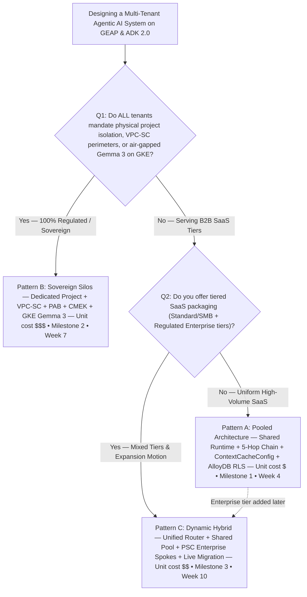

## Workstream 5 — Wrap-Up, Decision Guide & Backlog (Capstone)

### Objective & outcome

Workstream 5 is the capstone of the ten-week program (`1W Design • 2W Build • 1W Launch`, Weeks 1–10). It produces no new runtime code; instead it consolidates Workstreams 1–4 into the three artifacts executives and FDEs actually asked for:

1. **A one-page topology decision tree** that reduces the Pattern A / B / C choice to two gating questions (a compliance question and a packaging question).
2. **A twelve-row side-by-side comparison matrix** of Pattern A (Pooled), Pattern B (Sovereign Silos) and Pattern C (Dynamic Hybrid), dimension by dimension across the 5-Hop chain, CMEK granularity, live tier upgrade path and relative unit cost.
3. **The Multi-Tenant Agentic Triad** — the framing that whatever topology is selected, production multi-tenant agents must balance Zero-Trust Cryptographic Security, FinOps & COGS Engineering, and Privacy-Preserving Tenant Observability simultaneously.

Both deliverables are drawn from a single blueprint — **Diagram 14, `ws5-decision-tree-and-agentic-triad`** — which is the only diagram in Workstream 5 and the seventh "architecture document" diagram in the program (per the [README](../README.md): seven cover architecture documents x.1 / 1.3 / 2.5 / 5.1; seven cover setup guides, Terraform blueprints and the tier-upgrade suite).

**Outcome.** The blog [`ws5-decision-guide-and-agentic-triad.md`](../blogs/ws5-decision-guide-and-agentic-triad.md) and the editable deck [`ws5-wrap-up-editable-slides.pptx`](../slides/ws5-wrap-up-editable-slides.pptx) (13 slides • 56 shapes • 23 connectors per the README deck table) ship with status `PUBLISH_READY`. The workstream also carries the program's second deliverable to Google product teams: the consolidated **nine-gap EAP backlog** (3× P0, 4× P1, 2× P2) first recorded in [1.4](../workstream-1-reference-architecture/1.4-eap-and-product-gap-tracker.md) and refined through [2.4](../workstream-2-pattern-a-pooled/2.4-product-gaps-prioritization.md), [3.4](../workstream-3-pattern-b-siloed/3.4-product-collaboration-vpc-sc-signoff.md) and [4.4](../workstream-4-pattern-c-hybrid/4.4-product-collaboration-psc-and-registry.md).

### Deliverables map

| Deliverable | Purpose | Key content | Link | Diagram 14 coverage |
| :--- | :--- | :--- | :--- | :--- |
| **5.1 — Pattern Comparison & Executive Decision Guide** | Give architects and FDEs a like-for-like matrix and a two-question decision tree for choosing a topology on GEAP & ADK 2.0. Synthesizes two internal papers plus the Architecture Center *Multi-tenant agentic AI system* reference. | §1 twelve-row comparison matrix (value proposition, project topology, Hops 1–5, CMEK kill-switch granularity, live tier upgrade path, relative COGS `$`/`$$$`/`$$`); §2 Mermaid decision tree (Q1 isolation mandate → Pattern B; Q2 tiered packaging → Pattern A or C). Slides 2, 5 & 13 of the deck. | [5.1](../workstream-5-wrap-up-and-backlog/5.1-pattern-comparison-and-decision-guide.md) | Embeds the diagram as the "Reference Architecture Blueprint" above the decision tree; the diagram's **Routing hub** (Architecture Selector `Routes Pattern A, B or C`) and the two spokes (Pattern A left; Pattern B/C right, with `$$$` / `$$` in the right boundary label) are the visual form of the matrix. |
| **5.2 — Blog: The Multi-Tenant Agentic Triad** (Part 4 of 4, Capstone & Backlog #1) | Flagship capstone post for CTOs, VPs of Engineering, SaaS CFOs / FinOps leads and security architects: unify Pooled, Silo and Hybrid under one FinOps + observability model. 15 min read, `PUBLISH_READY`. | §2 Pillar 1 — the 5-Hop chain hop by hop with code links; §3 Pillar 2 — FinOps table for a 1,000-tenant deployment (`-90%` prefix COGS, `-68%` thinking spend, `99.99%` SLA, `-74%` TCO); §4 Pillar 3 — zero-PII BigQuery OTel spans and the three-model chargeback SQL; §5 social promotion kit. Slides 4, 5 & 13. | [5.2](../workstream-5-wrap-up-and-backlog/5.2-blog-multi-tenant-agentic-triad.md) | The three Triad pillars are literally the three zone titles: `Triad Pillar 1: Zero-Trust Cryptographic Security` (routing hub), `Triad Pillar 2 (High Density / Regulated Scale)` (left/right spoke boundaries), `Triad Pillar 3: Privacy-Preserving OTel & Chargeback` (governance hub with `3 Chargeback Models` and `BigQuery OTel Sink`). |

Supporting WS5 assets: the blog deck source [`ws5-decision-guide-and-agentic-triad.deck.json`](../blogs/ws5-decision-guide-and-agentic-triad.deck.json) (deck title, TL;DR, six sections, Figure 1 talking points, takeaways) and the per-workstream copies of the blueprint under [`workstream-5-wrap-up-and-backlog/diagrams/`](../workstream-5-wrap-up-and-backlog/diagrams/ws5-decision-tree-and-agentic-triad.drawio.png).

### The Pattern A / B / C decision framework

#### Comparison dimensions

The six executive-level dimensions below are the ones that appear identically in the [README](../README.md) §1 table and in §3 of the WS5 blog; the hop-by-hop, CMEK and cost rows are from the full matrix in [5.1 §1](../workstream-5-wrap-up-and-backlog/5.1-pattern-comparison-and-decision-guide.md).

| Dimension | Pattern A: Pooled (`Maximum Density`) | Pattern B: Sovereign Silos (`Zero Trust Isolation`) | Pattern C: Dynamic Hybrid (`Intelligent Routing`) |
| :--- | :--- | :--- | :--- |
| **Isolation model** | Shared runtime & compute pools with logical + cryptographic isolation (5-Hop Context Chain); single shared GCP project for compute, registry & data | Dedicated GCP project, VPC-SC perimeter, IAM PAB policy & CMEK per corporate tenant + central routing/security hub | Unified control plane & tenant-aware gateway routing across mixed Pooled & Sovereign tiers: central control/ingress hub + shared pool project + N dedicated Enterprise spoke projects |
| **Compute & runtime** | Shared GEAP Agent Runtime (gVisor sandbox) + immutable `temp:tenant_id`; shared `ContextCacheConfig` (90% COGS savings); Redis bulkhead | Dedicated per-tenant GEAP Runtime / Provisioned Throughput **or** air-gapped Gemma 3 (27B) on private GKE + project CMEK | Standard routed to shared pool (`4k` cap); Enterprise routed via **Private Service Connect** to dedicated spoke (`8k` cap + CMEK) |
| **Data & memory plane** | Shared AlloyDB with PostgreSQL RLS (`SET LOCAL app.current_tenant`) + tenant-prefixed 5-Level Memory Bank + BigQuery OTel; envelope CMEK per namespace (`finvault:user:session`) | Dedicated CMEK AlloyDB & BigQuery per tenant project inside VPC-SC; full project-level Cloud KMS / EKM kill-switch (`HTTP 423 KMS_KEY_DISABLED`) | Shared RLS AlloyDB for Standard + PSC bridge to dedicated VPC-SC CMEK data spokes for Enterprise; envelope CMEK in pool, full project CMEK in spokes |
| **FinOps & COGS profile** | **`$`** — lowest unit cost; 85–90% shared prefix savings; instant self-service onboarding | **`$$$`** — dedicated baseline per tenant; dedicated quotas & Provisioned Throughput; zero noisy neighbors | **`$$`** — optimal blended SaaS margin: pooled efficiency for SMB/Standard + dedicated SLA & zero-downtime live tier upgrades |
| **Ideal workload fit** | Standard B2B SaaS tiers & high-volume tasks | Healthcare, FinTech & regulated enterprises | Tiered SaaS models serving SMB to Fortune 500 |
| **Delivery milestone** | **Milestone 1 • Week 4** ([WS2](../workstream-2-pattern-a-pooled/2.1-case-study-and-solution-architecture.md)) | **Milestone 2 • Week 7** ([WS3](../workstream-3-pattern-b-siloed/3.1-case-study-and-solution-architecture.md)) | **Milestone 3 • Week 10** ([WS4](../workstream-4-pattern-c-hybrid/4.1-case-study-and-solution-architecture.md)) |

Additional rows from the full 5.1 matrix that the blog singles out as the two that "most often change a decision late in procurement":

| Dimension | Pattern A | Pattern B | Pattern C |
| :--- | :--- | :--- | :--- |
| **Hop 1 — Edge & Identity PEP** | Cloud Armor WAF + IAP (`X-Tenant-ID` strip) + RFC 8693 OBO + DPoP (`jkt`) | Cloud Armor + mTLS SPIFFE pinning + IAM Principal Access Boundary | Unified Cloud Armor/IAP hub + tenant-aware Firestore router + cross-project PAB |
| **Hop 2 — Agent & MCP catalog** | Shared GEAP Registry filtered by tenant labels + ADK `before_agent_callback` pruning | Dedicated per-project GEAP Registry & local MCP servers | Cross-project federated GEAP Registry + ADK `before_agent_callback` |
| **Hop 4 — Guardrails & DLP** | Shared Vertex AI Model Armor with per-tenant SDP detectors & Semantic NLCs | Dedicated per-project Model Armor + SDP templates | Ingress Model Armor at hub + spoke-specific SDP/NLC enforcement |
| **CMEK kill-switch granularity** | Envelope CMEK per namespace only | Full project-level Cloud KMS / EKM kill-switch (`HTTP 423`) | Envelope CMEK in pool; full project CMEK kill-switch in Enterprise spokes |
| **Live tier upgrade path** | Requires migration to Pattern C to add dedicated spokes | Static silo provisioning | 3-phase zero-downtime live tier migration (`SHADOW_SYNC` → `ATOMIC_CUTOVER` → `DRAIN`) |

#### Decision-tree questions, in order

The tree in [5.1 §2](../workstream-5-wrap-up-and-backlog/5.1-pattern-comparison-and-decision-guide.md) starts at *"Designing a Multi-Tenant Agentic AI System on GEAP & ADK 2.0"* and asks exactly two questions:

| Step | Question | Who answers it | Answer → Routing |
| :--- | :--- | :--- | :--- |
| **Q1 (compliance)** | Do **ALL** tenants mandate physical project isolation, VPC-SC perimeters, or air-gapped Gemma 3 on GKE? | Legal / security of the regulated customer base (OCC/FDIC/DORA banks, HIPAA providers, sovereign public sector) | **Yes — 100% Regulated / Sovereign** → **Pattern B: Sovereign Silos** (Dedicated Project + VPC-SC + PAB + CMEK + GKE Gemma 3). **No — Serving B2B SaaS Tiers** → go to Q2. |
| **Q2 (packaging)** | Do you offer tiered SaaS packaging (e.g., Standard/SMB + Regulated Enterprise tiers)? | Product and pricing teams | **No — Uniform High-Volume SaaS** → **Pattern A: Pooled Architecture** (Shared Runtime + 5-Hop Chain + `ContextCacheConfig` + AlloyDB RLS). **Yes — Mixed Tiers & Expansion Motion** → **Pattern C: Dynamic Hybrid** (Unified Router + Shared Pool + PSC Enterprise Spokes + Live Migration). |

In Pattern C the per-tenant routing is then made at runtime by the Architecture Selector: Standard tenants go to the shared pool (`4k` thinking cap, RLS AlloyDB), Enterprise tenants go over PSC to a dedicated spoke (`8k` cap + CMEK). The 4.4 field playbook phrases the same triage as three questions (`>20 Standard-tier tenants where unit COGS is paramount` → A; `100% mandate physical isolation` → B; `tiered pricing` → C) — see [4.4 §2 Step 1](../workstream-4-pattern-c-hybrid/4.4-product-collaboration-psc-and-registry.md).

Reproduced from the blog's Mermaid (which extends 5.1's tree with unit cost, milestone and the dotted Pattern A → C edge):

Routing summary:

- **Pooled (Pattern A)** — one shared GCP project; every tenant on the shared gVisor runtime; isolation is logical + cryptographic only.
- **Silo (Pattern B)** — one dedicated project per corporate tenant behind its own VPC-SC perimeter and PAB policy, plus a central routing/security hub.
- **Hybrid PSC spoke (Pattern C)** — the hub's tenant-aware Firestore router sends Standard tenants to the shared pool and Enterprise tenants over a PSC consumer forwarding rule to a dedicated spoke project (producer `google_compute_service_attachment`).

#### The "live tier upgrade" escape hatch (from WS4)

The blog's Mermaid tree adds one dotted edge not present in 5.1's: `PatA -.-> |Enterprise tier added later| PatC`. Its justification is the *Live Tier Upgrade Path* row of the 5.1 matrix: Pattern A's upgrade path is explicitly "migrate to Pattern C to add dedicated spokes", and because the hub, the pool and the 5-Hop code are shared, that migration is an additive topology change rather than a rewrite. Only Pattern C ships the 3-phase zero-downtime migration (`SHADOW_SYNC` → `ATOMIC_CUTOVER` → `DRAIN_AND_VERIFY`, `0` dropped turns, `4/4 PASS` in [4.5](../workstream-4-pattern-c-hybrid/4.5-zero-downtime-tier-upgrade-suite/run_tier_migration_suite.py)); Pattern B silos are statically provisioned. The runbook (Terraform spoke module → `execute_zero_downtime_tier_upgrade()` → verify `replication_lag_ms == 0` and `PSC_CONNECTION_ACCEPTED` → atomic Firestore route cutover → confirm `PATTERN_C_HYBRID_PSC_SPOKE` with `8,000` budget in BigQuery OTel) is in [4.4 §2 Step 2](../workstream-4-pattern-c-hybrid/4.4-product-collaboration-psc-and-registry.md).

### The Multi-Tenant Agentic Triad (5.2)

[5.2](../workstream-5-wrap-up-and-backlog/5.2-blog-multi-tenant-agentic-triad.md) defines the Triad as "three competing forces" that must be balanced simultaneously when scaling multi-tenant autonomous agents, built on an **80% reusable core runtime** ([`core-cymbal-agent/`](../core-cymbal-agent/)) plus **20% topology deltas** across Patterns A, B and C.

| Pillar | 5.2 definition | 5-Hop mapping | WS2 / WS3 / WS4 evidence |
| :--- | :--- | :--- | :--- |
| **1. Zero-Trust Cryptographic Security** | "Eliminating cross-tenant tool, memory, and data bleed across Hops 1–5." Legacy apps verify a bearer token once at the LB and trust internal services; in an agent system "implicit internal trust is a single prompt-injection away from a cross-tenant breach." | All five hops: Hop 1 [`hop1_edge_identity_pep.py`](../core-cymbal-agent/governance/hop1_edge_identity_pep.py) (strip `X-Tenant-ID`, verify Google OIDC / Entra ID JWT, RFC 8693 OBO bound to RFC 9449 DPoP `jkt`); Hop 2 [`hop2_registry_pdp_callbacks.py`](../core-cymbal-agent/governance/hop2_registry_pdp_callbacks.py) (ARD catalog filter, `403` on cross-tenant call, `before_agent_callback` pruning); Hop 3 [`hop3_compute_finops_bulkhead.py`](../core-cymbal-agent/governance/hop3_compute_finops_bulkhead.py) (`temp:tenant_id` in gVisor, `L1_TURN_EPHEMERAL`..`L5_PLATFORM_SHARED_SKILLS`, `gs://cymbal-skills-{tenant}/`, and in B/C VPC-SC + PAB + CMEK `HTTP 423`); Hop 4 [`hop4_model_armor_guardrails.py`](../core-cymbal-agent/governance/hop4_model_armor_guardrails.py) (`400` jailbreak, `422 SEMANTIC_NLC_VIOLATION`, egress SDP); Hop 5 [`hop5_data_rls_and_otel.py`](../core-cymbal-agent/governance/hop5_data_rls_and_otel.py) (`SET LOCAL app.current_tenant`, 2LO/3LO broker). | WS2 breach-simulation suite **10/10** deterministic security gates PASS ([2.5](../workstream-2-pattern-a-pooled/2.5-breach-simulation-suite/run_breach_simulations.py)); WS3 silo security suite **6/6** sovereign tests PASS ([3.5](../workstream-3-pattern-b-siloed/3.5-exfiltration-and-cmek-revocation-tests/run_silo_security_tests.py)) with all four 3.4 control domains `SIGNED OFF`. |
| **2. FinOps & COGS Engineering** | "Protecting SaaS gross margins via `ContextCacheConfig` 90% prefix savings, tiered `thinking_budget` clamps, and Redis rate bulkheads." | Hop 3 controls: `ContextCacheConfig` (`READ_ONLY_IMMUTABLE_PREFIX`) on the `32,000`-token shared system prompt; `thinking_budget` clamped to `4,000` Standard / `8,000` Enterprise (vs. an uncapped `16,000` baseline); Memorystore for Redis sliding-window bulkhead `120 RPM` Std / `600 RPM` Ent with `HTTP 429` shed. | 5.2 §3 model (1,000 tenants = 950 Standard + 50 Enterprise, `50,000` turns/day): **-90%** prefix token COGS with `0` cross-tenant cache bleed, **-68%** output thinking-token spend, **`99.99%`** Enterprise SLA preservation, **-74%** total infrastructure TCO for the Pattern C blend vs. 1,000 dedicated projects. WS2's net input-token figure is `~84.7%` ([2.1](../workstream-2-pattern-a-pooled/2.1-case-study-and-solution-architecture.md)); WS4's **4/4** migration tests prove the pool→spoke upgrade that makes the blend operable. |
| **3. Privacy-Preserving Tenant Observability** | "Attributing every token, tool invocation, and guardrail decision in BigQuery OpenTelemetry without leaking raw customer PII." | Hop 4 egress SDP redaction (`US_BANK_ACCOUNT_NUMBER` / `SWIFT` for FinVault, `CREDIT_CARD_NUMBER` for RetailStream) and Hop 5 zero-PII OTel spans into `cymbal_multi_tenant_otel.agent_turn_spans` carrying `obo_token_hash`, `dpop_jkt`, SDP redaction counts and token metrics. | 5.2 §4 chargeback SQL implements three models over the span table: even split (`10000.0 / active_tenants`), proportional dynamic-token consumption (`× 45000.0`), and a `2500.00` tiered surcharge for `PATTERN_B_SILOED` / `PATTERN_C_HYBRID_PSC_SPOKE` topologies. The 4.4 runbook's final step verifies topology routing in the same BigQuery OTel sink. |

The blog states the key framing: the Triad is a *balance*, not a checklist — "tightening security alone (Pattern B everywhere) raises TCO; optimizing cost alone (one giant pool with no bulkheads) exposes you to noisy neighbors and cache bleed; and observability without egress redaction turns your audit sink into the breach."

#### 5-Hop invariant: per-pattern deltas (5.1 matrix × 5.2 §2)

Every pattern runs the same five modules in [`core-cymbal-agent/governance/`](../core-cymbal-agent/governance/); only the perimeter each hop is deployed into changes.

| Hop | Shared module | Pattern A delta | Pattern B delta | Pattern C delta |
| :--- | :--- | :--- | :--- | :--- |
| 1 — Edge Identity PEP | [`hop1_edge_identity_pep.py`](../core-cymbal-agent/governance/hop1_edge_identity_pep.py) | Cloud Armor WAF + IAP header strip + OBO + DPoP | + mTLS SPIFFE pinning + IAM PAB | + tenant-aware Firestore router + cross-project PAB |
| 2 — Registry PDP / ARD / ADK pruning | [`hop2_registry_pdp_callbacks.py`](../core-cymbal-agent/governance/hop2_registry_pdp_callbacks.py) | Shared registry filtered by tenant labels | Dedicated per-project registry + local MCP servers | Cross-project federated registry |
| 3 — Compute, Memory Bank, FinOps | [`hop3_compute_finops_bulkhead.py`](../core-cymbal-agent/governance/hop3_compute_finops_bulkhead.py) | Shared gVisor + shared `ContextCacheConfig` + Redis bulkhead | Dedicated runtime / Provisioned Throughput or air-gapped Gemma 3 (27B) + project CMEK | Pool (`4k`) or PSC spoke (`8k` + CMEK) |
| 4 — Model Armor & Semantic NLCs | [`hop4_model_armor_guardrails.py`](../core-cymbal-agent/governance/hop4_model_armor_guardrails.py) | Shared Model Armor, per-tenant SDP detectors | Per-project Model Armor + SDP templates | Hub ingress screen + spoke-specific SDP/NLC |
| 5 — AlloyDB RLS, 2LO/3LO, OTel | [`hop5_data_rls_and_otel.py`](../core-cymbal-agent/governance/hop5_data_rls_and_otel.py) | Shared AlloyDB RLS + BigQuery OTel | Dedicated CMEK AlloyDB & BigQuery inside VPC-SC | Shared RLS DB + PSC bridge to VPC-SC spokes |

#### Pillar 2 unit-economics table (5.2 §3, verbatim figures)

Scenario: 1,000-tenant B2B SaaS deployment, `950 Standard + 50 Regulated Enterprise`, averaging `50,000` agent turns/day.

| FinOps control | Baseline (naive agent) | Optimized GEAP 5-Hop | Net impact |
| :--- | :--- | :--- | :--- |
| Shared system prompt (`32,000` tokens/turn) | Billed at full input rate every turn (`1.6B` prefix tokens/day) | Cached via `ContextCacheConfig` (`READ_ONLY_IMMUTABLE_PREFIX`) | **-90% prefix token COGS** (`0` cross-tenant cache bleed) |
| Chain-of-thought (`thinking_budget`) | Uncapped `16,000` thinking tokens across all tiers | Clamped to `4,000` Standard (`95%` of tenants); `8,000` Enterprise | **-68% output thinking-token spend** |
| Noisy-neighbor burst protection | Single runaway loop exhausts regional TPM quota | Memorystore for Redis sliding-window bulkhead (`120 RPM` Std / `600 RPM` Ent) | **`99.99%` Enterprise SLA preservation** (`HTTP 429` shed) |
| Blended deployment topology | 1,000 dedicated GCP projects (Pattern B everywhere) | Pattern C: 950 tenants in shared pool + 50 in dedicated PSC spokes | **-74% total cloud infrastructure TCO** |

#### Pillar 3 chargeback models (5.2 §4 SQL)

| Model | SQL expression over `cymbal_multi_tenant_otel.agent_turn_spans` (30-day window) | Output column |
| :--- | :--- | :--- |
| 1. Even split of shared infrastructure | `ROUND(10000.0 / p.active_tenants, 2)` | `even_split_base_infra_usd` |
| 2. Proportional token consumption | `(thinking_tokens + completion_tokens) / grand_total_dynamic_tokens * 45000.0` | `proportional_token_cogs_usd` |
| 3. Tiered SLA & sovereign spoke surcharge | `CASE WHEN topology IN ('PATTERN_B_SILOED','PATTERN_C_HYBRID_PSC_SPOKE') THEN 2500.00 ELSE 0.00 END` | `dedicated_spoke_surcharge_usd` |

Span fields the query depends on: `tenant_id`, `tier`, `topology`, `prompt_prefix_tokens`, `thinking_tokens_used`, `output_tokens`, `prompt_prefix_cache_hit`, `turn_timestamp` — plus the hashed identity fields (`obo_token_hash`, `dpop_jkt`) that make the sink zero-PII. The constants `10000.0`, `45000.0` and `2500.00` are illustrative values in 5.2, not program-measured costs.

### Diagram 14 — Workstream 5 Capstone: Executive Topology Decision Guide & The Multi-Tenant Agentic Triad

| Field | Value |
| :--- | :--- |
| **Diagram ID** | `ws5-decision-tree-and-agentic-triad` (vision AST id `VIS-WS5-DECISION-TREE-AND-AGENTIC-TRIAD`) |
| **Source deliverables** | [5.1 Pattern Comparison & Decision Guide](../workstream-5-wrap-up-and-backlog/5.1-pattern-comparison-and-decision-guide.md) • [5.2 The Multi-Tenant Agentic Triad](../workstream-5-wrap-up-and-backlog/5.2-blog-multi-tenant-agentic-triad.md) • blog [ws5-decision-guide-and-agentic-triad.md](../blogs/ws5-decision-guide-and-agentic-triad.md) |
| **Badge** | `WORKSTREAM 5.1 & 5.2 • CAPSTONE BLUEPRINT` |
| **Subtitle** | `Unifying Zero-Trust Security, FinOps Unit Economics (90% Prefix Cache), and Zero-PII OpenTelemetry Across All 3 Patterns` |
| **Files** | [`.drawio`](../diagrams/ws5-decision-tree-and-agentic-triad.drawio) • [`.drawio.xml`](../diagrams/ws5-decision-tree-and-agentic-triad.drawio.xml) • [`.drawio.png`](../diagrams/ws5-decision-tree-and-agentic-triad.drawio.png) • [`.svg`](../diagrams/ws5-decision-tree-and-agentic-triad.svg) • [`.png`](../diagrams/ws5-decision-tree-and-agentic-triad.png) • [`vision.json`](../diagrams/vision_metadata/ws5-decision-tree-and-agentic-triad.vision.json) |
| **Editable deck** | [`ws5-wrap-up-editable-slides.pptx`](../slides/ws5-wrap-up-editable-slides.pptx) — **Figure 1** (also in the combined deck [`geap-multi-tenancy-all-workstreams-editable-slides.pptx`](../slides/geap-multi-tenancy-all-workstreams-editable-slides.pptx)) |
| **Shape stats** | 56 editable shapes (vertices), 23 connectors (deterministic orthogonal edges), 54 addressable vision objects; `componentCount` 79; viewer metrics 20 images / 100 paths / 188 texts |
| **Generator** | Blueprint #7 in [`scripts/build_all_workstream_diagrams.mjs`](../scripts/build_all_workstream_diagrams.mjs) (config object at lines 464–527); `workstreamDir: workstream-5-wrap-up-and-backlog/diagrams` |

#### The question this diagram answers

*"If the same five hops run in every pattern, what actually changes when I choose Pooled, Silo or Hybrid — and where do security, cost and observability each live?"* The diagram answers by drawing one shared ingress/routing hub (Pillar 1) and one shared governance hub (Pillar 3) above two spokes that are the *same five hop positions with different blast radii*: a high-density Pattern A pool on the left and a regulated Pattern B / Pattern C sovereign spoke on the right (Pillar 2, both halves). The Architecture Selector in the hub is the decision tree made executable.

#### Zone-by-zone walkthrough

Every label below is an exact string from the blueprint config / vision AST, so it can be located in the `.drawio` source.

**Top actor.** `Enterprise & SMB Users` / `10,000+ Multi-Tier Tenants` (object `actor_top_user`, x=465 y=52). Step badge **`1`** labelled **`Request`** enters the Google Cloud frame; badge **`7`** labelled **`Response`** returns to the user.

**Outer & inner boundary labels.**
- Outer wrapper (`wrapper_shared_hubs`, 1128×1104): **`The Multi-Tenant Agentic Triad: Security (Hops 1–5) • FinOps COGS (-84.7%) • Zero-PII Observability`**. The `-84.7%` is the WS2 net input-token COGS reduction (2.1 §4), i.e. the 90% cached `32,000`-token prefix with the ~2,000-token tenant suffix added back.
- Inner wrapper (`wrapper_vpc`, 1096×1050): **`Unified GEAP & ADK 2.0 Reference Architecture (12/12 Forensic Audit • 20/20 Simulations PASS)`**. `20/20` = 10 breach gates (WS2) + 6 silo tests (WS3) + 4 migration tests (WS4).

**Routing hub (upper left, 664×330) — `Triad Pillar 1: Zero-Trust Cryptographic Security`, subtitle `5-Hop Context Chain across Ingress, Registry & Runtime`.** Five cards:

| Position | Icon (meaning) | Title | Subtitle | Edge label |
| :--- | :--- | :--- | :--- | :--- |
| Top-left | `load_balancer_cloud_armor` (Cloud Armor WAF / edge) | `Hop 1: Edge PEP` | `Header Strip + OBO + DPoP` | `Verify OBO & DPoP` |
| Mid-left | `model_armor` (Vertex AI Model Armor) | `Hop 4: Model Armor` | `Injection 400 + NLC 422 + SDP` | `Screen & redact PII` |
| Bottom-left | `iap_iam_shield` (IAM / IAP policy decision) | `Hop 2: Registry PDP` | `ARD Filter + ADK Tool Prune` | `Prune ARD & MCP tools` |
| Top-right | `load_balancer_cloud_armor` | `External Application` / `Load Balancer` | `Global Anycast Ingress` | — |
| Bottom-right | `cloud_run` (Cloud Run gateway) | `Architecture Selector` | `Routes Pattern A, B or C` | — |

Inside the hub, step badge **`2`** (`Request`) marks the request leaving the ALB toward the guardrail stack, and a second **`7`** (`Response`) marks the screened response returning (objects `step_2_mid`, `step_7_mid` at y=523).

**Central governance hub (upper right, 328×320) — `Triad Pillar 3: Privacy-` / `Preserving OTel & Chargeback`** (the AST label is truncated to the first line, `Triad Pillar 3: Privacy-`). Three cards:

| Icon | Title | Subtitle |
| :--- | :--- | :--- |
| `security_command_center` | `Security Command` / `Center` | `Unified SIEM & Audit Lineage` |
| `iap_iam_shield` | `3 Chargeback Models` | `Even, Proportional & Tiered` |
| `cloud_logging` | `BigQuery OTel Sink` | `Zero-PII Cryptographic Spans` |

A dashed governance line labelled **`Real-time COGS & security telemetry`** (`lbl_gov_trunk`, x=968 y=672) drops from this hub into the spokes; it is dashed because it carries only zero-PII span metadata, never request payloads.

**Trunk.** Below the routing hub: badge **`3`** **`Dispatch to optimal cost/security tier`** (where the Architecture Selector commits to a pattern) and badge **`7`** **`Verified zero-bleed agent completion`** (the response has cleared Hop 4 egress redaction on its way back up).

**Left spoke — Pattern A.**
- Boundary label (`wrapper_left_pab`, 516×560): **`Triad Pillar 2 (High Density): Pattern A Pooled FinOps & COGS Engine`**
- Zone title / sub: **`Pattern A: Pooled Unit Economics`** / **`Lowest COGS ($) • 84.7% Net Input Token Savings`**
- Cards (position → icon → title / subtitle):

| Slot | Icon | Title | Subtitle |
| :--- | :--- | :--- | :--- |
| `modelArmor` (top-left) | `model_armor` | `Redis Rate Bulkhead` | `120 RPM Std / 600 RPM Ent` |
| `runtime` (top-right) | `gemini_agent_platform` | `Thinking Budget Cap` | `Clamps 4k Std vs 8k Ent` |
| `mcp` (mid-right) | `mcp_servers` | `2LO & 3LO Auth Mgr` | `Scoped Per-Tenant Vault` |
| `llm` (bottom-left) | `gemini_agent_platform` | `ContextCacheConfig` | `90% Discount on 32k Prefix` |
| `datastore` (bottom-right) | `datastore_alloydb_bq` | `AlloyDB RLS & L1–L5` | `Shared Storage Density` |

- Step labels: **`4`** `Check quota` (at the Redis bulkhead), **`6`** `Log COGS`, **`5`** `90% Cached` / `inference` (at `ContextCacheConfig`).
- RAG label (`lbl_left_rag`): `Zero Cache Bleed`; tool label (`lbl_left_tool`): `Storage-Engine RLS Policy`.

**Right spoke — Patterns B & C.**
- Boundary label (`wrapper_right_pab`): **`Triad Pillar 2 (Regulated Scale): Pattern B Silos ($$$) & Pattern C Hybrid ($$)`**
- Zone title / sub: **`Pattern B Silos & Pattern C PSC Spokes`** / **`Zero Blast Radius + Zero-Downtime Tier Promotion`**
- Cards:

| Slot | Icon | Title | Subtitle |
| :--- | :--- | :--- | :--- |
| `modelArmor` | `model_armor` | `VPC-SC & IAM PAB` | `Hard Perimeter Isolation` |
| `runtime` | `gemini_agent_platform` | `PSC Spoke Runtime` | `3-Phase Live Tier Upgrade` |
| `mcp` | `mcp_servers` | `Dedicated Silo MCP` | `Zero Cross-Project Egress` |
| `llm` | `gemini_agent_platform` | `Gemma 3 & Claude 3.7` | `Air-Gapped GKE & Dedicated PT` |
| `datastore` | `datastore_alloydb_bq` | `Cloud KMS CMEK Lock` | `Instant HTTP 423 Kill-Switch` |

- Step labels: the blueprint config defines **no** `step4Label` / `step5Label` / `step6Label` for `rightCards`, and the renderer only emits `lbl_step4_left` / `lbl_step6_left` / `lbl_step5_left`; the vision AST confirms there are no right-spoke step badges. The right spoke is annotated only by its RAG/tool labels.
- RAG label (`lbl_right_rag`): `Private PSC NAT Bridge`; tool label (`lbl_right_tool`): `Customer-Revocable CMEK Keys`.

**Steps 1–7 narrative, end to end.**
1. **`1` Request** — a user from one of the `10,000+ Multi-Tier Tenants` sends a request into the Google Cloud frame via the `External Application Load Balancer` (`Global Anycast Ingress`).
2. **`2` Request** — the ALB hands the request to the Pillar 1 stack: `Hop 1: Edge PEP` strips forged headers and verifies OBO & DPoP; `Hop 4: Model Armor` screens the prompt (`400` injection, `422` NLC); `Hop 2: Registry PDP` prunes the ARD catalog and MCP tools.
3. **`3` Dispatch to optimal cost/security tier** — the `Architecture Selector` (Cloud Run) routes the verified tenant context to Pattern A (left) or Pattern B/C (right).
4. **`4` Check quota** (left spoke) — the `Redis Rate Bulkhead` enforces `120 RPM` Std / `600 RPM` Ent; the `Thinking Budget Cap` clamps `4k` vs `8k`.
5. **`5` 90% Cached inference** — `ContextCacheConfig` serves the `32k` prefix at a 90% discount with `Zero Cache Bleed`; tool calls go through the `2LO & 3LO Auth Mgr` and data through `AlloyDB RLS & L1–L5` under the `Storage-Engine RLS Policy`. (On the right spoke the equivalent path runs inside the `VPC-SC & IAM PAB` perimeter over the `Private PSC NAT Bridge` to `Gemma 3 & Claude 3.7`, `Dedicated Silo MCP`, and the `Cloud KMS CMEK Lock`.)
6. **`6` Log COGS** — token, cache-hit and guardrail metrics are emitted as zero-PII spans up the dashed `Real-time COGS & security telemetry` line into the `BigQuery OTel Sink`, `3 Chargeback Models`, and `Security Command Center`.
7. **`7` Verified zero-bleed agent completion → Response** — the completion passes back up the trunk, through Hop 4 egress SDP redaction in the hub (`Response` badge), and out to the user (`Response` badge at the actor).

#### Grounding in the source

- The two spokes draw the Pattern A vs. B/C rows of the 5.1 matrix verbatim: `Shared Runtime + ContextCacheConfig + AlloyDB RLS` on the left; `VPC-SC + PAB + CMEK + GKE Gemma 3` / `PSC Spokes + Live Migration` on the right, with `$` / `$$$` / `$$` carried into the zone and boundary labels.
- `120 RPM Std / 600 RPM Ent`, `4k Std vs 8k Ent`, and `90% Discount on 32k Prefix` are the three Hop 3 FinOps controls in the 5.2 §3 table; `3 Chargeback Models` / `Even, Proportional & Tiered` is the 5.2 §4 SQL.
- `-84.7%` in the outer wrapper and `84.7% Net Input Token Savings` in the left zone subtitle come from 2.1 §4 (*"~84.7% total input cost savings with zero cross-tenant cache bleed"*).
- `Instant HTTP 423 Kill-Switch` and `Customer-Revocable CMEK Keys` reproduce the 3.4 sign-off row *Cloud KMS CMEK Cryptographic Kill-Switch* (`HTTP 423 KMS_KEY_DISABLED`).
- `PSC Spoke Runtime` / `3-Phase Live Tier Upgrade` and `Private PSC NAT Bridge` reproduce the 4.4 product-collaboration rows (PSC spoke bridge, 3-phase silent migration state machine).
- `20/20 Simulations PASS` equals the sum of the three test suites (10 + 6 + 4) referenced by the WS2/WS3/WS4 blogs; `12/12 Forensic Audit` refers to the repo's `scripts/run_deep_forensic_audit.py` gate (the 12 individual checks are not enumerated in the WS5 sources).

#### Design decisions & trade-offs

- **Hub-and-spoke, not a flowchart.** Rather than redraw the Mermaid decision tree, the blueprint reuses the Architecture Center hub-and-spoke template shared by Diagrams 1–13, so the decision tree appears as a routing component (`Architecture Selector`) and the outcomes as spokes. This keeps visual parity with WS2/3/4 at the cost of not showing Q1/Q2 as literal branch nodes.
- **Pillars mapped to zones.** Pillar 1 → routing hub, Pillar 3 → governance hub, Pillar 2 split across both spokes (`High Density` vs `Regulated Scale`). The trade-off is that Pillar 2 has no single box; readers must read the two boundary labels together.
- **Patterns B and C share one spoke.** Merging them halves the diagram's width and emphasises that C's Enterprise spoke *is* a B silo reached over PSC; the cost is that C's shared pool half is only implied by the left spoke.
- **Hop order in the hub is 1 → 4 → 2 top-to-bottom**, matching request flow (edge, screen, prune) rather than hop numbering.
- **Dashed telemetry line** encodes the Pillar 3 "zero-PII" constraint visually: control-plane metadata only.

#### Caveats / known gaps

- The vision AST reports `validationReport.valid: false` with `errorCount: 34` (and `warningCount: 0`) even though `isCertified: true` and the healer log says the master blueprint was "passed through without geometric mutation". The sources do not enumerate those 34 errors.
- The governance-hub zone label is stored as the truncated string `Triad Pillar 3: Privacy-`; the second line (`Preserving OTel & Chargeback`) is a separate text run, so text search on the full phrase in the AST will not match.
- Step badges `4`, `5`, `6` exist only on the Pattern A spoke; the right spoke has no numbered steps, so the Steps 1–7 narrative for Patterns B/C is inferred from the left spoke's positions.
- `Gemma 3 & Claude 3.7` places an air-gapped open model and a Model Garden partner model on one card; the subtitle `Air-Gapped GKE & Dedicated PT` is the only cue that these are two different deployment modes.
- The diagram does not show the Firestore tenant router or the 3-phase migration states individually (those are in Diagram 10 and Diagram 12 of Workstream 4).
- 5.1 and 5.2 link the figure via `diagrams/...png` relative to the workstream folder (the `workstream-5-wrap-up-and-backlog/diagrams/` copies), whereas the blog, README and this guide reference the canonical `diagrams/` copies; both sets exist on disk.

#### How to edit / reuse

- **Text, icons, colours:** edit the config object for `id: 'ws5-decision-tree-and-agentic-triad'` in [`scripts/build_all_workstream_diagrams.mjs`](../scripts/build_all_workstream_diagrams.mjs) (lines 464–527) — `routingCards`, `govCards`, `leftCards`, `rightCards`, the boundary/zone labels and the `midStep3Label` / `midStep7Label` / `midGovLabel` arrays — then rebuild all 14 blueprints with that script. Two-line labels are arrays (`['90% Cached', 'inference']`).
- **Adding right-spoke step badges:** the renderer only emits `lbl_step4_left` / `lbl_step5_left` / `lbl_step6_left`; adding `step4Label` etc. to `rightCards` has no effect without extending the renderer.
- **Manual edits:** open [`.drawio`](../diagrams/ws5-decision-tree-and-agentic-triad.drawio) in diagrams.net; use the `id` / `urlSlug` values in [`vision.json`](../diagrams/vision_metadata/ws5-decision-tree-and-agentic-triad.vision.json) (e.g. `OBJ-15-ARCHITECTURE-SELECTOR-RO`, `OBJ-41-DISPATCH-TO-OPTIMAL-COST`) to find objects.
- **Slides:** the deck is regenerated from the blueprint via `scripts/build_editable_slide_decks.ts` (per the README) and the talking points in [`ws5-decision-guide-and-agentic-triad.deck.json`](../blogs/ws5-decision-guide-and-agentic-triad.deck.json) → `diagrams[0].talkingPoints`; Figure 1 is a native editable shape slide, not a picture.
- **Reuse for a customer deck:** replace `Enterprise & SMB Users / 10,000+ Multi-Tier Tenants` with the customer's tenant count and change the `$`/`$$`/`$$$` markers only if the customer's 5.1 matrix differs.

#### Addressable object index (vision AST)

All 54 addressable objects in [`vision.json`](../diagrams/vision_metadata/ws5-decision-tree-and-agentic-triad.vision.json), by `id`, for scripted edits or slide talking-point anchors. Coordinates are canvas pixels (`x`, `y`).

| # | `id` | Label | Zone (AST) | x, y |
| :--- | :--- | :--- | :--- | :--- |
| 01 | `hdr_title_box` | `[WORKSTREAM 5.1 & 5.2 • CAPSTONE BLUEPRINT] Workstream 5 Capstone: …` | Header & Value Pillars | 20, 6 |
| 02 | `actor_top_user` | `Enterprise & SMB Users 10,000+ Multi-Tier Tenants` | Header & Value Pillars | 465, 52 |
| 03 | `wrapper_shared_hubs` | `The Multi-Tenant Agentic Triad: Security (Hops 1–5) • FinOps COGS (-84.7%) • Zero-PII Observability` | Apps & Solutions Tier | 36, 268 |
| 04 | `wrapper_vpc` | `Unified GEAP & ADK 2.0 Reference Architecture (12/12 Forensic Audit • 20/20 Simulations PASS)` | Apps & Solutions Tier | 52, 304 |
| 05 | `zone_routing_hub` | `Triad Pillar 1: Zero-Trust Cryptographic Security` | Apps & Solutions Tier | 68, 338 |
| 06 | `zone_gov_hub` | `Triad Pillar 3: Privacy-` | Apps & Solutions Tier | 798, 346 |
| 07 | `wrapper_left_pab` | `Triad Pillar 2 (High Density): Pattern A Pooled FinOps & COGS Engine` | Agentic Capabilities Platform | 70, 772 |
| 08 | `zone_left_tenant` | `Pattern A: Pooled Unit Economics` | Agentic Capabilities Platform | 86, 808 |
| 09 | `wrapper_right_pab` | `Triad Pillar 2 (Regulated Scale): Pattern B Silos ($$$) & Pattern C Hybrid ($$)` | Agentic Capabilities Platform | 614, 772 |
| 10 | `zone_right_tenant` | `Pattern B Silos & Pattern C PSC Spokes` | Agentic Capabilities Platform | 630, 808 |
| 11 | `card_rc_topleft` | `Hop 1: Edge PEP Header Strip + OBO + DPoP` | Apps & Solutions Tier | 88, 398 |
| 12 | `card_rc_midleft` | `Hop 4: Model Armor` | Apps & Solutions Tier | 88, 482 |
| 13 | `card_rc_botleft` | `Hop 2: Registry PDP` | Agentic Capabilities Platform | 96, 580 |
| 14 | `card_rc_alb` | `External Application Load Balancer` | Apps & Solutions Tier | 452, 432 |
| 15 | `card_rc_cloudrun` | `Architecture Selector Routes Pattern A, B or C` | Agentic Capabilities Platform | 476, 580 |
| 16 | `card_gc_top` | `Security Command Center` | Apps & Solutions Tier | 824, 406 |
| 17 | `card_gc_mid` | `3 Chargeback Models` | Apps & Solutions Tier | 830, 492 |
| 18 | `card_gc_bot` | `BigQuery OTel Sink` | Agentic Capabilities Platform | 828, 574 |
| 19 | `card_lc_ma` | `Redis Rate Bulkhead 120 RPM Std / 600 RPM Ent` | Agentic Capabilities Platform | 102, 874 |
| 20 | `card_lc_llm` | `ContextCacheConfig 90% Discount on 32k Prefix` | Governance & Footer | 102, 1110 |
| 21 | `card_lc_run` | `Thinking Budget Cap Clamps 4k Std vs 8k Ent` | Governance & Footer | 334, 924 |
| 22 | `card_lc_mcp` | `2LO & 3LO Auth Mgr Scoped Per-Tenant Vault` | Governance & Footer | 338, 1068 |
| 23 | `card_lc_db` | `AlloyDB RLS & L1–L5 Shared Storage Density` | Governance & Footer | 332, 1218 |
| 24 | `card_sc_ma` | `VPC-SC & IAM PAB Hard Perimeter Isolation` | Agentic Capabilities Platform | 646, 874 |
| 25 | `card_sc_llm` | `Gemma 3 & Claude 3.7` | Governance & Footer | 646, 976 |
| 26 | `card_sc_run` | `PSC Spoke Runtime 3-Phase Live Tier Upgrade` | Governance & Footer | 878, 924 |
| 27 | `card_sc_mcp` | `Dedicated Silo MCP Zero Cross-Project Egress` | Governance & Footer | 882, 1068 |
| 28 | `card_sc_db` | `Cloud KMS CMEK Lock` | Governance & Footer | 876, 1218 |
| 29–32 | `step_1_top`, `lbl_step1_top`, `step_7_top`, `lbl_step7_top` | `1` / `Request` / `7` / `Response` | Header & Value Pillars | 546–636, 160–166 |
| 33–35 | `lbl_rc_top`, `lbl_rc_mid`, `lbl_rc_bot` | `Verify OBO & DPoP` / `Screen & redact PII` / `Prune ARD & MCP tools` | Apps & Solutions / Agentic Capabilities | 300–306, 392–574 |
| 36–39 | `step_2_mid`, `lbl_step2_mid`, `step_7_mid`, `lbl_step7_mid` | `2` / `Request` / `7` / `Response` | Agentic Capabilities Platform | 450–636, 523–529 |
| 40–43 | `step_3_trunk`, `lbl_step3_trunk`, `step_7_trunk`, `lbl_step7_trunk` | `3` / `Dispatch to optimal cost/security tier` / `7` / `Verified zero-bleed agent completion` | Agentic Capabilities Platform | 384–640, 680 |
| 44 | `lbl_gov_trunk` | `Real-time COGS & security telemetry` | Agentic Capabilities Platform | 968, 672 |
| 45–50 | `step_4_left`, `lbl_step4_left`, `step_6_left`, `lbl_step6_left`, `step_5_left`, `lbl_step5_left` | `4` / `Check quota` / `6` / `Log COGS` / `5` / `90% Cached inference` | Governance & Footer | 104–148, 956–1194 |
| 51–52 | `lbl_left_rag`, `lbl_left_tool` | `Zero Cache Bleed` / `Storage-Engine RLS Policy` | Governance & Footer | 354, 1014 / 1160 |
| 53–54 | `lbl_right_rag`, `lbl_right_tool` | `Private PSC NAT Bridge` / `Customer-Revocable CMEK Keys` | Governance & Footer | 898, 1014 / 1160 |

Zone colours recorded in `extractedZones`: outer Google Cloud frame `#1a73e8`; Zone 1 Routing Hub `#aecbfa`; Zone 2 Central Governance & Security Hub `#ceead6`; Zone 3 Left Tenant / Pool Spoke `#feefc3`; Zone 4 Right Tenant / Sovereign Spoke `#fad2cf`.

#### Deck structure (Figure 1 in `ws5-wrap-up-editable-slides.pptx`)

Per the README, every workstream deck follows: Title → Executive TL;DR → section narrative → per diagram [1:1 master image • decomposed editable slide with talking-points sidebar & speaker notes • component spec table] → Key Takeaways → Asset index. The WS5 deck has 13 slides, 56 shapes and 23 connectors; its narrative sections mirror `ws5-decision-guide-and-agentic-triad.deck.json`:

1. Series Recap & the Cymbal Anchor
2. Executive Decision Tree
3. Side-by-Side Comparison Matrix
4. The Multi-Tenant Agentic Triad
5. 5-Hop Chain: The Invariant Across A, B and C
6. Consolidated EAP Backlog & Retrospective

Figure 1 talking points (from `diagrams[0].talkingPoints`): actor enters at badge 1 / exits at badge 7; routing hub = Pillar 1 (Hop 1, Hop 4, Hop 2, ALB, Architecture Selector); governance hub = Pillar 3 (SCC, 3 Chargeback Models, BigQuery OTel Sink, dashed zero-PII line); badge 3 commits the selector, badge 7 closes the loop; left spoke = Pattern A pooled unit economics; right spoke = Pattern B silos & Pattern C PSC spokes. 5.1 maps to slides 2, 5 & 13 and 5.2 to slides 4, 5 & 13 of this deck (per each deliverable's header).

### Consolidated product-gap & EAP backlog

Merged from [1.4](../workstream-1-reference-architecture/1.4-eap-and-product-gap-tracker.md) (authoritative ledger), [2.4](../workstream-2-pattern-a-pooled/2.4-product-gaps-prioritization.md) (Milestone 1 ranking with `GEAP-POOL-xx` aliases and target GA feature requests), [3.4](../workstream-3-pattern-b-siloed/3.4-product-collaboration-vpc-sc-signoff.md) (Milestone 2 sign-off matrix) and [4.4](../workstream-4-pattern-c-hybrid/4.4-product-collaboration-psc-and-registry.md) (Milestone 3 alignment). Where a source lacks a field, `—` is written.

| ID / name | Pattern | Severity / priority | Status / EAP allowlist | Target | Workaround in repo | Source |
| :--- | :--- | :--- | :--- | :--- | :--- | :--- |
| `GAP-P0-01` (alias `GEAP-POOL-01`) — GEAP Agent Registry (PDP) filters by IAM project principal, not sub-project `tenant_id` claim | A (WS2) | **P0** (2.4 rank #1) | Open — `geap-registry-tenant-label-pdp-eap`; GA ask: native `X-GEAP-Verified-Tenant` evaluation in `ListAgents` / `GetAgent` | Q4 2026 | Tenant label check in Cloud Run Gateway PEP + ADK `before_agent_callback` pruning (`hop2_registry_pdp_callbacks.py`), `403 Forbidden` | 1.4, 2.4 |
| `GAP-P0-02` (alias `GEAP-POOL-03`) — GEAP 5-Level Memory Bank: project-level CMEK only, no per-`tenant_id` namespace key binding | A (WS2) | **P0** (2.4 rank #3) | Open — `geap-memory-bank-per-tenant-cmek-eap`; GA ask: `memory_namespace_cmek_config` | Q4 2026 | Envelope encryption per namespace via Cloud KMS `Encrypt`/`Decrypt` in `hop3_compute_finops_bulkhead.py`, or route CMEK-mandated tenants to a Pattern C PSC memory spoke | 1.4, 2.4 |
| `GAP-P0-03` (alias `GEAP-POOL-02`) — GCP Agent Identity (Auth Manager): OBO + DPoP from external Entra ID tenants needs custom verification | A (WS2) | **P0** (2.4 rank #2) | Open — `gcp-agent-identity-dpop-entra-eap`; GA ask: native Entra ID v2.0 DPoP exchange & stateless ADK OAuth checkpoints | Q4 2026 | DPoP `jkt` verification + header strip in `hop1_edge_identity_pep.py` before the Auth Manager 3LO broker; `CHALLENGE_3LO_OAUTH` flow in `hop5_data_rls_and_otel.py` | 1.4, 2.4 |
| `GAP-P1-01` (alias `GEAP-POOL-04`) — Vertex AI `ContextCacheConfig` + Model Garden: partner models (Claude 3.7 Sonnet) use provider-specific cache headers (`anthropic-beta: prompt-caching`) | A (WS2) | P1 (2.4 rank #4) | Open — `vertex-model-garden-unified-cache-api`; GA ask: unified `ContextCacheConfig` abstraction across Gemini and Model Garden | Q1 2027 | Cache abstraction split: Gemini `ContextCacheConfig` (`READ_ONLY_IMMUTABLE_PREFIX`) in `SharedIncidentDiagnosticAgent` vs. Anthropic ephemeral cache control in `FinVaultPrivateAgentAlpha` | 1.4, 2.4 |
| `GAP-P1-02` — ADK 2.0 inline 3LO OAuth: pausing/resuming the reasoning loop across stateless Cloud Run needs externalized state | A (WS2) | P1 | Open — `adk-stateless-oauth-checkpoint-v2` | Q4 2026 | Checkpoint persisted in Firestore/Redis keyed `retailstream:user:session`, resumed on OAuth callback (`hop5_data_rls_and_otel.py`) | 1.4 |
| `GAP-P1-03` — VPC-SC + GEAP Remote MCP: 3P SaaS MCP egress from a strict perimeter needs explicit PSC egress proxy | B (WS3) | P1 | Open — `vpc-sc-geap-mcp-egress-bridge`; related 3.4 control *VPC-SC Service Perimeter* `SIGNED OFF` | Q4 2026 | Envoy/Cloud NAT egress proxy in a perimeter bridge project with FQDN allowlisting ([3.6](../workstream-3-pattern-b-siloed/3.6-terraform-silo-blueprint/)) | 1.4, 3.4 |
| `GAP-P1-04` — Cloud KMS CMEK revocation propagation latency: cached credentials can serve in-memory state up to 5 min | B (WS3) | P1 | Open — `geap-cmek-instant-killswitch-sla`; related 3.4 control *CMEK Cryptographic Kill-Switch* `SIGNED OFF` | Q1 2027 | Sub-second KMS key-state probe in `hop3_compute_finops_bulkhead.py` (`KMS_KEY_DISABLED` → HTTP `423 Locked`) | 1.4, 3.4 |
| `GAP-P2-01` — Cross-project GEAP Agent Registry over PSC: hub cannot natively discover a spoke's agent card | C (WS4) | P2 | Open — `geap-cross-project-federated-registry`; 4.4 alignment: federated Firestore/Registry sync + PSC consumer forwarding rules | Q1 2027 | Firestore-backed cross-project registry sync controller + `psc_service_attachment` routing table ([4.3](../workstream-4-pattern-c-hybrid/4.3-solution-implementation/)) | 1.4, 4.4 |
| `GAP-P2-02` — Zero-downtime tenant tier upgrade (Standard → Enterprise) risks dropped sessions / lost Memory Bank entries | C (WS4) | P2 | Open — `geap-live-tenant-tier-migrator`; 4.4 alignment: `0` dropped turns | Q1 2027 | 3-phase Silent Tenant Migration State Machine (`SHADOW_SYNC` → `ATOMIC_CUTOVER` → `DRAIN_AND_VERIFY`) in [4.3](../workstream-4-pattern-c-hybrid/4.3-solution-implementation/) | 1.4, 4.4 |

Items from 3.4 and 4.4 that are *not* gaps but sign-off / alignment records, listed for completeness:

| Record | Pattern | Status | Source |
| :--- | :--- | :--- | :--- |
| VPC-SC perimeter `perimeter_finvault_sovereign` blocks cross-perimeter calls (`VPC_SERVICE_CONTROLS_PERMISSION_DENIED`, `403`) | B | `SIGNED OFF` | 3.4 |
| IAM PAB policy `finvault-sovereign-pab` restricts principals to `cymbal-finvault-silo-prod` | B | `SIGNED OFF` | 3.4 |
| Cloud KMS CMEK kill-switch `finvault-kr/agent-memory-cmek` → `HTTP 423 KMS_KEY_DISABLED` on Hop 3 & Hop 5 | B | `SIGNED OFF` | 3.4 |
| mTLS SPIFFE pinning (`spiffe://finvault.com/ns/sre/sa/agent-client`) + air-gapped `gemma-3-27b-it-vllm` on GKE | B | `SIGNED OFF` | 3.4 |
| PSC spoke bridge (producer `google_compute_service_attachment` + consumer `google_compute_forwarding_rule`) eliminates VPC-peering CIDR exhaustion | C | Aligned (no status field in source) | 4.4 |

Before deploying any pattern, the 1.4 allowlist checklist enables `aiplatform`, `discoveryengine`, `modelarmor`, `dlp`, `compute`, `run`, `alloydb`, `redis`, `cloudkms`, `accesscontextmanager`, `iam`, `bigquery` and `telemetry` APIs and verifies Claude 3.7 Sonnet access in Model Garden (`us-central1` / `us-east5`).

### Ten-week retrospective (blog §8)

| Weeks | Phase | Workstream | Milestone & outputs |
| :--- | :--- | :--- | :--- |
| 1–4 | 1W Design • 2W Build • 1W Launch | WS1 reference architecture + WS2 Pattern A | **Milestone 1 (Week 4)**: taxonomy & 5-Hop baseline diagrams, Pooled case study, 3P auth sandbox, breach-simulation suite, Terraform starter, Pattern A blog, codelab, gap prioritization (2.4) |
| 4–7 | 1W Design • 2W Build • 1W Launch | WS3 Pattern B | **Milestone 2 (Week 7)**: multi-project silo & CMEK setup, VPC-SC sign-off (3.4), exfiltration & CMEK-revocation tests, silo Terraform blueprint, Sovereign Silos blog and codelab |
| 7–10 | 1W Design • 2W Build • 1W Launch | WS4 Pattern C + WS5 wrap-up | **Milestone 3 (Week 10)**: hub-and-spoke PSC demo environment, zero-downtime tier-upgrade suite, hybrid PSC Terraform blueprint, Dynamic Tiering blog, decision guide (5.1) and Triad capstone (5.2) |

Three lessons the blog generalizes beyond Cymbal:

1. **Build the pooled pattern first, even if you will never ship it alone** — Pattern A forces the 5-Hop chain to be correct under shared-everything; B and C become perimeter deltas.
2. **Treat the gap ledger as a first-class deliverable** — each of the nine entries has an engineered workaround, a product owner and an EAP name, turning 2.4 / 3.4 / 4.4 collaboration into sign-off gates.
3. **Diagram once, publish everywhere** — each blueprint exists as `.drawio`, `.drawio.png`, Architecture Center `.svg` and a `.vision.json` AST with addressable labels, so the same figure is consistent across blogs, decks and the doc PR ([1.3](../workstream-1-reference-architecture/1.3-cloud-architecture-center-doc-update-pr.md)).

Milestone 1 sign-off gate (2.4 §2), recommended by the blog as generic acceptance criteria: 100% forged `X-Tenant-ID` strip at Hop 1; deterministic `403` on cross-tenant agent/MCP calls; `4,000`-token clamp and `429` above `120 RPM` for Standard without touching the Enterprise `8,000` / `600 RPM` lane; tenant-aware PII redaction (bank account / SWIFT vs. card PAN) plus AlloyDB RLS that survives simulated SQL filter tampering.

### Program summary

1. **One anchor scenario, three topologies.** Cymbal SaaS Platform's Shared Incident Diagnostic Agent (Gemini 2.5 Pro + `ContextCacheConfig`) served FinVault Bank (Enterprise, Google Workspace/Jira, `8,000` thinking tokens, private `Agent Alpha` on Claude Sonnet, CMEK) and RetailStream Corp (Standard, Entra ID + SharePoint/ServiceNow, `4,000` cap, Redis bulkhead, `403` on `Agent Alpha`) across all of WS1–5.
2. **80/20 reuse proven.** [`core-cymbal-agent/`](../core-cymbal-agent/) implements the 5-Hop Cryptographic Context Chain once (`hop1`..`hop5` governance modules); Patterns A, B and C are perimeter deltas — shared RLS pool vs. per-tenant VPC-SC/PAB/CMEK projects vs. a hub routing to both over PSC.
3. **WS1** delivered the taxonomy and 5-Hop baseline (Diagrams 1–2), the product review pack, the Architecture Center doc-update PR, and the nine-entry gap ledger (1.4) that fed every later milestone.
4. **WS2 / Milestone 1 (Week 4) — Pattern A:** pooled architecture with gVisor `temp:tenant_id`, AlloyDB RLS and the 90% prefix cache (`~84.7%` net input-token saving); **10/10** breach-simulation gates PASS; Terraform starter; four P0/P1 gaps ranked (2.4) with a four-point sign-off gate.
5. **WS3 / Milestone 2 (Week 7) — Pattern B:** per-tenant silo projects, VPC-SC, IAM PAB, project-wide CMEK kill-switch (`HTTP 423`), mTLS SPIFFE pinning and air-gapped Gemma 3 (27B) on GKE; **6/6** silo security tests PASS; all four 3.4 control domains `SIGNED OFF`.
6. **WS4 / Milestone 3 (Week 10) — Pattern C:** hub-and-spoke with PSC service attachments, cross-project registry sync, and the 3-phase zero-downtime tier migration; **4/4** migration tests PASS with `0` dropped turns; field playbook and live-upgrade runbook (4.4).
7. **WS5 capstone:** the two-question decision tree (Q1 isolation mandate → B; Q2 tiered packaging → A or C), the twelve-row comparison matrix, the Multi-Tenant Agentic Triad, and Diagram 14 unifying all three — 20/20 simulations total across the three suites.
8. **FinOps case quantified (5.2):** for 1,000 tenants (950 Standard + 50 Enterprise) the Pattern C blend yields `-90%` prefix COGS, `-68%` thinking-token spend, `99.99%` Enterprise SLA preservation and `-74%` TCO versus 1,000 dedicated projects, with three chargeback models computable from zero-PII BigQuery OTel spans.
9. **Publishing pipeline:** 14 blueprints, each as `.drawio` / `.drawio.xml` / `.drawio.png` / `.svg` / `.png` / `.vision.json`; five workstream blogs and five editable `.pptx` decks plus a combined deck (60 slides • 784 shapes • 322 connectors per the README).
10. **What remains open:** all nine product gaps (3× P0 targeting Q4 2026; 4× P1 split Q4 2026 / Q1 2027; 2× P2 targeting Q1 2027) still rely on repo workarounds pending their named EAP allowlists; Diagram 14's vision AST still reports 34 unenumerated validation errors; and Pattern A's only path to a dedicated spoke remains a migration to Pattern C.
