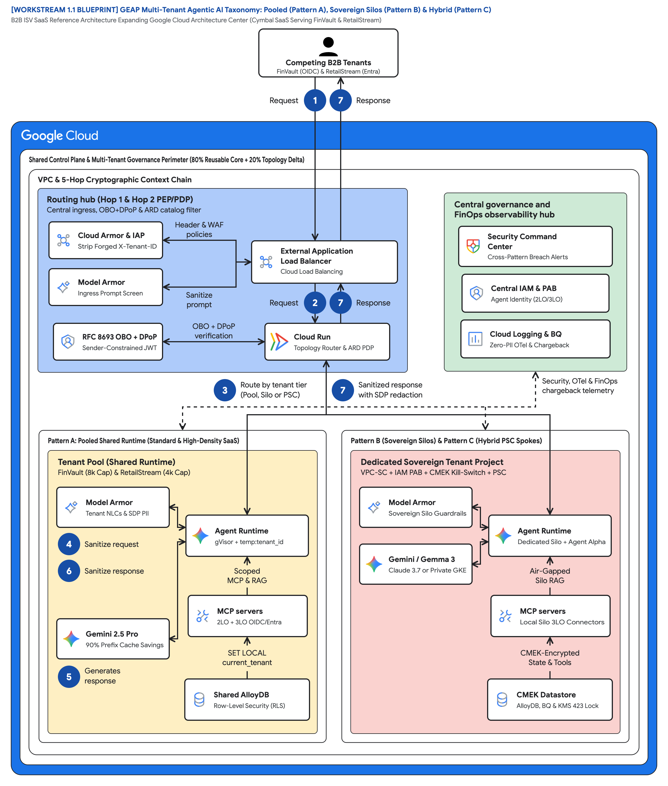
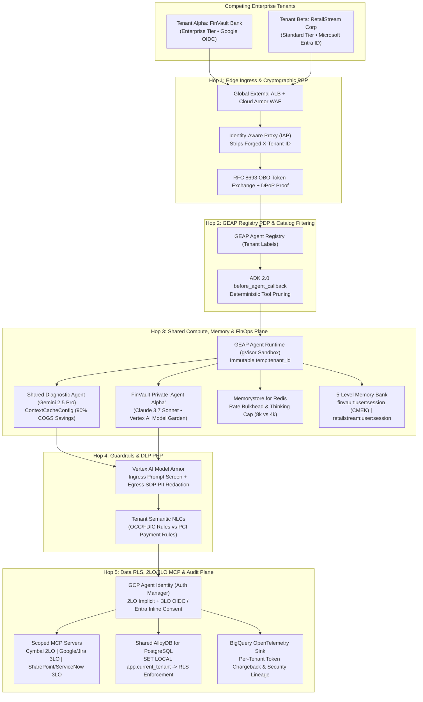
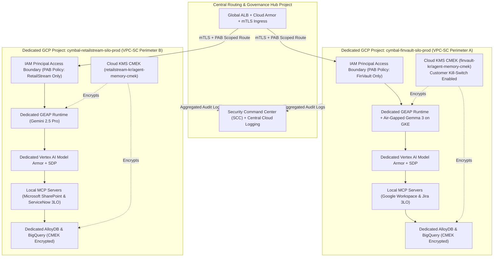

# Workstream 1.1: Multi-Tenant Agentic AI Architecture Taxonomy & Diagrams

> **Workstream**: Workstream 1 — Prepare Reference Architectures & Update GCP Documentation  
> **Baseline Reference**: [Multi-tenant agentic AI system (Cloud Architecture Center)](https://docs.cloud.google.com/architecture/multi-tenant-agentic-ai-system)  
> **Scope**: Expand Google Cloud's intra-enterprise business-unit reference architecture to **B2B ISV SaaS Topologies** across **Pattern A (Pooled)**, **Pattern B (Sovereign Silos)**, and **Pattern C (Dynamic Hybrid)**.

---

## 1. Architectural Taxonomy: Three Core Multi-Tenancy Patterns

B2B SaaS providers (such as **Cymbal SaaS Platform**) and large multi-brand enterprises operate across a spectrum of tenant density, unit economics (COGS), and regulatory isolation mandates.

| Taxonomy Dimension | Pattern A: Pooled Architecture (`Maximum Density`) | Pattern B: Sovereign Silos (`Zero Trust Isolation`) | Pattern C: Dynamic Hybrid (`Intelligent Routing`) |
| :--- | :--- | :--- | :--- |
| **Control Plane** | Single shared GEAP Control Plane & Agent Registry | Dedicated GCP Project & GEAP Control Plane per corporate tenant | Unified GEAP Control Plane + Tenant-Aware Ingress Router |
| **Compute & Runtime** | Shared GEAP Agent Runtime (gVisor sandbox) + immutable `temp:tenant_id` | Dedicated GEAP Runtime or air-gapped **Gemma 3 on GKE** per tenant project | Shared Pool for Standard tier + **Private Service Connect (PSC)** spokes for Enterprise tier |
| **Network Perimeter** | Single shared VPC behind Cloud Armor + IAP | Per-tenant **VPC Service Controls (VPC-SC)** perimeter + **mTLS Ingress** | Hub-and-Spoke VPC with **PSC Service Attachments** bridging to isolated tenant perimeters |
| **Identity & Access** | **RFC 8693 OBO + DPoP** + **GCP Agent Identity (Auth Manager)** 2LO/3LO | **IAM Principal Access Boundary (PAB)** + per-project Workload Identity Pools | Unified IdP Broker + cross-project PAB + PSC identity propagation |
| **Data & Memory Isolation** | Shared AlloyDB with **Row-Level Security (RLS)** + `{tenant}:{user}:{session}` Memory Bank | Dedicated AlloyDB / BigQuery per tenant project + **Cloud KMS CMEK** | Shared RLS DB for Standard + dedicated CMEK data spokes via PSC for Enterprise |
| **Model & FinOps COGS** | Shared **Prompt Prefix Caching (`ContextCacheConfig`)** (up to 90% COGS savings) + Redis token bulkheads | Dedicated Provisioned Throughput (PT) endpoints per project; zero noisy neighbors | Pooled caching for Standard + dedicated PT/Model Garden (Claude Sonnet) for Enterprise |
| **Target Customer Segment** | High-volume Standard B2B SaaS tiers (e.g., *RetailStream Corp*) | Regulated FinTech, Healthcare, Public Sector (e.g., *FinVault Bank*) | Multi-tiered SaaS serving SMB to Fortune 500 with live tier upgrades |

---

## 2. Topology Architecture Diagrams

### 2.0 Google Cloud Architecture Center Reference Blueprints (1800x970 Widescreen)

#### Blueprint 1A: GEAP Multi-Tenant Agentic AI Taxonomy (Pattern A, Pattern B & Pattern C)
> **Artifacts**: [2x Retina PNG](diagrams/ws1-multi-tenant-taxonomy-overview.png) • [Vector SVG](diagrams/ws1-multi-tenant-taxonomy-overview.svg) • [Editable Draw.io XML](diagrams/ws1-multi-tenant-taxonomy-overview.drawio.xml)



#### Blueprint 1B: Cloud Architecture Center 5-Hop Cryptographic Context Chain Baseline
> **Artifacts**: [2x Retina PNG](diagrams/ws1-cloud-arch-center-5hop-baseline.png) • [Vector SVG](diagrams/ws1-cloud-arch-center-5hop-baseline.svg) • [Editable Draw.io XML](diagrams/ws1-cloud-arch-center-5hop-baseline.drawio.xml)


---

### 2.1 Pattern A — Pooled Architecture (Maximum Density & Logical/Cryptographic Governance)



---

### 2.2 Pattern B — Sovereign Silos (Zero Trust Physical & Cryptographic Isolation)



---

### 2.3 Pattern C — Dynamic Hybrid (Unified Control Plane, PSC Spokes & Zero-Downtime Tier Migration)

```mermaid
flowchart TB
    subgraph ControlHub["Cymbal Unified Control Plane & Ingress Hub Project"]
        Router["Tenant-Aware Intelligent Ingress Router<br/>(Cloud Run + Firestore Live Routing Table)"]
        CrossReg["Cross-Project GEAP Agent & MCP Registry"]
        Migrator["Zero-Downtime Tier Migration Controller<br/>(Shadow Sync -> Atomic Cutover -> Drain)"]
    end

    subgraph SharedPool["Shared Pooled Runtime (Standard Tier: RetailStream Corp)"]
        PoolRuntime["Pooled GEAP Runtime (4,000 Thinking Cap + ContextCacheConfig)"]
        PoolRLS["Shared AlloyDB (Row-Level Security)"]
    end

    subgraph SovereignSpoke["Dedicated Enterprise Spoke Project (FinVault Bank • VPC-SC)"]
        PSC_Attach["Private Service Connect (PSC) Service Attachment"]
        SpokeRuntime["Dedicated Agent Alpha (Claude Sonnet) + 8,000 Thinking Cap"]
        SpokeData["Dedicated CMEK AlloyDB + Local Google/Jira MCP Spoke"]
    end

    Router -->|Tier = STANDARD| PoolRuntime --> PoolRLS
    Router -->|Tier = ENTERPRISE via PSC Endpoint| PSC_Attach --> SpokeRuntime --> SpokeData
    CrossReg -.-> PoolRuntime
    CrossReg -.-> SpokeRuntime
    Migrator ==>|Live Upgrade (0 Dropped Sessions)| Router
```
