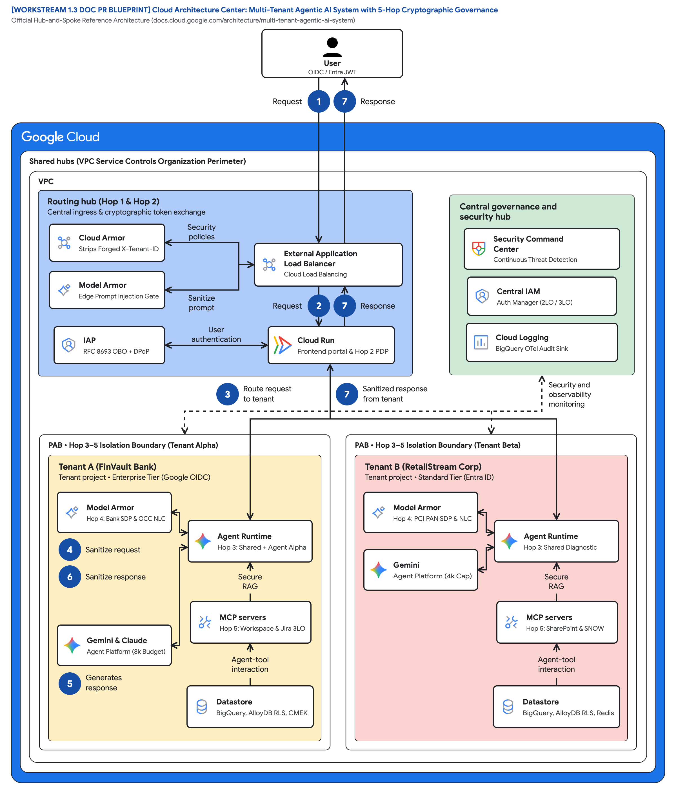

# Workstream 1.3: Cloud Architecture Center Documentation Update / Pull Request

> **Target Document**: [https://docs.cloud.google.com/architecture/multi-tenant-agentic-ai-system](https://docs.cloud.google.com/architecture/multi-tenant-agentic-ai-system)  
> **PR Title**: `feat(arch-center): Expand Multi-Tenant Agentic AI System to B2B ISV SaaS Topologies (Pooled, Siloed, Hybrid) & 5-Hop GEAP Governance`  
> **Authors / Contributors**: FDE & Cloud Architecture Center Enablement Team

---

## 1. Summary of Changes to Existing Documentation

The existing Cloud Architecture Center article models **intra-enterprise multi-tenancy** (multiple business units within a single enterprise, each deployed in a dedicated spoke project). This Pull Request expands the reference architecture to support **B2B Independent Software Vendors (ISVs), SaaS providers, and multi-tiered enterprises** by introducing:

1. **Three Core Multi-Tenancy Deployment Topologies**:
   * **Pattern A: Pooled Architecture (Maximum Density)** — Shared runtime with logical and cryptographic isolation for high-volume B2B SaaS tiers.
   * **Pattern B: Sovereign Silos (Zero Trust Isolation)** — Dedicated project per corporate tenant with VPC-SC, Principal Access Boundary (PAB), Customer-Managed Encryption Keys (CMEK), and air-gapped Gemma 3 on GKE.
   * **Pattern C: Dynamic Hybrid (Intelligent Routing)** — Unified control plane routing Standard tenants to a shared pool while connecting Enterprise tenants to dedicated data/tool spokes via Private Service Connect (PSC), with zero-downtime live tier migration.
2. **The 5-Hop Cryptographic Context Chain**: Defense-in-depth enforcement across Edge Ingress (Hop 1), GEAP Registry PDP (Hop 2), Compute & FinOps Bulkheads (Hop 3), Vertex AI Model Armor & Semantic NLCs (Hop 4), and Data RLS + 2LO/3LO Tool Auth + BigQuery OTel (Hop 5).
3. **B2B SaaS Case Study ("Cymbal")**: Replaces/augments the internal retail division example with an enterprise B2B SaaS scenario serving competing regulated and standard tenants (**FinVault Bank** on Google Workspace/Jira and **RetailStream Corp** on Microsoft Entra ID/ServiceNow).

---

## 2. Drop-In Markdown Patch for `multi-tenant-agentic-ai-system`

```diff
--- a/architecture/multi-tenant-agentic-ai-system.md
+++ b/architecture/multi-tenant-agentic-ai-system.md
@@ -1,12 +1,28 @@
 # Multi-tenant agentic AI system
 
 This document provides a reference architecture to help you design and deploy a
-multi-tenant agentic AI system on Google Cloud. As your organization scales
-generative AI deployments, different business units require specialized AI
-agents that access unique tools, follow specific operational rules, and process
-sensitive data.
+multi-tenant agentic AI system on Google Cloud using Gemini Enterprise Agent
+Platform (GEAP) and Agent Development Kit (ADK 2.0). This guidance applies to two
+primary audiences:
+
+1. **B2B SaaS & Independent Software Vendors (ISVs)** embedding shared operator
+   agents and tenant-customizable agents across competing external customer
+   organizations while protecting SaaS gross margins (COGS).
+2. **Large Decentralized Enterprises** governing autonomous agents across
+   regulated business units, brands, or regional subsidiaries.
+
+## Choose a multi-tenant agentic topology
+
+Before you deploy a multi-tenant agentic AI system, select one of the three core
+isolation patterns based on your tenant density, compliance mandates, and unit
+cost requirements:
+
+| Pattern | Isolation model | Best suited for | Key Google Cloud & GEAP controls |
+| :--- | :--- | :--- | :--- |
+| **Pattern A: Pooled Architecture** | Shared compute & agent worker pools with logical and cryptographic boundaries | Standard B2B SaaS tiers & high-volume workloads requiring lowest unit COGS | Cloud Armor header sanitization, RFC 8693 OBO + DPoP, GEAP Registry PDP labels, ADK `before_agent_callback`, shared `ContextCacheConfig`, Memorystore token bulkheads, AlloyDB Row-Level Security (RLS) |
+| **Pattern B: Sovereign Silos** | Dedicated Google Cloud project, network perimeter, and encryption keys per tenant | Healthcare, FinTech, and regulated enterprises requiring zero blast radius | Dedicated project per tenant, VPC Service Controls (VPC-SC), IAM Principal Access Boundary (PAB), Cloud KMS CMEK with customer kill-switch, mTLS ingress, optional air-gapped Gemma 3 on GKE |
+| **Pattern C: Dynamic Hybrid** | Unified control plane with tenant-aware routing across pooled and sovereign tiers | Tiered B2B SaaS platforms serving both SMB and Fortune 500 customers | Tenant-Aware Ingress Router, Cross-Project GEAP Registry, Private Service Connect (PSC) service attachments to dedicated tenant spokes, zero-downtime live tier migration |
```

---

## 3. New Section Addition: Enforcing the 5-Hop Cryptographic Context Chain

*(To be inserted immediately following the Architecture Diagram section in the Cloud Architecture Center article)*

> **Reference Architecture Blueprint**: [2x Retina PNG](diagrams/ws1-cloud-arch-center-5hop-baseline.png) • [Vector SVG](diagrams/ws1-cloud-arch-center-5hop-baseline.svg) • [Editable Draw.io XML](diagrams/ws1-cloud-arch-center-5hop-baseline.drawio.xml)



### Why legacy SaaS multi-tenancy breaks for autonomous AI agents

Traditional multi-tenant web applications rely on static API routes and deterministic database queries. Autonomous AI agents introduce four new multi-tenancy failure modes that require cryptographic and runtime guardrails:

1. **Dynamic MCP tool discovery mid-turn**: If an agent dynamically queries a shared Model Context Protocol (MCP) registry during multi-turn reasoning, it might discover or invoke another tenant's private connectors or custom agents.
2. **Confused deputy ambient credentials**: If the agent runtime executes tool calls using a shared service account's ambient IAM permissions, a prompt injection attack can trick the agent into reading another tenant's storage buckets or APIs.
3. **Shared context cache bleed**: Sharing prompt caches or session memory across tenants without cryptographic prefix separation can leak sensitive tenant context into another tenant's completion.
4. **Noisy neighbor runaway loops**: Unbounded chain-of-thought reasoning (`thinking_budget`) or recursive tool retries from one tenant can exhaust shared model TPM quotas and degrade availability for all other tenants.

### The 5-Hop Cryptographic Context Chain

To eliminate these four failure modes across Pooled, Siloed, and Hybrid deployments, enforce the **5-Hop Cryptographic Context Chain**:

1. **Hop 1 — Edge Identity & Token Exchange PEP**:
   * **Google Cloud Armor** and **Identity-Aware Proxy (IAP)** terminate ingress traffic and strip any client-supplied `X-Tenant-ID` headers to prevent tenant spoofing.
   * The ingress gateway validates the user's OIDC JWT (such as Google Workspace OIDC or Microsoft Entra ID) and performs an **RFC 8693 On-Behalf-Of (OBO)** token exchange bound to an **RFC 9449 DPoP (Demonstrating Proof-of-Possession)** key thumbprint.
2. **Hop 2 — GEAP Registry PDP & Deterministic Tool Pruning**:
   * **GEAP Agent Registry** acts as a Policy Decision Point (PDP), filtering the catalog of shared and private agents by verified tenant labels. Direct API calls to another tenant's private agent return `403 Forbidden`.
   * Before reasoning begins, ADK 2.0 executes a `before_agent_callback` hook that prunes any MCP tool descriptor not explicitly authorized for the active tenant.
3. **Hop 3 — Compute Sandbox, Memory Bank & FinOps Bulkheads**:
   * **GEAP Agent Runtime** executes the agent inside an isolated **gVisor sandbox** and binds an immutable `temp:tenant_id` session variable.
   * **Memorystore for Redis** enforces per-tenant RPM rate limits and clamps the model's `thinking_budget` based on the tenant's subscription tier (for example, 8,000 thinking tokens for Enterprise tenants versus 4,000 for Standard tenants).
   * Shared operator agents use **Prompt Prefix Caching (`ContextCacheConfig`)** in immutable read-only mode on the shared system instructions—reducing inference COGS by up to 90%—while storing dynamic conversation state in a tenant-prefixed 5-Level Memory Bank (`{tenant}:{user}:{session}`).
4. **Hop 4 — Vertex AI Model Armor & Semantic Natural Language Constraints (NLCs)**:
   * **Model Armor** screens ingress prompts for prompt injection and jailbreak attempts before the model or MCP tools are invoked.
   * On egress, Model Armor integrates with **Sensitive Data Protection (SDP)** to apply tenant-specific PII redaction templates (such as masking bank account and SWIFT numbers for financial tenants or payment card numbers for retail tenants).
5. **Hop 5 — Data Plane Row-Level Security (RLS), 2LO/3LO Auth Manager & BigQuery OTel**:
   * **GCP Agent Identity (Auth Manager)** brokers **2LO implicit session passthrough** for first-party platform APIs and **3LO delegated OAuth tokens** (with inline mid-session OAuth consent challenges when a user's 3P token for Google Drive, Jira, SharePoint, or ServiceNow is missing).
   * For pooled relational stores in **AlloyDB for PostgreSQL**, the data access layer binds `SET LOCAL app.current_tenant = '<tenant_id>'` inside every database transaction, enforcing PostgreSQL Row-Level Security (RLS) policies at the storage engine layer.
   * Every hop emits **OpenTelemetry (OTel)** spans tagged with `tenant_id`, `tier`, `thinking_tokens`, and `cache_hit` into **BigQuery** for real-time security auditing and proportional FinOps chargeback.
