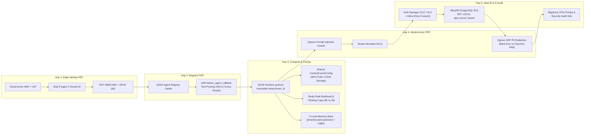

# Workstream 2.1: Case Study & Solution Architecture — Pooled Architecture (Pattern A)

> **Workstream**: Workstream 2 — Pooled Architecture (Pattern A) [Weeks 1–4 Priority • Milestone 1]  
> **Scenario**: Cymbal SaaS Platform securely serves **FinVault Bank** (Enterprise Tier • Google Workspace + Jira stack) and **RetailStream Corp** (Standard Tier • Microsoft 365 + ServiceNow stack) within a **shared runtime** using logical and cryptographic governance.

---

## 1. Business Challenge & Architectural Mandate

**Cymbal SaaS Platform** is a B2B SaaS provider for IT observability and incident management embedding autonomous AI agents via **Gemini Enterprise Agent Platform (GEAP)** and **ADK 2.0**.

To preserve SaaS gross margins (COGS) across thousands of customers while meeting enterprise security requirements, Cymbal's **Pattern A (Pooled Architecture)** must govern:
1. **Multi-turn reasoning loops** with tiered thinking-token caps (`8,000` for FinVault vs. `4,000` for RetailStream).
2. **Dynamic MCP tool calls** across heterogeneous 1P/3P stacks (`2LO` Cymbal Core Telemetry API, `3LO` Google Workspace & Jira for FinVault, `3LO` Microsoft Entra ID SharePoint & ServiceNow for RetailStream).
3. **Shared Prompt Prefix Caching (`ContextCacheConfig`)** achieving up to **90% COGS savings** on shared operator instructions with zero cross-tenant context cache bleed.
4. **Private Tenant-Built Agents**: Allowing FinVault Bank to build and operate a private **Regulatory Escalation Agent (`Agent Alpha`)** running **Claude 3.7 Sonnet on Vertex AI Model Garden** inside the same control plane, while remaining 100% invisible (`403 Forbidden`) to RetailStream Corp.

---

## 2. End-to-End Solution Architecture: The 5-Hop Cryptographic Context Chain

### 2.1 Pattern A High-Density Pooled Architecture Blueprint
> **Artifacts**: [2x Retina PNG](diagrams/ws2-pattern-a-pooled-5hop-architecture.png) • [Vector SVG](diagrams/ws2-pattern-a-pooled-5hop-architecture.svg) • [Editable Draw.io XML](diagrams/ws2-pattern-a-pooled-5hop-architecture.drawio.xml)

### 2.2 Pattern A 10-Point Cross-Tenant Breach Defense & Guardrail Verification Matrix
> **Artifacts**: [2x Retina PNG](diagrams/ws2-pattern-a-breach-defense-sequence.png) • [Vector SVG](diagrams/ws2-pattern-a-breach-defense-sequence.svg) • [Editable Draw.io XML](diagrams/ws2-pattern-a-breach-defense-sequence.drawio.xml)

---

## 3. Governance Enforcement Matrix (FinVault Bank vs. RetailStream Corp)

| Governance Pillar | Tenant Alpha: FinVault Bank (`Enterprise`) | Tenant Beta: RetailStream Corp (`Standard`) | GEAP & GCP Enforcement Mechanism |
| :--- | :--- | :--- | :--- |
| **1. Catalog & Agent Visibility (Hop 2 • Registry PDP)** | - Shared Diagnostic Agent - Private `Agent Alpha` (Full CRUD & API Owner) | - Shared Diagnostic Agent - `Agent Alpha` Hidden (`403 Forbidden` on direct ID call) | GEAP Agent Registry (PDP) tenant labels + ARD catalog filtering + ADK `before_agent_callback` deterministic tool pruning |
| **2. Identity & Tool Auth (Hop 1 & 5 • 2LO / 3LO)** | - 2LO Implicit: Cymbal Telemetry API - 3LO Google OIDC: Drive, Calendar, Gmail, Jira | - 2LO Implicit: Cymbal Telemetry API - 3LO Entra ID: SharePoint & ServiceNow (Inline OAuth) | Cloud Armor/IAP (strips forged `X-Tenant-ID`) $\rightarrow$ RFC 8693 OBO + DPoP $\rightarrow$ GCP Agent Identity (Auth Manager) |
| **3. Model, Memory & FinOps (Hop 3 • Compute Plane)** | - Gemini 2.5 Pro (`8,000` Thinking Tokens) - Claude 3.7 Sonnet (`Agent Alpha`, hot-swappable) - Memory: `finvault:user:session` + CMEK | - Gemini 2.5 Pro/Flash (`4,000` Thinking Cap) - Shared Prompt Prefix Cache (`90%` COGS savings) - Memory: `retailstream:user:session` | GEAP Agent Runtime (gVisor Sandbox) + immutable `temp:tenant_id` + 5-Level Memory Bank + Redis Token Bulkheads |
| **4. Guardrails, Data & Audit (Hop 4 & 5 • PEP & RLS)** | - Redacts bank account / IBAN / SWIFT PII in stack traces - Enforces regulatory NLCs & FinVault DB rows | - Redacts customer payment card PAN PII - Scopes queries strictly to RetailStream DB rows | Vertex AI Model Armor (Ingress prompt screen & Egress SDP DLP) + Semantic NLCs + AlloyDB RLS + BigQuery OTel |

---

## 4. FinOps & Unit Economics Math (Why Pooled Pattern A Saves 90% COGS)

In Cymbal's Shared Incident Diagnostic Agent, the static operator system prompt, SRE diagnostic taxonomy, and tool schemas consume **32,000 input tokens** per turn, while the tenant-specific incident delta averages **2,000 input tokens**.

* **Without Shared Prompt Prefix Caching**: Every turn bills `34,000` full-price input tokens.
* **With `ContextCacheConfig` (`READ_ONLY_IMMUTABLE_PREFIX`)**:
  * The 32,000-token operator prefix is cached once across the shared pool and billed at a **90% discount** (equivalent to `3,200` tokens).
  * Each tenant's dynamic conversation suffix (`2,000` tokens) and `thinking_budget` (`4,000` or `8,000` tokens) are evaluated post-prefix inside an isolated gVisor memory context and never written back to the shared prefix cache.
  * **Net Input Token COGS Reduction**: **~84.7% total input cost savings** with **zero cross-tenant cache bleed**.
