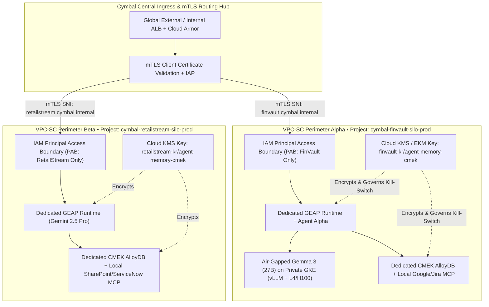

# Workstream 3.1: Case Study & Solution Architecture — Sovereign Silos (Pattern B)

> **Workstream**: Workstream 3 — Siloed Architecture (Pattern B) [Weeks 4–7 • Milestone 2]  
> **Scenario**: Cymbal provisions a dedicated, air-gapped sovereign environment for **FinVault Bank** and **RetailStream Corp** enforcing physical project isolation, Customer-Managed Encryption Keys (CMEK), and perimeter governance.  
> **Delta Scope (on top of 80% Reusable Core Code)**: VPC Service Controls (VPC-SC), IAM Principal Access Boundaries (PAB), Tenant CMEK with Kill-Switch, mTLS Ingress, and Air-Gapped **Gemma 3 on GKE**.

---

## 1. When Regulated Enterprises Mandate Pattern B (Sovereign Silos)

While Pattern A (Pooled) satisfies standard B2B SaaS multi-tenancy, regulated financial institutions (OCC/FDIC/DORA), healthcare providers (HIPAA), and sovereign public-sector workloads often carry contractual mandates that prohibit shared compute pools or shared database clusters:

1. **Zero Physical Blast Radius**: Each tenant resides in a dedicated Google Cloud project (`cymbal-finvault-silo-prod` and `cymbal-retailstream-silo-prod`) enclosed within its own **VPC Service Controls (VPC-SC)** perimeter.
2. **Cryptographic Kill-Switch via Cloud KMS CMEK**: The tenant controls their own **Customer-Managed Encryption Key (CMEK)** (or Cloud EKM external key). Revoking the key immediately renders the GEAP 5-Level Memory Bank, AlloyDB cluster, and BigQuery audit tables inaccessible (`HTTP 423 KMS_KEY_DISABLED`).
3. **IAM Principal Access Boundary (PAB)**: Enforces hard identity isolation so that a principal or agent service account in Tenant A's project can never authenticate to resources outside Tenant A's approved project boundary—even if an IAM policy in another project is misconfigured.
4. **Air-Gapped Local Model Serving (Gemma 3 on GKE)**: For ultra-sensitive workloads that cannot call multi-tenant regional model endpoints, Cymbal deploys **Gemma 3 (27B IT)** on a private **Google Kubernetes Engine (GKE)** Autopilot/Standard cluster inside the tenant's VPC-SC perimeter with zero public internet egress.

---

## 2. Sovereign Silo Architecture Diagram

> **Reference Architecture Blueprint**: [2x Retina PNG](diagrams/ws3-pattern-b-sovereign-silos-architecture.png) • [Vector SVG](diagrams/ws3-pattern-b-sovereign-silos-architecture.svg) • [Editable Draw.io XML](diagrams/ws3-pattern-b-sovereign-silos-architecture.drawio.xml)

---

## 3. Delta Controls Added Over Pattern A

| Control Layer | Pattern A (Pooled) Baseline | Pattern B (Sovereign Silos) Delta |
| :--- | :--- | :--- |
| **Network Perimeter** | Shared VPC + Cloud Armor WAF | Per-project **VPC Service Controls (VPC-SC)** dry-run & enforced service perimeters + **mTLS** client cert pinning |
| **Identity Boundary** | RFC 8693 OBO + DPoP claims | Organization-level **IAM Principal Access Boundary (PAB)** bound to each tenant's Workload Identity Pool & Agent Runtime SA |
| **Encryption & Kill-Switch** | Envelope CMEK on Enterprise namespace | Project-wide **Cloud KMS CMEK** on GEAP Runtime, Memory Bank, AlloyDB, GKE Persistent Disks, and BigQuery with instant revocation kill-switch |
| **Model Serving** | Shared Gemini 2.5 Pro (`ContextCacheConfig`) + Model Garden | Dedicated Provisioned Throughput OR **Air-Gapped Gemma 3 on GKE** inside the VPC-SC perimeter |
