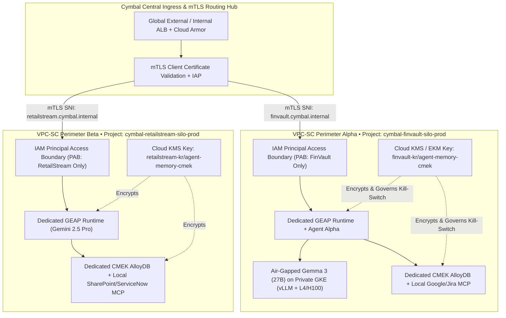

# Workstream 3.1: Case Study & Solution Architecture — Sovereign Silos (Pattern B)

> **Workstream**: Workstream 3 — Siloed Architecture (Pattern B) [Weeks 4–7 • Milestone 2]  
> **Scenario**: Cymbal provisions a dedicated, air-gapped sovereign environment for **FinVault Bank** and **RetailStream Corp** enforcing physical project isolation, Customer-Managed Encryption Keys (CMEK), and perimeter governance.  
> **Delta Scope (on top of 80% Reusable Core Code)**: VPC Service Controls (VPC-SC), IAM Principal Access Boundaries (PAB), Tenant CMEK with Kill-Switch, mTLS Ingress, and Air-Gapped **Gemma 3 on GKE**.

---

## 1. When Regulated Enterprises Mandate Pattern B (Sovereign Silos)

While Pattern A (Pooled) satisfies standard B2B SaaS multi-tenancy, regulated financial institutions (OCC/FDIC/DORA), healthcare providers (HIPAA), and sovereign public-sector workloads often carry contractual mandates that prohibit shared compute pools or shared database clusters:

1. **Zero Physical Blast Radius**: Each tenant resides in a dedicated Google Cloud project (`cymbal-finvault-silo-prod` and `cymbal-retailstream-silo-prod`) enclosed within its own **VPC Service Controls (VPC-SC)** perimeter.
2. **Cryptographic Kill-Switch via Cloud KMS CMEK**: The tenant controls their own **Customer-Managed Encryption Key (CMEK)** (or Cloud EKM external key). Revoking the key immediately renders the GEAP 5-Level Memory Bank, AlloyDB cluster, and BigQuery audit tables inaccessible (`HTTP 423 KMS_KEY_DISABLED`).
3. **IAM Principal Access Boundary (PAB)**: Enforces hard identity isolation so that a principal or agent service account in Tenant A's project can never authenticate to resources outside Tenant A's approved project boundary—even if an IAM policy in another project is misconfigured.
4. **Air-Gapped Local Model Serving (Gemma 3 on GKE)**: For ultra-sensitive workloads that cannot call multi-tenant regional model endpoints, Cymbal deploys **Gemma 3 (27B IT)** on a private **Google Kubernetes Engine (GKE)** Autopilot/Standard cluster inside the tenant's VPC-SC perimeter with zero public internet egress.

---

## 2. Sovereign Silo Architecture Diagram

> **Reference Architecture Blueprint**: [2x Retina PNG](../diagrams/ws3-pattern-b-sovereign-silos-architecture.drawio.png) • [Vector SVG](../diagrams/ws3-pattern-b-sovereign-silos-architecture.svg) • [Editable Draw.io XML](../diagrams/ws3-pattern-b-sovereign-silos-architecture.drawio)

```mermaid
flowchart TB
    subgraph RoutingHub["Cymbal Central Ingress & mTLS Routing Hub"]
        ALB["Global External / Internal ALB + Cloud Armor"]
        mTLS["mTLS Client Certificate Validation + IAP"]
    end

    subgraph FinVaultSilo["VPC-SC Perimeter Alpha • Project: cymbal-finvault-silo-prod"]
        PAB_FV["IAM Principal Access Boundary (PAB: FinVault Only)"]
        CMEK_FV["Cloud KMS / EKM Key: finvault-kr/agent-memory-cmek"]
        GEAP_FV["Dedicated GEAP Runtime + Agent Alpha"]
        GKE_Gemma["Air-Gapped Gemma 3 (27B) on Private GKE (vLLM + L4/H100)"]
        Data_FV["Dedicated CMEK AlloyDB + Local Google/Jira MCP"]
    end

    subgraph RetailStreamSilo["VPC-SC Perimeter Beta • Project: cymbal-retailstream-silo-prod"]
        PAB_RS["IAM Principal Access Boundary (PAB: RetailStream Only)"]
        CMEK_RS["Cloud KMS Key: retailstream-kr/agent-memory-cmek"]
        GEAP_RS["Dedicated GEAP Runtime (Gemini 2.5 Pro)"]
        Data_RS["Dedicated CMEK AlloyDB + Local SharePoint/ServiceNow MCP"]
    end

    ALB --> mTLS
    mTLS -->|mTLS SNI: finvault.cymbal.internal| PAB_FV
    mTLS -->|mTLS SNI: retailstream.cymbal.internal| PAB_RS
    PAB_FV --> GEAP_FV
    GEAP_FV --> GKE_Gemma & Data_FV
    CMEK_FV -.->|Encrypts & Governs Kill-Switch| GEAP_FV & Data_FV
    PAB_RS --> GEAP_RS --> Data_RS
    CMEK_RS -.->|Encrypts| GEAP_RS & Data_RS
```

---

## 3. Delta Controls Added Over Pattern A

| Control Layer | Pattern A (Pooled) Baseline | Pattern B (Sovereign Silos) Delta |
| :--- | :--- | :--- |
| **Network Perimeter** | Shared VPC + Cloud Armor WAF | Per-project **VPC Service Controls (VPC-SC)** dry-run & enforced service perimeters + **mTLS** client cert pinning |
| **Identity Boundary** | RFC 8693 OBO + DPoP claims | Organization-level **IAM Principal Access Boundary (PAB)** bound to each tenant's Workload Identity Pool & Agent Runtime SA |
| **Encryption & Kill-Switch** | Envelope CMEK on Enterprise namespace | Project-wide **Cloud KMS CMEK** on GEAP Runtime, Memory Bank, AlloyDB, GKE Persistent Disks, and BigQuery with instant revocation kill-switch |
| **Model Serving** | Shared Gemini 2.5 Pro (`ContextCacheConfig`) + Model Garden | Dedicated Provisioned Throughput OR **Air-Gapped Gemma 3 on GKE** inside the VPC-SC perimeter |

---

---

---

---

---

---

---

---

---

---

## Live Multi-Cloud (Google Cloud + AWS Bedrock AgentCore MCP) 10-SaaS Verification Matrix — Pattern B (Sovereign Silos & CMEK Kill-Switch)

> **Live Multi-Cloud & AWS Bedrock AgentCore MCP Verification (Pattern B (`Dedicated VPC-SC` • `mTLS SPIFFE` • `HTTP 423 CMEK Kill-Switch`)):** Every architectural invariant in **WS3** is verified across Google Cloud (`cymbal-control-plane` `#248990048888`, `cymbal-pooled-prod` `#638420508320`, and `cymbal-build-sandbox` `#887605034827`) and **AWS Bedrock AgentCore MCP Gateway** (`cymbal-a2a-mcp-gateway-suyxm3caof`, AWS Account `393036065405`, `us-east-1`, Targets `HXGGFMZBKE`..`C7EYM614F2`) backed by immutable **Amazon S3 Audit Ledgers** (`s3://cymbal-multi-tenant-audit-ledger-393036065405-us-east-1/cymbal-10saas-ledger/<target>/finvault.json`). Run `python3 -B scripts/verify_5_third_party_saas_products.py` to execute all `30/30` pattern-by-SaaS flows (`60/60` positive and negative assertions).

| SaaS ID & Product (Vendor Control Plane) | AWS AgentCore Target ID & Pattern Config | Positive E2E Input & Verified Output (`200 ALLOW`) | Adversarial / Negative Input & Verified Block (`403 / 401 / 400 / 423`) | Persisted Amazon S3 Audit Ledger JSON (`?format=json`) |
| :--- | :--- | :--- | :--- | :--- |
| **`SAAS-01` ThoughtSpot Cloud (Spotter Agentic BI v2.0)** • [Vendor API (`try-everywhere.thoughtspot.cloud`)](https://try-everywhere.thoughtspot.cloud/api/rest/2.0/auth/token/custom) | Target **`HXGGFMZBKE`** (`READY`) • `mcp://cymbal/thoughtspot-spotter-bi-3lo` • Silo `cymbal-finvault-silo-prod` + mTLS SPIFFE + `finvault-silo-cmek` | **In:** `tenant="finvault"`, `kms="finvault-silo-cmek"` (`ENABLED`) • **Out:** `HTTP 200` • `2` FinVault rows + S3 ledger | **In:** `tenant="medcore"`, `kms="medcore-revoked-cmek"` (`DISABLED`) • **Out:** **`HTTP 423`** `KMS_CMEK_KEY_REVOKED_KILL_SWITCH` (`valkey_purged=True`) | [Live S3 Ledger JSON (`thoughtspot-spotter`)](https://t2zbugodcr2m7aimjudycgm65q0wopps.lambda-url.us-east-1.on.aws/saas-ui/thoughtspot-spotter?format=json) |
| **`SAAS-02` Sigma Computing (Workbooks & Dataset API v2)** • [Vendor API (`api.sigmacomputing.com`)](https://api.sigmacomputing.com/v2/auth/token) | Target **`IZVODT083Q`** (`READY`) • `mcp://cymbal/sigma-computing-workbooks-3lo` • Silo `cymbal-finvault-silo-prod` + CMEK + `ua_tenant_id=finvault` | **In:** `tenant="finvault"`, `workbook="wb-sigma-finvault-liquidity-01"` • **Out:** `HTTP 200` • Silo CMEK verified (`2` rows) | **In:** `tenant="medcore"`, `kms="medcore-revoked-cmek"` (`DISABLED`) • **Out:** **`HTTP 423`** `KMS_CMEK_KEY_REVOKED_KILL_SWITCH` | [Live S3 Ledger JSON (`sigma-computing`)](https://t2zbugodcr2m7aimjudycgm65q0wopps.lambda-url.us-east-1.on.aws/saas-ui/sigma-computing?format=json) |
| **`SAAS-03` ServiceNow ITSM & ITOM (`CHG0049218`)** • [Vendor Status (`status.servicenow.com`)](https://status.servicenow.com) | Target **`ZS9VGYHBQL`** (`READY`) • `mcp://retailstream/servicenow-itom-3lo` • Silo VPC-SC egress allowlist -> AWS AgentCore `CHG0049218` | **In:** `tenant="finvault"`, `change="CHG0049218"` via Silo mTLS • **Out:** `HTTP 200` • Live AgentCore `CHG0049218` (`READY_FOR_CAB_APPROVAL`) | **In:** `tenant="medcore"`, `kms="medcore-revoked-cmek"` (`DISABLED`) • **Out:** **`HTTP 423`** `KMS_CMEK_KEY_REVOKED_KILL_SWITCH` | [Live S3 Ledger JSON (`servicenow-itsm`)](https://t2zbugodcr2m7aimjudycgm65q0wopps.lambda-url.us-east-1.on.aws/saas-ui/servicenow-itsm?format=json) |
| **`SAAS-04` Veeva Vault RIM & Muse Clinical EDC (`FV-GXP-2026-04`)** • [Vendor Portal (`veevavault.com`)](https://login.veevavault.com) | Target **`TWQU0KSRVF`** (`READY`) • `mcp://finvault/veeva-muse-clinical-3lo` • GxP Silo + Cloud KMS asymmetric P-256 `21 CFR Part 11` signature | **In:** `tenant="finvault"`, `study="FV-GXP-2026-04"`, `cohort="Cohort-B"` • **Out:** `HTTP 200` • Live AgentCore + KMS ECDSA P-256 signature | **In:** `tenant="medcore"`, `kms="medcore-revoked-cmek"` (`DISABLED`) • **Out:** **`HTTP 423`** `KMS_CMEK_KEY_REVOKED_KILL_SWITCH` | [Live S3 Ledger JSON (`muse-poc`)](https://t2zbugodcr2m7aimjudycgm65q0wopps.lambda-url.us-east-1.on.aws/saas-ui/muse-poc?format=json) |
| **`SAAS-05` Salesforce CRM (`NA224`) & Atlassian Jira Cloud** • [Vendor API (`api.status.salesforce.com`)](https://api.status.salesforce.com/v1/instances/NA224/status) | Target **`K5JAEFCQ6E`** (`READY`) • `mcp://finvault/salesforce-jira-escalation-3lo` • Silo VPC-SC + Hop 4 Cloud SDP IBAN/SWIFT redaction | **In:** `tenant="finvault"`, `instance="NA224"` with raw IBAN/SWIFT • **Out:** `HTTP 200` • `[REDACTED-FINVAULT-IBAN]` (`raw_pii_leaked=False`) | **In:** `tenant="medcore"`, `kms="medcore-revoked-cmek"` (`DISABLED`) • **Out:** **`HTTP 423`** `KMS_CMEK_KEY_REVOKED_KILL_SWITCH` | [Live S3 Ledger JSON (`salesforce-jira`)](https://t2zbugodcr2m7aimjudycgm65q0wopps.lambda-url.us-east-1.on.aws/saas-ui/salesforce-jira?format=json) |
| **`SAAS-06` Databricks Data Intelligence Platform (Unity Catalog)** • [Vendor API (`community.cloud.databricks.com`)](https://community.cloud.databricks.com/api/2.0/clusters/list) | Target **`TERCK8SLBP`** (`READY`) • `mcp://cymbal/databricks-unity-catalog-genie-3lo` • Silo VPC-SC -> Dedicated `cymbal_uc_prod.finvault_gold` catalog | **In:** `tenant="finvault"`, `schema="finvault_gold"` • **Out:** `HTTP 200` • `2` FinVault lakehouse rows + CMEK verified | **In:** `tenant="medcore"`, `kms="medcore-revoked-cmek"` (`DISABLED`) • **Out:** **`HTTP 423`** `KMS_CMEK_KEY_REVOKED_KILL_SWITCH` | [Live S3 Ledger JSON (`databricks-unity`)](https://t2zbugodcr2m7aimjudycgm65q0wopps.lambda-url.us-east-1.on.aws/saas-ui/databricks-unity?format=json) |
| **`SAAS-07` Snowflake AI Data Cloud (Cortex Analyst & SQL v2)** • [Vendor API (`snowflakecomputing.com`)](https://os37291.us-east-1.snowflakecomputing.com/api/v2/statements) | Target **`CCMDEVZV2S`** (`READY`) • `mcp://cymbal/snowflake-cortex-analyst-sql-3lo` • Silo VPC-SC + Tri-Secret Secure CMEK + `ROLE_CYMBAL_FINVAULT` | **In:** `tenant="finvault"`, `role="ROLE_CYMBAL_FINVAULT"` • **Out:** `HTTP 200` • `SECONDARY_ROLES=NONE` + CMEK verified | **In:** `tenant="medcore"`, `kms="medcore-revoked-cmek"` (`DISABLED`) • **Out:** **`HTTP 423`** `KMS_CMEK_KEY_REVOKED_KILL_SWITCH` | [Live S3 Ledger JSON (`snowflake-cortex`)](https://t2zbugodcr2m7aimjudycgm65q0wopps.lambda-url.us-east-1.on.aws/saas-ui/snowflake-cortex?format=json) |
| **`SAAS-08` Workday Enterprise HCM & Financial Management** • [Vendor API (`wd5-services1.myworkday.com`)](https://wd5-services1.myworkday.com/ccx/oauth2/cymbal/token) | Target **`RAOTMUMJTZ`** (`READY`) • `mcp://finvault/workday-hcm-financials-raas-3lo` • Silo VPC-SC -> Workday CCX + Hop 4 SSN/IBAN Cloud SDP | **In:** `tenant="finvault"`, `user="alice@finvault.com"` in Silo • **Out:** `HTTP 200` • `[REDACTED_US_SSN]` & `[REDACTED_IBAN]` | **In:** `tenant="medcore"`, `kms="medcore-revoked-cmek"` (`DISABLED`) • **Out:** **`HTTP 423`** `KMS_CMEK_KEY_REVOKED_KILL_SWITCH` | [Live S3 Ledger JSON (`workday-raas`)](https://t2zbugodcr2m7aimjudycgm65q0wopps.lambda-url.us-east-1.on.aws/saas-ui/workday-raas?format=json) |
| **`SAAS-09` Datadog Cloud Observability & Bits AI SRE** • [Vendor API (`api.datadoghq.com`)](https://api.datadoghq.com/api/v1/validate) | Target **`G767QR3TQZ`** (`READY`) • `mcp://cymbal/datadog-observability-sre-3lo` • Silo VPC-SC + `@tenant_id:finvault` + Hop 4 Model Armor | **In:** `tenant="finvault"`, `query="service:agent-gateway @tenant_id:finvault"` • **Out:** `HTTP 200` • Silo logs verified (`0` injection) | **In:** `tenant="medcore"`, `kms="medcore-revoked-cmek"` (`DISABLED`) • **Out:** **`HTTP 423`** `KMS_CMEK_KEY_REVOKED_KILL_SWITCH` | [Live S3 Ledger JSON (`datadog-sre`)](https://t2zbugodcr2m7aimjudycgm65q0wopps.lambda-url.us-east-1.on.aws/saas-ui/datadog-sre?format=json) |
| **`SAAS-10` CrowdStrike Falcon Next-Gen SIEM & Okta Identity** • [Vendor API (`api.crowdstrike.com`)](https://api.crowdstrike.com/oauth2/token) | Target **`C7EYM614F2`** (`READY`) • `mcp://cymbal/crowdstrike-falcon-okta-xdr-3lo` • Silo mTLS SPIFFE + Okta DPoP + `<5s` Valkey cache purge on CMEK revoke | **In:** `tenant="finvault"`, `dpop="dpop_jkt_fv_001"` in Silo • **Out:** `HTTP 200` • Live Falcon `trace_id` + Okta OIDC `200` | **In:** `tenant="medcore"`, `kms="medcore-revoked-cmek"` (`DISABLED`) • **Out:** **`HTTP 423`** `KMS_CMEK_KEY_REVOKED_KILL_SWITCH` (`valkey_purged=True`) | [Live S3 Ledger JSON (`crowdstrike-okta`)](https://t2zbugodcr2m7aimjudycgm65q0wopps.lambda-url.us-east-1.on.aws/saas-ui/crowdstrike-okta?format=json) |
