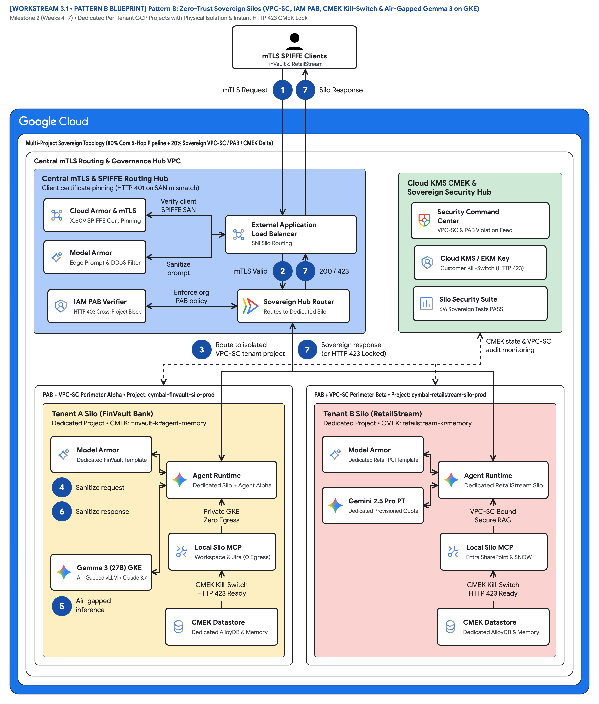
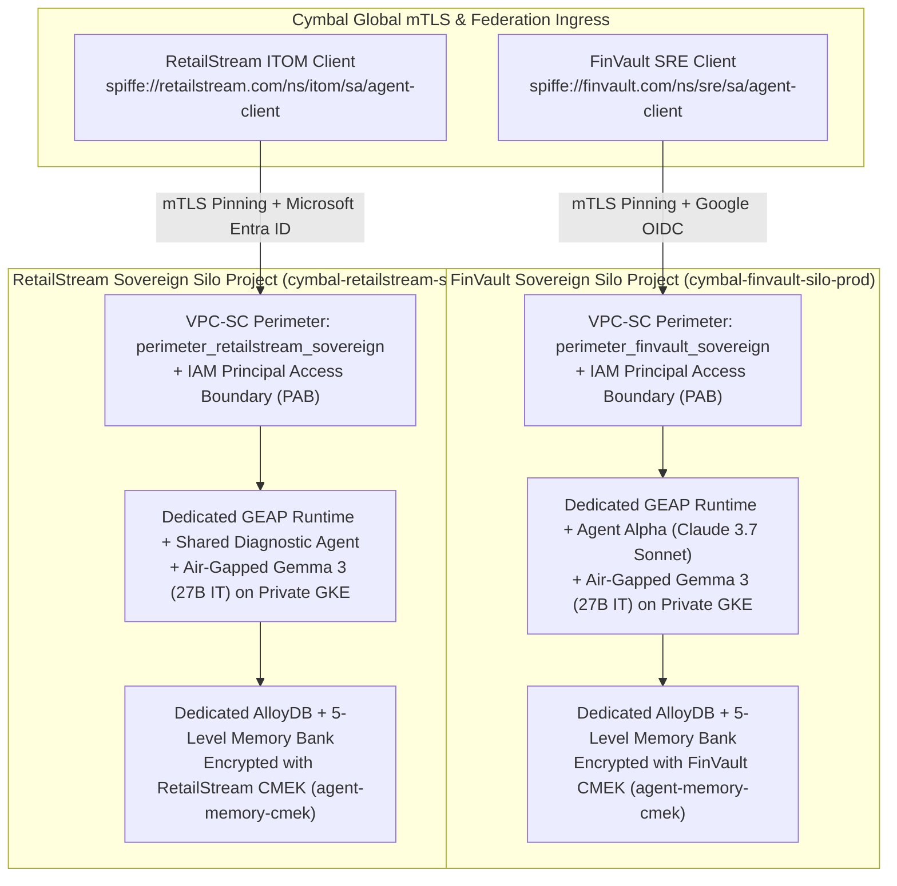

# Dedicated Silos & Regulated Isolation: Architecting Zero-Trust Sovereign AI Agents with VPC-SC, PAB, CMEK Kill-Switches, and Air-Gapped Gemma 3 on GKE

> **Executive TL;DR**
> - **The Problem**: While **Pattern A (Pooled Architecture)** delivers 90% COGS savings via logical and cryptographic isolation, Tier-1 regulated institutions (G-SIB banks, HIPAA healthcare systems, sovereign agencies) frequently mandate **zero physical blast radius**, dedicated cloud perimeters, customer-revocable encryption keys, and air-gapped model hosting.
> - **The Solution**: **Pattern B (Sovereign Silos)** reuses **80% of Cymbal's core 5-Hop ADK 2.0 codebase** (`core-cymbal-agent/`) and layers on **20% Sovereign Infrastructure Delta** per tenant project (`cymbal-finvault-silo-prod` and `cymbal-retailstream-silo-prod`): Mutual TLS (mTLS) SPIFFE certificate pinning, Organization **IAM Principal Access Boundaries (PAB)**, **VPC Service Controls (VPC-SC)** perimeters, **Cloud KMS CMEK** instant kill-switches (`HTTP 423 KMS_KEY_DISABLED`), and air-gapped **Gemma 3 (27B IT)** on Private GKE.
> - **The Outcome**: Complete physical and cryptographic sovereignty verified across all **6 automated Sovereign Silo security gates** ([`run_silo_security_tests.py`](3.5-exfiltration-and-cmek-revocation-tests/run_silo_security_tests.py)).

---

## 1. Introduction: When Logical Multi-Tenancy Is Not Enough

In [Part 1 (`2.7-blog-pooled-architecture-governance.md`)](../workstream-2-pattern-a-pooled/2.7-blog-pooled-architecture-governance.md), we demonstrated how **Pattern A (Pooled Architecture)** enforces the **5-Hop Cryptographic Context Chain** to serve competing SaaS tenants from a shared runtime without cross-tenant bleed.

However, when your SaaS platform sells to a globally systemically important bank (**FinVault Bank**), a PCI Level-1 global retailer demanding sovereign regional enclaves (**RetailStream Corp**), or a regulated healthcare provider, external auditors often impose three non-negotiable mandates:

1. **Zero Physical Blast Radius & Dedicated Quotas**: Dedicated GCP projects (`cymbal-finvault-silo-prod` and `cymbal-retailstream-silo-prod`), dedicated VPCs, and dedicated Provisioned Throughput or GKE GPU node pools so no external tenant can ever contend for compute or API quotas.
2. **Customer-Controlled Cryptographic Kill-Switch (`CMEK` / `EKM`)**: Every byte of agent memory (`5-Level Memory Bank`), vector embeddings, and AlloyDB state must be encrypted with a customer-managed key in **Cloud KMS** (or **Cloud EKM**). If the customer's SOC revokes that key, all active and queued agent turns must halt instantaneously with `HTTP 423 Locked`.
3. **Hard Perimeter Exfiltration Prevention**: Even if an autonomous agent is compromised by a zero-day dependency or malicious prompt, the underlying infrastructure must make it mathematically and network-impossible to exfiltrate data to an unauthorized project.

---

## 2. The 80/20 Engineering Rule: Reusing the Core 5-Hop Pipeline Inside Sovereign Silos

A common mistake made by B2B SaaS engineering teams is forking their application codebase when moving from a pooled SaaS tier to single-tenant enterprise silos. With **GEAP** and **ADK 2.0**, Cymbal reuses **100% of its 5-Hop core pipeline** ([`core-cymbal-agent/runtime_pipeline.py`](../core-cymbal-agent/runtime_pipeline.py)) and wraps it with [`PatternBSiloedService`](3.3-solution-implementation/pattern_b_siloed_service.py):

> **Reference Architecture Blueprint**: [2x Retina PNG](diagrams/ws3-pattern-b-sovereign-silos-architecture.png) • [Vector SVG](diagrams/ws3-pattern-b-sovereign-silos-architecture.svg) • [Editable Draw.io XML](diagrams/ws3-pattern-b-sovereign-silos-architecture.drawio.xml)





---

## 3. Deep Dive: The Four Sovereign Infrastructure Controls of Pattern B

### Layer 1: Mutual TLS (mTLS) SPIFFE Pinning at Silo Ingress
Before Hop 1 even evaluates the user's OIDC or Entra ID JWT, the Silo Ingress load balancer verifies the client's X.509 mTLS client certificate Subject Alternative Name (SPIFFE ID):
- **FinVault Silo (`cymbal-finvault-silo-prod`)**: Accepts only `spiffe://finvault.com/ns/sre/sa/agent-client`.
- **RetailStream Silo (`cymbal-retailstream-silo-prod`)**: Accepts only `spiffe://retailstream.com/ns/itom/sa/agent-client`.

If a spoofed or cross-tenant client certificate is presented, [`PatternBSiloedService.invoke_siloed_agent`](3.3-solution-implementation/pattern_b_siloed_service.py#L63-L95) rejects the connection immediately with `HTTP 401 MTLS_CERTIFICATE_MISMATCH`.

### Layer 2: Organization IAM Principal Access Boundaries (PAB)
Standard IAM policies are resource-centric (*"Which principals can read this bucket?"*). In a multi-project agentic architecture, you also need principal-centric guardrails (*"Which GCP projects is this agent service account ever allowed to touch?"*).

In [`3.6-terraform-silo-blueprint/main.tf`](3.6-terraform-silo-blueprint/main.tf), Cymbal binds an **IAM Principal Access Boundary (PAB)** policy to each tenant's federated identities and GEAP runtime service accounts:

```json
{
  "displayName": "finvault-sovereign-pab-policy",
  "details": {
    "rules": [
      {
        "description": "Restrict FinVault principals and agent SAs strictly to cymbal-finvault-silo-prod",
        "resources": [
          "//cloudresourcemanager.googleapis.com/projects/cymbal-finvault-silo-prod"
        ],
        "effect": "ALLOW"
      }
    ],
    "enforcementVersion": "1"
  }
}
```

Even if an engineer misconfigures an IAM policy in RetailStream's project (`cymbal-retailstream-silo-prod`), FinVault's agent identity is cryptographically blocked at the Google Cloud IAM evaluation plane with `HTTP 403 PAB_BOUNDARY_VIOLATION`.

### Layer 3: VPC Service Controls (VPC-SC) Service Perimeters
Each tenant project is enclosed inside its own dedicated **VPC Service Controls** perimeter (`perimeter_finvault_sovereign` and `perimeter_retailstream_sovereign`) restricting:
- `aiplatform.googleapis.com` (Vertex AI & Model Garden)
- `discoveryengine.googleapis.com` (GEAP Agent Runtime & Registry)
- `modelarmor.googleapis.com` (Vertex AI Model Armor)
- `alloydb.googleapis.com`, `storage.googleapis.com`, and `bigquery.googleapis.com`

If a compromised MCP tool attempts to exfiltrate incident data to `external-attacker-exfil-proj`, the VPC-SC boundary drops the API call with `HTTP 403 VPC_SERVICE_CONTROLS_PERMISSION_DENIED`.

### Layer 4: Cloud KMS CMEK Instant Kill-Switch & Air-Gapped Gemma 3 (27B) on GKE
Every stateful resource inside a Pattern B silo is encrypted with a tenant-dedicated Cloud KMS key (`silo_cmek_key_uri`):
- **FinVault CMEK**: `projects/cymbal-finvault-silo-prod/locations/us-central1/keyRings/finvault-kr/cryptoKeys/agent-memory-cmek`
- **RetailStream CMEK**: `projects/cymbal-retailstream-silo-prod/locations/us-central1/keyRings/retailstream-kr/cryptoKeys/agent-memory-cmek`

When a customer's CISO triggers `revoke_tenant_cmek()`, [`ComputeFinOpsBulkhead.enforce_compute_and_finops`](../core-cymbal-agent/governance/hop3_compute_finops_bulkhead.py#L107-L126) detects the disabled key at Hop 3 and halts all Memory Bank reads, writes, and model invocations with `HTTP 423 KMS_KEY_DISABLED`.

Furthermore, for workloads requiring 100% air-gapped inference with zero external API calls, Cymbal deploys **Gemma 3 (27B IT)** on a private **GKE Autopilot** GPU node pool (`vLLM` on NVIDIA L4 GPUs) using [`gke_gemma3_airgapped_manifest.yaml`](3.3-solution-implementation/gke_gemma3_airgapped_manifest.yaml).

---

## 4. Verification: 6-Point Automated Sovereign Silo Security Suite

Run [`run_silo_security_tests.py`](3.5-exfiltration-and-cmek-revocation-tests/run_silo_security_tests.py) to validate all six sovereign controls across **both FinVault Bank and RetailStream Corp** (per Slide 11 of the roadmap):

```bash
PYTHONDONTWRITEBYTECODE=1 python3 -B workstream-3-pattern-b-siloed/3.5-exfiltration-and-cmek-revocation-tests/run_silo_security_tests.py
```

| Test Gate | Sovereign Security Control | Target Silo | Verified Result |
| :--- | :--- | :--- | :--- |
| **`TEST 1`** | Spoofed client SPIFFE certificate at mTLS Ingress | `cymbal-finvault-silo-prod` | Rejected with `401 MTLS_CERTIFICATE_MISMATCH` (`PASS`) |
| **`TEST 2`** | Cross-project access attempt (`finvault` $\rightarrow$ `retailstream` silo) | `cymbal-retailstream-silo-prod` | Blocked by IAM PAB with `403 PAB_BOUNDARY_VIOLATION` (`PASS`) |
| **`TEST 3`** | Data exfiltration to `external-attacker-exfil-proj` | `perimeter_finvault_sovereign` | Blocked with `403 VPC_SERVICE_CONTROLS_PERMISSION_DENIED` (`PASS`) |
| **`TEST 4A`** | FinVault CISO revokes Cloud KMS CMEK key | `cymbal-finvault-silo-prod` | Immediate halt with `423 KMS_KEY_DISABLED` (`PASS`) |
| **`TEST 4B & 5`** | FinVault restores CMEK & runs air-gapped Gemma 3 (27B) on GKE | `cymbal-finvault-silo-prod` | Sovereign GKE Gemma 3 inference & SDP redaction verified (`PASS`) |
| **`TEST 6`** | RetailStream Sovereign Silo VPC-SC & CMEK Kill-Switch parity | `cymbal-retailstream-silo-prod` | RetailStream CMEK `423` halt & restore verified (`PASS`) |

---

## 5. Ready-to-Publish Social & Community Promotion Kit (LinkedIn / X)

```text
🛡️ New Technical Deep-Dive (Part 2): What happens when regulated FinTech & Healthcare customers tell your SaaS team that logical multi-tenancy isn't enough?

In Part 2 of our Gemini Enterprise Agent Platform (GEAP) & ADK 2.0 series, we show how to reuse 80% of your core agent codebase and layer on Pattern B (Zero-Trust Sovereign Silos):
🔒 mTLS SPIFFE Certificate Pinning at Silo Ingress (HTTP 401 on spoofed certs)
🚧 Organization IAM Principal Access Boundaries (PAB) preventing cross-project principal drift (HTTP 403)
🌐 VPC Service Controls (VPC-SC) perimeters blocking data exfiltration at the Google Cloud API boundary
🔑 Customer-Managed Encryption Keys (Cloud KMS CMEK) acting as an instant CISO kill-switch (HTTP 423 Locked)
🧠 Air-Gapped Gemma 3 (27B IT) running on private GKE GPU node pools inside the sovereign perimeter

Includes a modular Terraform Silo Blueprint and a 6-check automated perimeter & CMEK test suite.
#GoogleCloud #CloudSecurity #ZeroTrust #VPCServiceControls #GKE #Gemma3 #AgenticAI
```

*Next in **Part 3 ([`4.7-blog-dynamic-tiering-and-migration.md`](../workstream-4-pattern-c-hybrid/4.7-blog-dynamic-tiering-and-migration.md))**: Unifying Pooled and Sovereign tiers with Pattern C (Dynamic Hybrid), Private Service Connect (PSC) Spokes, and Zero-Downtime Live Tenant Tier Migration.*
