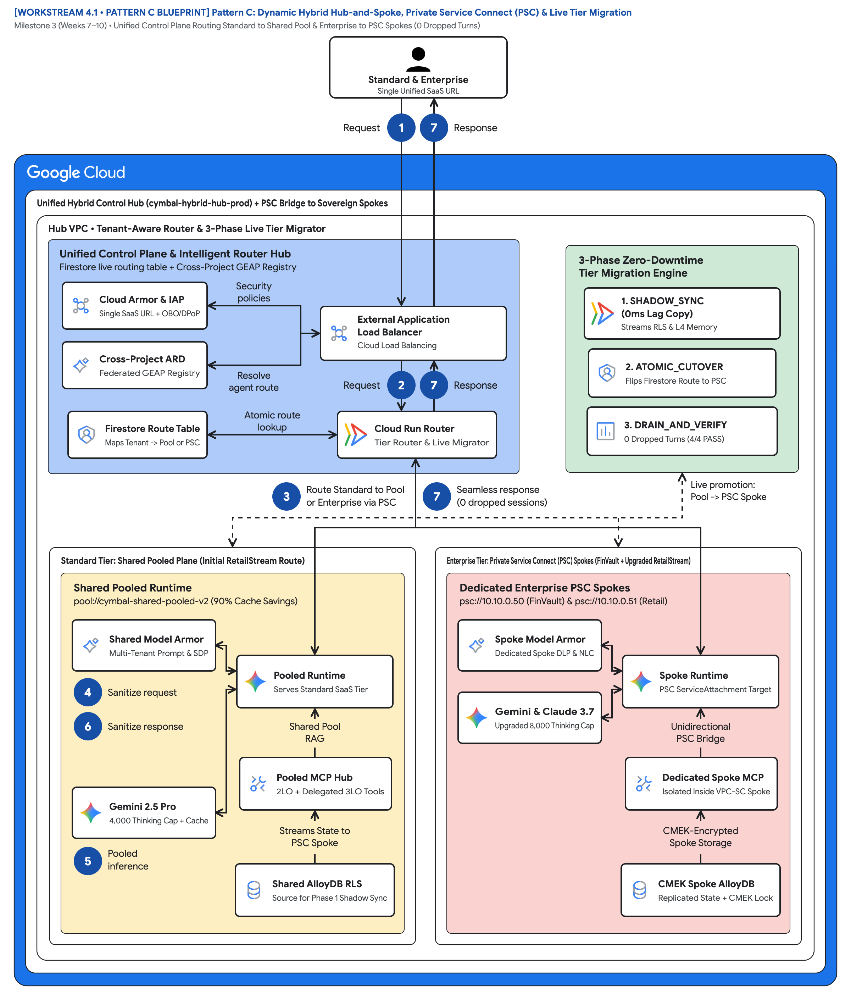

# Dynamic Tiering, PSC Spokes & Silent Tenant Migration: Scaling Multi-Tenant Agentic AI from SMB to Fortune 500 with Zero Downtime

> **Executive TL;DR**
> - **The Problem**: High-growth B2B SaaS platforms cannot afford to run two disconnected stacks—one for Pooled SMB/Standard tenants (**Pattern A**) and another for Sovereign Enterprise tenants (**Pattern B**). Worse, when a Standard-tier customer upgrades to an Enterprise contract, migrating their agent memory, AlloyDB rows, and active sessions traditionally requires maintenance windows and breaking URL changes.
> - **The Solution**: **Pattern C (Dynamic Hybrid Architecture)** combines a **Unified Ingress & Control Plane Hub (`cymbal-hybrid-hub-prod`)**, a **Cross-Project Federated GEAP Registry**, **Private Service Connect (PSC)** service attachments to dedicated Enterprise Spokes, and a **3-Phase Silent Tenant Migration State Machine** (`SHADOW_SYNC` $\rightarrow$ `ATOMIC_CUTOVER` $\rightarrow$ `DRAIN_AND_VERIFY`).
> - **The Outcome**: Standard tenants (`RetailStream Corp`) start in the cost-optimized Shared Pool (`4,000` thinking cap) and upgrade live to a Dedicated Enterprise PSC Spoke (`8,000` thinking budget + CMEK) mid-session with **0 dropped turns**.

---

## 1. Introduction: Bridging the Pooled-to-Sovereign Chasm

In [Part 1 (`2.7-blog-pooled-architecture-governance.md`)](../workstream-2-pattern-a-pooled/2.7-blog-pooled-architecture-governance.md), we engineered **Pattern A (Pooled Architecture)** to maximize tenant density and reduce shared system prompt COGS by 90% via `ContextCacheConfig`. In [Part 2 (`3.7-blog-sovereign-silos.md`)](../workstream-3-pattern-b-siloed/3.7-blog-sovereign-silos.md), we engineered **Pattern B (Sovereign Silos)** to satisfy regulated enterprises demanding dedicated GCP projects, VPC Service Controls (VPC-SC), IAM Principal Access Boundaries (PAB), and customer-revocable Cloud KMS CMEK keys.

In the real world, successful B2B SaaS platforms rarely choose just one:
- You onboard hundreds of **Standard-tier** customers into a shared pool on Day 1 to keep onboarding frictionless and gross margins above 80%.
- Six months later, your fastest-growing Standard customer—**RetailStream Corp**—signs a seven-figure Enterprise expansion contract requiring a dedicated VPC-SC spoke, customer-managed encryption keys (CMEK), and an 8,000 thinking-token budget.

How do you operate a **single unified control plane** across both tiers and promote a live customer from the Shared Pool to a Dedicated Sovereign Spoke **without dropping a single in-flight agent turn**? Welcome to **Pattern C: Dynamic Hybrid Architecture**.

---

## 2. Reference Architecture: Unified Control Plane Hub + Private Service Connect (PSC) Spokes

In [`pattern_c_hybrid_router_and_migrator.py`](4.3-solution-implementation/pattern_c_hybrid_router_and_migrator.py), Cymbal operates a central **Ingress & Control Plane Hub (`cymbal-hybrid-hub-prod`)** backed by a live **Firestore Routing Table** and a **Cross-Project Federated GEAP Agent Registry**:

> **Reference Architecture Blueprint**: [2x Retina PNG](diagrams/ws4-pattern-c-hybrid-psc-and-migration.png) • [Vector SVG](diagrams/ws4-pattern-c-hybrid-psc-and-migration.svg) • [Editable Draw.io XML](diagrams/ws4-pattern-c-hybrid-psc-and-migration.drawio.xml)



```mermaid
flowchart LR
    subgraph Ingress["Cymbal Unified Control Plane Hub (cymbal-hybrid-hub-prod)"]
        PEP["Hop 1: Cloud Armor + IAP<br/>RFC 8693 OBO + DPoP"] --> Router["Tenant-Aware Intelligent Router<br/>+ Firestore Routing Table"]
        Router --> FedReg["Hop 2: Cross-Project Federated<br/>GEAP Agent & MCP Registry"]
    end

    subgraph Pool["Standard Tier: Shared Pooled Plane"]
        PoolRun["pool://cymbal-shared-pooled-runtime-v2<br/>4,000 Thinking Cap + Shared AlloyDB RLS"]
    end

    subgraph SpokeFV["Enterprise Spoke 1: FinVault Bank (cymbal-finvault-silo-prod)"]
        PSCFV["PSC Endpoint: psc://10.10.0.50/...<br/>Service Attachment: finvault-agent-spoke-psc"] --> RunFV["8,000 Thinking Budget + Agent Alpha<br/>+ FinVault CMEK + VPC-SC"]
    end

    subgraph SpokeRS["Enterprise Spoke 2: RetailStream Upgraded (cymbal-retailstream-silo-prod)"]
        PSCRS["PSC Endpoint: psc://10.10.0.51/...<br/>Service Attachment: retailstream-agent-spoke-psc"] --> RunRS["8,000 Thinking Budget + Entra 3LO<br/>+ RetailStream CMEK + VPC-SC"]
    end

    FedReg -->|RetailStream (Pre-Upgrade: STANDARD)| PoolRun
    FedReg -->|FinVault (ENTERPRISE)| PSCFV
    FedReg -.->|RetailStream (Post-Upgrade: ATOMIC_CUTOVER)| PSCRS
```

---

## 3. Why Private Service Connect (PSC) Beats VPC Peering for Multi-Tenant Spokes

Connecting a shared SaaS control plane to dozens or hundreds of dedicated enterprise spoke projects via traditional VPC Network Peering quickly hits hard architectural walls. **Private Service Connect (PSC)** ([`4.6-terraform-hybrid-psc-blueprint/main.tf`](4.6-terraform-hybrid-psc-blueprint/main.tf)) eliminates every one of those bottlenecks:

| Networking Dimension | Legacy VPC Network Peering | Private Service Connect (`PSC` Service Attachment) |
| :--- | :--- | :--- |
| **IP CIDR Management** | Every tenant spoke requires a globally unique, non-overlapping RFC 1918 CIDR block | **Zero CIDR Overlap**: Every tenant spoke can use identical `10.40.0.0/20` CIDRs via PSC producer NAT |
| **Directionality & Blast Radius** | Bidirectional network reachability across peered subnets | **Unidirectional Least Privilege**: Hub initiates requests to `psc://10.10.0.5x`; spoke cannot initiate traffic back into Hub |
| **Scale & Quota Limits** | Capped by VPC peering group limits (`25` peerings per VPC network) | Scales to **hundreds of dedicated Enterprise Spokes** per central Hub VPC |
| **VPC Service Controls (VPC-SC)** | Complex perimeter bridge configurations required | Native PSC service attachment allowlisting (`consumer_accept_lists`) across perimeters |

---

## 4. Deep Dive: The 3-Phase Silent Tenant Migration Protocol (`0` Dropped Sessions)

When RetailStream upgrades from `STANDARD` (`PATTERN_C_HYBRID_POOL`) to `ENTERPRISE` (`PATTERN_C_HYBRID_PSC_SPOKE`), [`PatternCHybridRouterAndMigrator.execute_zero_downtime_tier_upgrade`](4.3-solution-implementation/pattern_c_hybrid_router_and_migrator.py#L94-L179) executes three deterministic phases without mutating global cross-instance state:

### Phase 1: `SHADOW_SYNC` (Background Provisioning & Continuous Replication)
1. Terraform provisions `cymbal-retailstream-silo-prod`, its Cloud KMS CMEK key (`retailstream-kr/cryptoKeys/agent-memory-cmek`), and its PSC Service Attachment (`retailstream-agent-spoke-psc`).
2. The migrator queries RetailStream's RLS-scoped AlloyDB rows (`SET LOCAL app.current_tenant = 'retailstream'`) and 5-Level Memory Bank namespaces (`retailstream:user:session`) and streams them into the dedicated spoke until `replication_lag_ms == 0` and the PSC health check reports `PSC_CONNECTION_ACCEPTED`.

### Phase 2: `ATOMIC_CUTOVER` (Single-Document Firestore Route Flip)
Once shadow sync reaches zero lag, a single atomic write updates the instance-scoped tenant profile and routing table:

```python
upgraded_profile = replace(
    old_profile,
    tier=core_models.TenantTier.ENTERPRISE,
    thinking_token_budget=8000,
    redis_rpm_limit=600,
    allowed_agents=updated_agents,
    cmek_key_uri=new_cmek_key_uri,
    dedicated_project_id=new_spoke_project_id,
    psc_service_attachment=new_psc_attachment_uri,
)
self.runtime.tenant_profiles[tenant_id] = upgraded_profile

self.routing_table[tenant_id] = {
    "tier": core_models.TenantTier.ENTERPRISE,
    "topology": core_models.IsolationTopology.PATTERN_C_HYBRID_PSC_SPOKE,
    "target_endpoint": f"psc://10.10.0.51/{new_psc_attachment_uri}",
    "thinking_token_budget": 8000,
    "cmek_key_uri": new_cmek_key_uri,
    "migration_state": "UPGRADED_ZERO_DOWNTIME_SPOKE",
}
```

### Phase 3: `DRAIN_AND_VERIFY` (Seamless Mid-Session Continuity)
In-flight turns on the shared pool finish draining while the very next turn in the active user session (`sess-rs-live-upgrade-01`) transparently routes over `psc://10.10.0.51/...` with an `8,000` thinking-token budget and CMEK encryption active.

---

## 5. Verification: 4-Point Automated Zero-Downtime Tier Upgrade Suite

Run [`run_tier_migration_suite.py`](4.5-zero-downtime-tier-upgrade-suite/run_tier_migration_suite.py) to verify the complete hybrid routing and live tier upgrade flow:

```bash
PYTHONDONTWRITEBYTECODE=1 python3 -B workstream-4-pattern-c-hybrid/4.5-zero-downtime-tier-upgrade-suite/run_tier_migration_suite.py
```

| Test Gate | Hybrid Routing / Migration Stage | Active Endpoint | Verified Outcome |
| :--- | :--- | :--- | :--- |
| **`TEST 1A`** | Pre-Upgrade Standard Tier (`retailstream`) | `pool://cymbal-shared-pooled-runtime-v2` | Clamped `8,000` request to `4,000` Standard cap (`PASS`) |
| **`TEST 1B`** | Enterprise PSC Spoke (`finvault`) | `psc://10.10.0.50/.../finvault-agent-spoke-psc` | Full `8,000` thinking budget + CMEK active (`PASS`) |
| **`TEST 2`** | 3-Phase Silent Tier Migration (`SHADOW_SYNC` $\rightarrow$ `ATOMIC_CUTOVER` $\rightarrow$ `DRAIN`) | `pool://...` $\rightarrow$ `psc://10.10.0.51/...` | `0` replication lag; `0` dropped sessions; zero global state bleed (`PASS`) |
| **`TEST 3`** | Post-Upgrade Enterprise Spoke (`retailstream`) | `psc://10.10.0.51/.../retailstream-agent-spoke-psc` | Same session (`sess-rs-live-upgrade-01`) receives `8,000` thinking budget & CMEK (`PASS`) |

---

## 6. Ready-to-Publish Social & Community Promotion Kit (LinkedIn / X)

```text
⚡ New Technical Deep-Dive (Part 3): How do you promote a live B2B SaaS customer from a Shared Multi-Tenant AI Pool to a Dedicated Sovereign Spoke with ZERO downtime and ZERO dropped agent sessions?

In Part 3 of our Gemini Enterprise Agent Platform (GEAP) & ADK 2.0 series, we unveil Pattern C (Dynamic Hybrid Architecture):
🧭 Tenant-Aware Intelligent Ingress Router + Cross-Project Federated GEAP Registry
🔌 Private Service Connect (PSC) service attachments eliminating VPC peering limits & CIDR overlap
🔄 3-Phase Silent Tenant Migration Protocol (SHADOW_SYNC -> ATOMIC_CUTOVER -> DRAIN_AND_VERIFY)
🚀 Live mid-session upgrade from a 4,000-token Pooled Tier to an 8,000-token CMEK Enterprise Spoke

Includes a Hub-and-Spoke PSC Terraform blueprint and an automated zero-downtime migration test suite.
#GoogleCloud #PrivateServiceConnect #CloudNetworking #SaaS #AgenticAI #VertexAI #ZeroDowntime
```

*Next in **Part 4 ([`5.2-blog-multi-tenant-agentic-triad.md`](../workstream-5-wrap-up-and-backlog/5.2-blog-multi-tenant-agentic-triad.md))**: The Multi-Tenant Agentic Triad — Mastering Cost, Privacy-Preserving Observability, and Zero-Trust Security at Scale.*
