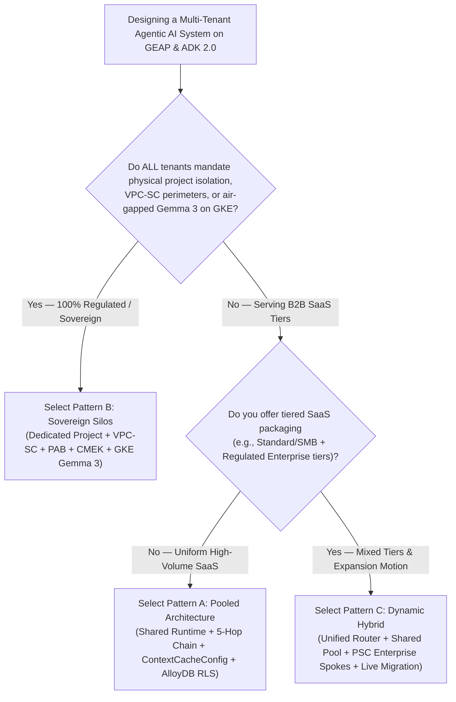

# Workstream 5.1: Multi-Tenant Agentic AI Pattern Comparison & Executive Decision Guide

> **Workstream**: Workstream 5 — Wrap-Up & Capstone Backlog (Slides 2, 5 & 13)  
> **Synthesizes**:  
> 1. *Multi-Tenant Agent Architectures for ISVs: Silo, Pooled, and Hybrid Models*  
> 2. *Building Multi-Tenant Agentic AI Systems Using Gemini Enterprise Agent Platform for B2B SaaS*  
> 3. *Google Cloud Architecture Center: [Multi-tenant agentic AI system](https://docs.cloud.google.com/architecture/multi-tenant-agentic-ai-system)*

---

## 1. Side-by-Side Architectural Comparison Matrix

| Evaluation Dimension | Pattern A: Pooled Architecture (`Maximum Density`) | Pattern B: Sovereign Silos (`Zero Trust Isolation`) | Pattern C: Dynamic Hybrid (`Intelligent Routing`) |
| :--- | :--- | :--- | :--- |
| **Primary Value Proposition** | Lowest unit COGS & instant self-service tenant onboarding | Zero physical blast radius, zero noisy neighbors & full regulatory sovereignty | Pooled unit economics for Standard tiers + Sovereign PSC Spokes for Enterprise tiers |
| **GCP Project Topology** | Single shared GCP Project for compute, registry & data | 1 Dedicated GCP Project per corporate tenant + Central Routing/Security Hub | Central Control/Ingress Hub + Shared Pool Project + N Dedicated Enterprise Spoke Projects |
| **Hop 1: Edge & Identity PEP** | Cloud Armor WAF + IAP (`X-Tenant-ID` strip) + RFC 8693 OBO + DPoP (`jkt`) | Cloud Armor + **mTLS SPIFFE Pinning** + **IAM Principal Access Boundary (PAB)** | Unified Cloud Armor/IAP Hub + Tenant-Aware Firestore Router + Cross-Project PAB |
| **Hop 2: Agent & MCP Catalog** | Shared GEAP Registry filtered by tenant labels + ADK `before_agent_callback` pruning | Dedicated per-project GEAP Registry & local MCP servers | **Cross-Project Federated GEAP Registry** + ADK `before_agent_callback` |
| **Hop 3: Compute, Model & Memory** | Shared gVisor Runtime + `temp:tenant_id` + **Shared `ContextCacheConfig` (90% COGS savings)** + Redis Bulkhead | Dedicated GEAP Runtime / Provisioned Throughput OR **Air-Gapped Gemma 3 (27B) on Private GKE** + Project CMEK | Standard routed to Shared Pool (`4k` cap); Enterprise routed via **PSC** to Dedicated Spoke (`8k` cap + CMEK) |
| **Hop 4: Guardrails & DLP** | Shared Vertex AI Model Armor with per-tenant SDP detectors & Semantic NLCs | Dedicated per-project Model Armor + Sensitive Data Protection (SDP) templates | Ingress Model Armor at Hub + Spoke-specific SDP/NLC enforcement |
| **Hop 5: Data & Telemetry Plane** | Shared AlloyDB with **PostgreSQL Row-Level Security (`SET LOCAL app.current_tenant`)** + BigQuery OTel | Dedicated CMEK AlloyDB & BigQuery per tenant project enclosed in **VPC Service Controls (VPC-SC)** | Shared RLS AlloyDB for Standard + **Private Service Connect (PSC)** bridge to dedicated VPC-SC Spokes |
| **CMEK Kill-Switch Granularity** | Envelope CMEK per namespace (`finvault:user:session`) | Full project-level Cloud KMS / EKM CMEK kill-switch (`HTTP 423 KMS_KEY_DISABLED`) | Envelope CMEK in Pool; full project CMEK kill-switch in Enterprise Spokes |
| **Live Tier Upgrade Path** | Requires migration to Pattern C to add dedicated spokes | Static silo provisioning | **3-Phase Zero-Downtime Live Tier Migration (`SHADOW_SYNC` $\rightarrow$ `ATOMIC_CUTOVER` $\rightarrow$ `DRAIN`)** |
| **Relative Unit Cost (COGS)** | **`$` (Lowest — 85–90% shared prefix savings)** | **`$$$` (Highest — dedicated baseline per tenant)** | **`$$` (Optimal blended SaaS margin across SMB & Enterprise)** |

---

## 2. Executive Decision Tree for Architects & FDEs

> **Reference Architecture Blueprint**: [2x Retina PNG](diagrams/ws5-decision-tree-and-agentic-triad.png) • [Vector SVG](diagrams/ws5-decision-tree-and-agentic-triad.svg) • [Editable Draw.io XML](diagrams/ws5-decision-tree-and-agentic-triad.drawio.xml)

