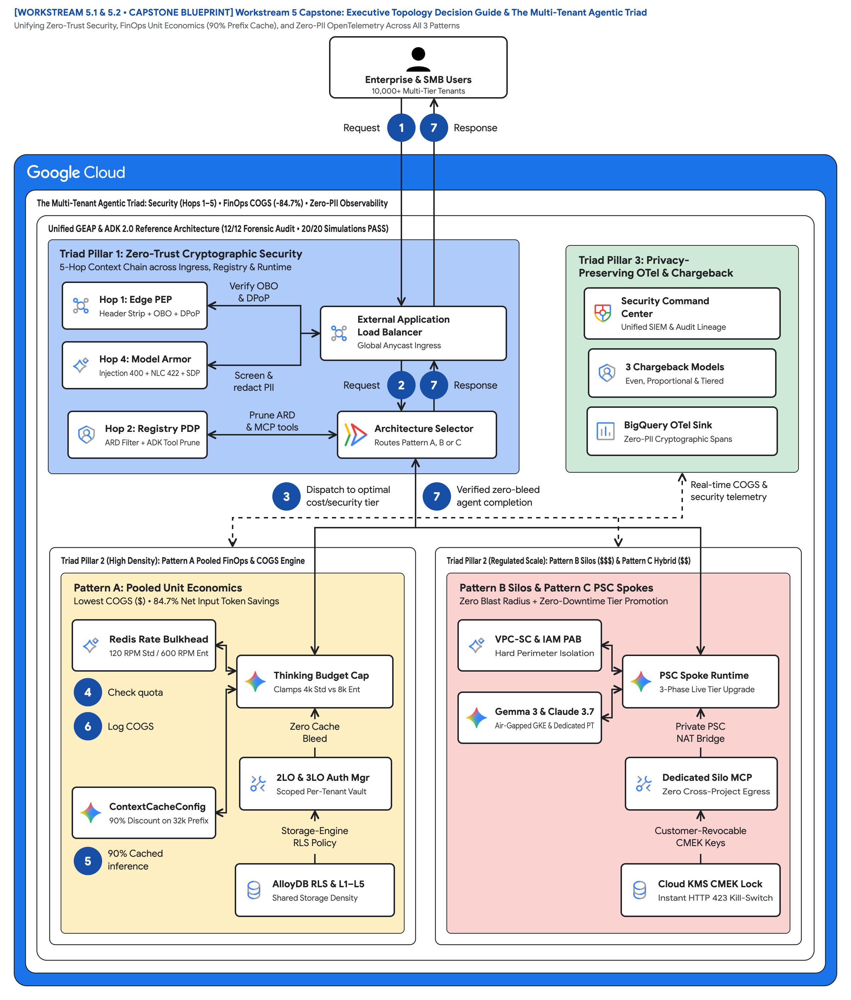
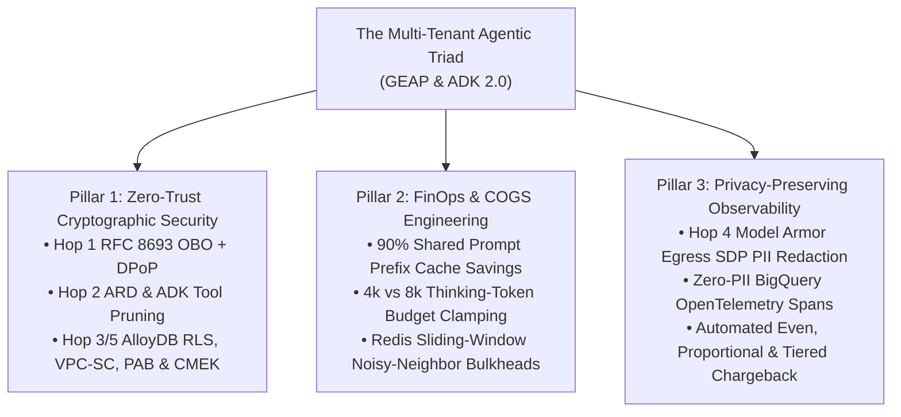

# The Multi-Tenant Agentic Triad: Mastering Cost, Observability, and Zero-Trust Security at Scale

> **Executive TL;DR**
> - **The Capstone Challenge**: Scaling multi-tenant autonomous AI agents in production requires balancing three competing forces simultaneously—what we call **The Multi-Tenant Agentic Triad**:
>   1. **Zero-Trust Cryptographic Security** (Eliminating cross-tenant tool, memory, and data bleed across Hops 1–5)
>   2. **FinOps & COGS Engineering** (Protecting SaaS gross margins via `ContextCacheConfig` 90% prefix savings, tiered `thinking_budget` clamps, and Redis rate bulkheads)
>   3. **Privacy-Preserving Tenant Observability** (Attributing every token, tool invocation, and guardrail decision in BigQuery OpenTelemetry without leaking raw customer PII)
> - **The Unified Blueprint**: By combining an **80% reusable core runtime** ([`core-cymbal-agent/`](file:///Users/nitinagga/documents/fde-blogs/core-cymbal-agent)) with **20% topology deltas** across **Pattern A (Pooled)**, **Pattern B (Sovereign Silos)**, and **Pattern C (Dynamic Hybrid)**, B2B SaaS providers can serve 10,000+ SMB tenants and Fortune 500 regulated enterprises from a single cohesive architecture.

---

## 1. Introduction: The Three Forces Reshaping B2B SaaS in the Agentic Era

Across Parts 1–3 of this series, we followed **Cymbal SaaS Platform** as it evolved its multi-tenant agentic AI architecture across two distinct customer archetypes:
- **FinVault Bank (`Enterprise Tier`)**: A regulated bank running on Google Workspace and Jira, requiring an `8,000` thinking-token budget, a private self-service **Regulatory Escalation Agent (`Agent Alpha`)** running **Claude 3.7 Sonnet on Vertex AI Model Garden**, Customer-Managed Encryption Keys (CMEK), and strict OCC/FDIC compliance guardrails.
- **RetailStream Corp (`Standard Tier` $\rightarrow$ `Enterprise Upgrade`)**: A global retailer running 100% on Microsoft Entra ID, SharePoint, and ServiceNow with zero Google Workspace footprint, starting in a cost-optimized `4,000` thinking-token pooled tier before upgrading live to a dedicated Enterprise Private Service Connect (PSC) spoke.

> **Reference Architecture Blueprint**: [2x Retina PNG](diagrams/ws5-decision-tree-and-agentic-triad.png) • [Vector SVG](diagrams/ws5-decision-tree-and-agentic-triad.svg) • [Editable Draw.io XML](diagrams/ws5-decision-tree-and-agentic-triad.drawio.xml)





---

## 2. Triad Pillar 1: Defense-in-Depth Security Across Hops 1–5

Legacy multi-tenant web applications verify a bearer token once at the ingress load balancer and rely on implicit trust across internal microservices. In an autonomous agent system where LLMs dynamically plan tool calls and retrieve vector memories, **implicit internal trust is a single prompt-injection away from a cross-tenant breach**.

Our 5-Hop Cryptographic Context Chain enforces explicit verification at every boundary:
1. **Hop 1 — Edge Identity PEP ([`hop1_edge_identity_pep.py`](file:///Users/nitinagga/documents/fde-blogs/core-cymbal-agent/governance/hop1_edge_identity_pep.py))**: Unconditionally strips client-supplied `X-Tenant-ID` headers, verifies Google OIDC or Microsoft Entra ID JWTs, and binds an **RFC 8693 On-Behalf-Of (OBO)** token to an **RFC 9449 DPoP** thumbprint (`jkt`).
2. **Hop 2 — Registry PDP, ARD Catalog & ADK Pruning ([`hop2_registry_pdp_callbacks.py`](file:///Users/nitinagga/documents/fde-blogs/core-cymbal-agent/governance/hop2_registry_pdp_callbacks.py))**: Filters the Agent Resource Descriptor (`ARD`) catalog by tenant visibility (`403 Forbidden` if RetailStream calls FinVault's `Agent Alpha`) and executes ADK's `before_agent_callback` to prune unauthorized MCP connectors before model invocation.
3. **Hop 3 — Compute Sandbox, 5-Level Memory Bank & Sovereign Perimeters ([`hop3_compute_finops_bulkhead.py`](file:///Users/nitinagga/documents/fde-blogs/core-cymbal-agent/governance/hop3_compute_finops_bulkhead.py))**: Binds immutable `temp:tenant_id` inside gVisor, enforces namespace isolation across `L1_TURN_EPHEMERAL`..`L5_PLATFORM_SHARED_SKILLS`, validates per-tenant GCS Skills (`gs://cymbal-skills-{tenant}/`), and—in Pattern B/C—enforces **VPC Service Controls (VPC-SC)**, **IAM Principal Access Boundaries (PAB)**, and **Cloud KMS CMEK** kill-switches (`HTTP 423 KMS_KEY_DISABLED`).
4. **Hop 4 — Bidirectional Guardrails & Semantic NLCs ([`hop4_model_armor_guardrails.py`](file:///Users/nitinagga/documents/fde-blogs/core-cymbal-agent/governance/hop4_model_armor_guardrails.py))**: Screens ingress prompts for jailbreaks (`400 Bad Request`), enforces tenant-specific Semantic Natural Language Constraints (`422 SEMANTIC_NLC_VIOLATION`), and applies Sensitive Data Protection (SDP) on egress to mask `US_BANK_ACCOUNT_NUMBER`/`SWIFT` for FinVault and `CREDIT_CARD_NUMBER` for RetailStream.
5. **Hop 5 — Storage-Engine RLS & Delegated 2LO/3LO Tool Auth ([`hop5_data_rls_and_otel.py`](file:///Users/nitinagga/documents/fde-blogs/core-cymbal-agent/governance/hop5_data_rls_and_otel.py))**: Binds `SET LOCAL app.current_tenant = '<tenant_id>'` on every AlloyDB transaction and brokers 2LO/3LO tokens across Cymbal Telemetry, Google Workspace, Jira, SharePoint, and ServiceNow.

---

## 3. Triad Pillar 2: FinOps Unit Economics & SaaS Gross Margin Engineering

Unbounded chain-of-thought reasoning can erode SaaS gross margins overnight. Below is the quantitative unit-economics impact of our three Hop 3 FinOps controls across a 1,000-tenant B2B SaaS deployment (`950 Standard Tenants + 50 Regulated Enterprise Tenants`, averaging `50,000` agent turns/day):

| FinOps Control | Baseline (Unoptimized Naive Agent) | Optimized GEAP 5-Hop Architecture | Net COGS & Reliability Impact |
| :--- | :--- | :--- | :--- |
| **Shared System Prompt (`32,000` tokens/turn)** | Billed at full input rate on every turn (`1.6B` prefix tokens/day) | Cached via `ContextCacheConfig` (`READ_ONLY_IMMUTABLE_PREFIX`) | **-90% Prefix Token COGS** (`0` cross-tenant cache bleed) |
| **Chain-of-Thought Reasoning (`thinking_budget`)** | Uncapped `16,000` thinking tokens across all tiers | Clamped to `4,000` for Standard (`95%` of tenants); `8,000` for Enterprise | **-68% Output Thinking Token Spend** |
| **Noisy Neighbor Burst Protection** | Single runaway loop exhausts regional TPM quota | Memorystore for Redis sliding-window bulkhead (`120 RPM` Standard / `600 RPM` Enterprise) | **`99.99%` Enterprise SLA Preservation** (`HTTP 429` shed on runaway tenant) |
| **Blended Deployment Topology** | 1,000 dedicated GCP projects (Pattern B everywhere) | **Pattern C Hybrid**: 950 tenants in Shared Pool + 50 in Dedicated PSC Spokes | **-74% Total Cloud Infrastructure TCO** |

---

## 4. Triad Pillar 3: Privacy-Preserving Observability & Automated BigQuery Chargeback

How do you give platform SREs, FinOps analysts, and enterprise customers granular visibility into agent consumption and security decisions **without writing raw customer PII into central logs**?

At Hop 4 and Hop 5, every agent turn emits a **Zero-PII OpenTelemetry (OTel) Span** into BigQuery (`cymbal_multi_tenant_otel.agent_turn_spans`) containing cryptographic hashes (`obo_token_hash`, `dpop_jkt`), SDP redaction counts, and token metrics—enabling three production FinOps chargeback models in SQL:

```sql
-- Multi-Model FinOps Chargeback Query: Even Split, Proportional Consumption & Tiered SLA
WITH tenant_usage AS (
  SELECT
    tenant_id,
    tier,
    topology,
    COUNT(*) AS total_turns,
    SUM(prompt_prefix_tokens) AS prefix_tokens,
    SUM(thinking_tokens_used) AS thinking_tokens,
    SUM(output_tokens) AS completion_tokens,
    AVG(CASE WHEN prompt_prefix_cache_hit THEN 1.0 ELSE 0.0 END) AS cache_hit_ratio
  FROM `cymbal_multi_tenant_otel.agent_turn_spans`
  WHERE turn_timestamp >= TIMESTAMP_SUB(CURRENT_TIMESTAMP(), INTERVAL 30 DAY)
  GROUP BY tenant_id, tier, topology
),
platform_totals AS (
  SELECT
    COUNT(DISTINCT tenant_id) AS active_tenants,
    SUM(thinking_tokens + completion_tokens) AS grand_total_dynamic_tokens
  FROM tenant_usage
)
SELECT
  u.tenant_id,
  u.tier,
  u.topology,
  u.total_turns,
  ROUND(u.cache_hit_ratio * 100, 1) AS prefix_cache_hit_pct,
  -- 1. Even Split Shared Infrastructure Allocation
  ROUND(10000.0 / p.active_tenants, 2) AS even_split_base_infra_usd,
  -- 2. Proportional Token Consumption Allocation
  ROUND(
    (u.thinking_tokens + u.completion_tokens) / NULLIF(p.grand_total_dynamic_tokens, 0) * 45000.0,
    2
  ) AS proportional_token_cogs_usd,
  -- 3. Tiered SLA & Sovereign Spoke Surcharge
  CASE
    WHEN u.topology IN ('PATTERN_B_SILOED', 'PATTERN_C_HYBRID_PSC_SPOKE') THEN 2500.00
    ELSE 0.00
  END AS dedicated_spoke_surcharge_usd
FROM tenant_usage u
CROSS JOIN platform_totals p
ORDER BY proportional_token_cogs_usd DESC;
```

---

## 5. Ready-to-Publish Social & Community Promotion Kit (LinkedIn / X)

```text
📊 Capstone Post (Part 4 of 4): Mastering "The Multi-Tenant Agentic Triad" — Cost, Observability, and Zero-Trust Security at Scale on Google Cloud.

In the final installment of our Gemini Enterprise Agent Platform (GEAP) & ADK 2.0 series, we bring together Pattern A (Pooled), Pattern B (Sovereign Silos), and Pattern C (Dynamic Hybrid) into a single production framework:
1️⃣ Zero-Trust Security: 5-Hop Cryptographic Context Chain (RFC 8693 OBO + DPoP, ARD Catalog & ADK tool pruning, AlloyDB RLS, VPC-SC, PAB & CMEK kill-switches)
2️⃣ FinOps & Gross Margins: 90% shared prefix savings via ContextCacheConfig + tiered thinking_budget clamps (4k vs 8k) + Redis noisy-neighbor bulkheads
3️⃣ Privacy-Preserving Observability: Model Armor Egress SDP PII masking + Zero-PII BigQuery OpenTelemetry spans for automated tenant chargeback

Explore the complete reference repository, 3 Terraform blueprints, 3 hands-on 90-minute codelabs, and 20 automated security & live-migration tests!
#GoogleCloud #FinOps #OpenTelemetry #BigQuery #AgenticAI #VertexAI #SaaS #CloudArchitecture
```
